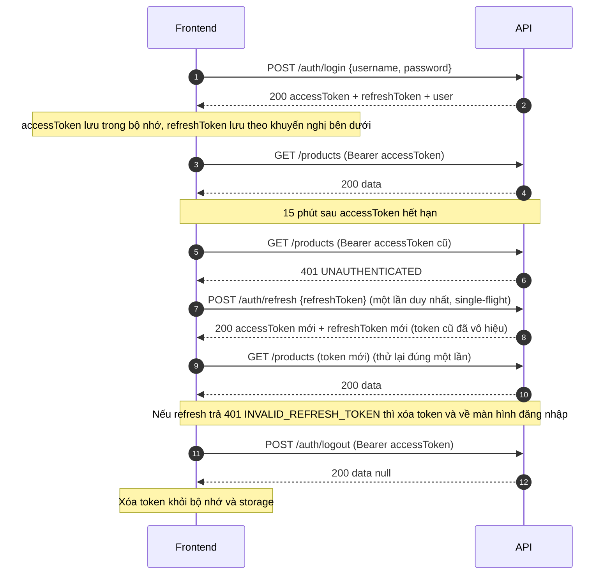
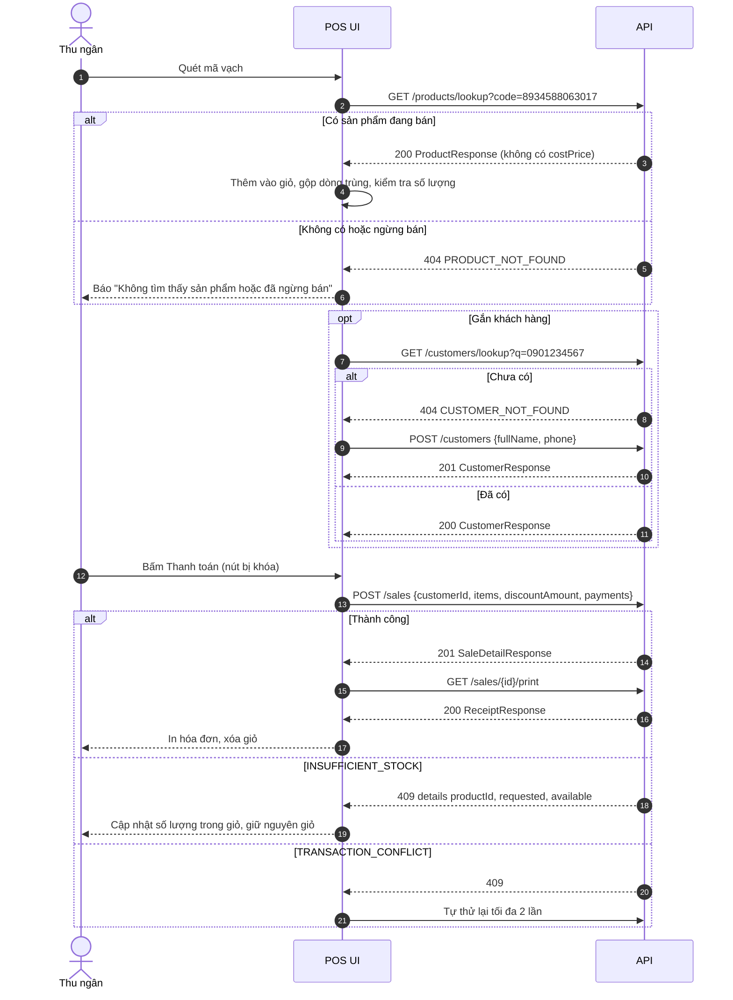
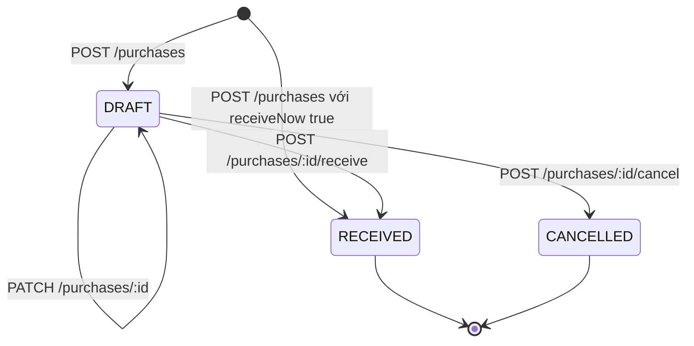
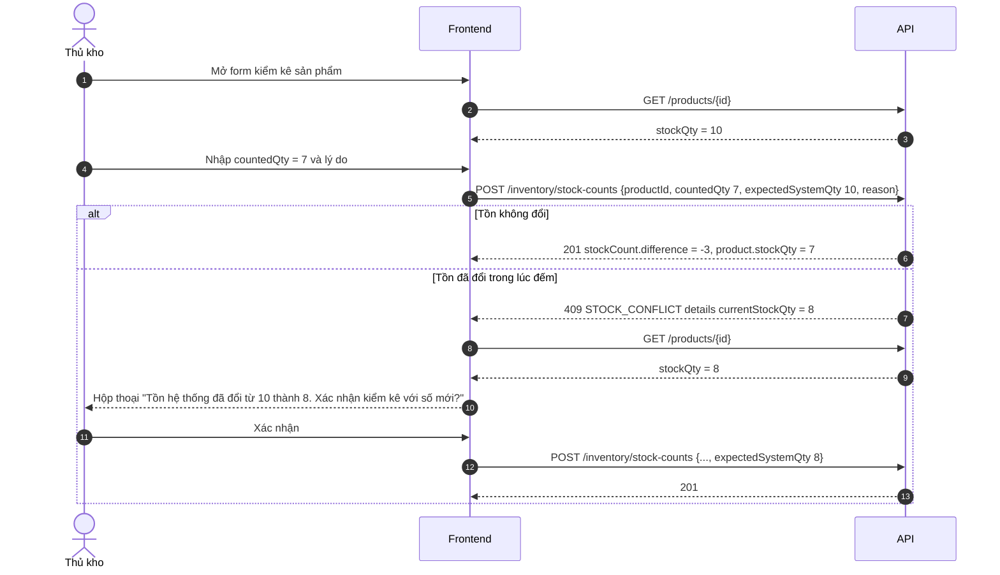

<!--
DOCUMENT METADATA
Owner: @backend-developer
Update trigger: Any change to the API contract (endpoint, request/response shape, error code, role),
                the auth flow, or the conventions described here
Update scope: Affected sections; regenerate the two tables with the commands in "Cập nhật tài liệu này"
Read by: @frontend-developer (primary), @qa-engineer, @ui-ux-designer
Language: Vietnamese prose; code, field names, enums and error codes stay in English
-->

# Hướng dẫn tích hợp API cho Frontend

> **Trạng thái**: Live (API v1)
> **Nguồn sự thật của hợp đồng**: [`openapi.json`](openapi.json) (sinh tự động từ code) · kiểu TypeScript: [`api-types.ts`](api-types.ts) · mô tả bằng lời: [`API.md`](API.md)
> **Cập nhật lần cuối**: 2026-10-02

## Tổng quan

Tài liệu này giúp đội frontend tích hợp REST API của hệ thống quản lý siêu thị mini (NestJS 11 + Fastify + Prisma 6 + MySQL 8) mà không phải đoán tên trường hay kiểu dữ liệu. Nó trả lời bốn câu hỏi: gọi ở đâu và sinh client thế nào, mọi phản hồi trông ra sao, đăng nhập/làm mới token thế nào cho an toàn, và từng nghiệp vụ chính (POS, nhập hàng, kiểm kê, báo cáo, người dùng) nên gọi API theo trình tự nào.

Nguyên tắc: **không có hai bản hợp đồng**.

| Tài liệu | Vai trò | Cách dùng |
|----------|---------|-----------|
| [`openapi.json`](openapi.json) | **Nguồn sự thật.** Mỗi endpoint có schema `data` cụ thể, enum đặt tên, danh sách mã lỗi, vai trò (`x-roles`) | Sinh client/type; đọc khi nghi ngờ |
| [`api-types.ts`](api-types.ts) | Kiểu TypeScript sinh từ `openapi.json` bằng `openapi-typescript` (không có phụ thuộc runtime) | Copy vào dự án hoặc sinh lại từ `openapi.json` |
| [`API.md`](API.md) | Mô tả bằng lời (tiếng Anh), quy tắc nghiệp vụ chi tiết từng endpoint | Đọc để hiểu *vì sao* |
| Swagger UI `/api/docs` | Bản tương tác của `openapi.json` (chỉ khi `SWAGGER_ENABLED=true`) | Thử gọi nhanh |
| File này | Cách dùng: quy ước, luồng nghiệp vụ, xử lý lỗi | Đọc trước khi code |

Hợp đồng được **kiểm chứng bằng test**: `test/openapi-contract.e2e-spec.ts` gọi API thật rồi validate từng phản hồi với schema trong `openapi.json` (bằng `ajv`). Trường thừa, trường thiếu, sai kiểu hay sai enum đều làm test đỏ, nên các kiểu trong `api-types.ts` phản ánh đúng những gì server gửi.

---

## 1. Bắt đầu nhanh

### 1.1 Địa chỉ

| Môi trường | Origin (base URL) | Ghi chú |
|------------|-------------------|---------|
| Local (`npm run start:dev` hoặc `docker compose up`) | `http://localhost:3000` | Cổng đổi bằng biến `PORT` |
| Staging / Production | `https://<api-host>` — do đội DevOps cung cấp, xem [`../devops/DEVOPS.md`](../devops/DEVOPS.md) | Đặt trong biến môi trường của frontend, **đừng hard-code** |

- Mọi endpoint nằm dưới tiền tố **`/api/v1`**, ví dụ `http://localhost:3000/api/v1/products`.
- Trong `openapi.json`, đường dẫn **đã gồm** `/api/v1` (ví dụ `/api/v1/sales/{id}`), vì vậy `baseUrl` của client sinh tự động chỉ là **origin** (`http://localhost:3000`), không có `/api/v1`.
- Body luôn là JSON (`Content-Type: application/json`). Gửi sai Content-Type nhận `415 UNSUPPORTED_MEDIA_TYPE`; body > 1 MB nhận `413 PAYLOAD_TOO_LARGE`.
- Xác thực bằng header `Authorization: Bearer <accessToken>`. Không dùng cookie nên không có CSRF; `credentials: 'omit'` (mặc định của `fetch`) là đúng.

### 1.2 Swagger và openapi.json

| Vị trí | Dùng khi |
|--------|----------|
| `GET {origin}/api/docs` | Swagger UI (chỉ khi `SWAGGER_ENABLED=true`, mặc định bật ở local) |
| `GET {origin}/api/docs-json` | Spec JSON từ server đang chạy; **giống hệt** `docs/backend/openapi.json` ở cùng commit |
| `docs/backend/openapi.json` | Bản được commit vào repo, versioned theo code. Production thường tắt Swagger, hãy dùng file này |
| `docs/backend/api-types.ts` | Kiểu TypeScript đã sinh sẵn |

**CORS**: server chỉ chấp nhận các origin trong biến `CORS_ORIGINS` (mẫu: `http://localhost:5173,http://localhost:3001`; để trống thì tắt CORS). Header được phép gửi: `Authorization`, `Content-Type`, `X-Request-Id`. Server không bật `credentials` và **không expose** header phản hồi nào ngoài nhóm mặc định của trình duyệt, nên trình duyệt không đọc được `X-RateLimit-*` hay `Retry-After`. Nếu gọi API bị chặn CORS, nhờ backend thêm origin của bạn vào `CORS_ORIGINS`.

### 1.3 Sinh client từ openapi.json

**Cách A (khuyến nghị): `openapi-typescript` + `openapi-fetch`** — nhẹ, type-safe, không sinh code runtime.

```bash
npm i openapi-fetch
npm i -D openapi-typescript

# từ file trong repo backend (hoặc copy file vào repo frontend)
npx openapi-typescript ../api-mini-store/docs/backend/openapi.json -o src/api/schema.d.ts

# hoặc từ server đang chạy
npx openapi-typescript http://localhost:3000/api/docs-json -o src/api/schema.d.ts
```

```ts
// src/api/client.ts
import createClient, { type Middleware } from 'openapi-fetch';

import type { paths } from './schema';
import { tokenStore } from './token-store';

const attachAccessToken: Middleware = {
  onRequest({ request }) {
    const accessToken = tokenStore.accessToken;
    if (accessToken) {
      request.headers.set('Authorization', `Bearer ${accessToken}`);
    }
    return request;
  },
};

export const client = createClient<paths>({ baseUrl: import.meta.env.VITE_API_ORIGIN });
client.use(attachAccessToken);

// Dùng: `data` là envelope, payload nằm ở data.data; `error` là union các envelope lỗi đã khai báo.
const { data: envelope, error } = await client.GET('/api/v1/products/lookup', {
  params: { query: { code: '8934588063017' } },
});
if (error) {
  // error.code, error.message, error.details, error.requestId
} else {
  const product = envelope.data; // components['schemas']['ProductResponse']
}
```

**Cách B: `orval`** — sinh sẵn hook React Query / SWR, hàm gọi API theo từng endpoint.

```bash
npm i -D orval
npm i @tanstack/react-query
```

```ts
// orval.config.ts
import { defineConfig } from 'orval';

export default defineConfig({
  miniStore: {
    input: { target: '../api-mini-store/docs/backend/openapi.json' },
    output: {
      mode: 'tags-split',
      target: 'src/api/generated',
      schemas: 'src/api/model',
      client: 'react-query',
      override: { mutator: { path: 'src/api/mutator.ts', name: 'apiMutator' } },
    },
  },
});
```

```bash
npx orval --config orval.config.ts
```

`apiMutator` là hàm bạn viết (có thể dùng lại `request()` ở mục 3.4) để gắn token và xử lý 401. Hãy để mutator trả về **nguyên envelope** (không bóc `data`) để kiểu sinh tự động vẫn khớp; bóc `data` ở lớp hook/selector của bạn. Tên hàm sinh ra lấy từ `operationId` (`Sales_checkout` → `salesCheckout`).

**Cách C: chỉ copy `api-types.ts`** — file không import gì, dùng được ngay với `fetch` thường:

```ts
import type { components, paths } from './api-types';

type Product = components['schemas']['ProductResponse'];
type CheckoutRequest = components['schemas']['CreateSaleDto'];
type CheckoutOk = paths['/api/v1/sales']['post']['responses'][201]['content']['application/json'];
//   CheckoutOk.data là components['schemas']['SaleDetailResponse']
```

Quy ước đặt tên trong spec: `*Dto` là body/query gửi lên, `*Response` là payload `data` trả về, các enum có tên (`Role`, `PurchaseStatus`, `SaleStatus`, `PaymentMethod`, `MovementType`, `ReferenceType`, `ReportGrouping`, `TopProductSort`, `ErrorCode`, `UnavailableReason`) nằm trong `components.schemas`.

---

## 2. Envelope phản hồi

Mọi phản hồi (kể cả lỗi, danh sách, `GET /health`) dùng **một envelope**. HTTP status là status thật (201 khi tạo, 4xx/5xx khi lỗi) và được lặp lại trong `statusCode`. Swagger UI và `/api/docs-json` là ngoại lệ (không bọc).

**Thành công**

```json
{
  "success": true,
  "statusCode": 201,
  "code": "OK",
  "message": "Tạo hóa đơn thành công",
  "data": { "id": 236, "invoiceNo": "HD202610020001", "total": 29000 },
  "requestId": "ef88a87b-1704-43e4-a1e1-03aa875e7ccb",
  "timestamp": "2026-10-02T08:33:06.939Z"
}
```

**Danh sách**: `data` là mảng, `meta` nằm ở cấp trên cùng.

```json
{
  "success": true, "statusCode": 200, "code": "OK", "message": "Thành công",
  "data": [ { "id": 16, "sku": "BANH-OREO" } ],
  "meta": { "page": 1, "pageSize": 20, "total": 12 },
  "requestId": "…", "timestamp": "…"
}
```

**Lỗi**

```json
{
  "success": false,
  "statusCode": 409,
  "code": "INSUFFICIENT_STOCK",
  "message": "Không đủ tồn kho cho một số sản phẩm. Vui lòng giảm số lượng hoặc cập nhật giỏ hàng.",
  "data": null,
  "details": [ { "productId": 14, "sku": "COCA-330", "name": "Coca-Cola lon 330ml", "requested": 9999, "available": 97 } ],
  "requestId": "900b9399-48f0-4a32-8a3e-c44fdd4c3416",
  "timestamp": "2026-10-02T06:15:02.942Z"
}
```

Ghi chú:

- `message` luôn là tiếng Việt, hiển thị được trực tiếp cho người dùng. **Logic UI phải dựa vào `code`**, không so sánh chuỗi `message`.
- `details` chỉ có ở một số mã lỗi và **hình dạng phụ thuộc `code`** (xem mục 8). Có thể là mảng hoặc object.
- `data` của `POST /auth/logout` và `POST /users/{id}/reset-password` là `null`.
- `GET /reports/inventory` trả một trang sản phẩm **bên trong** `data` (`data.products.items` + `data.products.meta`), không phải `meta` cấp trên cùng.
- `requestId` là mã tương ứng với mọi dòng log của request đó trên server. Hãy hiển thị nó trong thông báo lỗi 5xx để người dùng đọc cho bộ phận hỗ trợ.
- Header `X-Request-Id`: bạn **có thể gửi** `X-Request-Id` (1-64 ký tự `A-Za-z0-9._-`); server dùng đúng giá trị đó làm `requestId` trong envelope và log. Server **không** gửi lại header `X-Request-Id` ở phản hồi, nên hãy đọc `requestId` từ body. Nếu header thiếu hoặc không hợp lệ, server tự sinh UUID.

### 2.1 Kiểu TypeScript và `apiFetch`

```ts
// src/api/envelope.ts
import type { components } from './api-types';

export type ErrorCode = components['schemas']['ErrorCode'];

export interface PageMeta {
  page: number;
  pageSize: number;
  total: number;
}

export interface SuccessEnvelope<TData> {
  success: true;
  statusCode: number;
  code: 'OK';
  message: string;
  data: TData;
  meta?: PageMeta; // chỉ có ở endpoint danh sách
  requestId: string;
  timestamp: string; // ISO-8601 UTC
}

export interface ErrorEnvelope {
  success: false;
  statusCode: number;
  code: ErrorCode;
  message: string;
  data: null;
  details?: unknown;
  requestId: string;
  timestamp: string;
}

/** Mọi lỗi của lớp HTTP đều được ném dưới dạng ApiError. */
export class ApiError extends Error {
  constructor(
    readonly status: number, // 0 = không nhận được phản hồi (mất mạng, CORS, timeout)
    readonly code: ErrorCode | 'NETWORK_ERROR' | 'INVALID_RESPONSE',
    message: string,
    readonly details?: unknown,
    readonly requestId?: string,
  ) {
    super(message);
    this.name = 'ApiError';
  }

  is(...codes: ErrorCode[]): boolean {
    return codes.some((code) => code === this.code);
  }
}
```

```ts
// src/api/http.ts
import { ApiError, type ErrorEnvelope, type PageMeta, type SuccessEnvelope } from './envelope';
import { tokenStore } from './token-store';

const API_PREFIX = '/api/v1';
const ORIGIN = import.meta.env.VITE_API_ORIGIN as string; // ví dụ http://localhost:3000

export interface ApiResult<TData> {
  data: TData;
  meta?: PageMeta; // giữ lại để phân trang
  message: string;
  requestId: string;
}

export interface ApiRequestInit {
  method?: 'GET' | 'POST' | 'PATCH';
  query?: Record<string, string | number | boolean | undefined>;
  body?: unknown;
  /** false cho login/refresh (không gửi Authorization). */
  authenticated?: boolean;
  signal?: AbortSignal;
}

function buildUrl(path: string, query: ApiRequestInit['query']): string {
  const url = new URL(`${ORIGIN}${API_PREFIX}${path}`);
  for (const [key, value] of Object.entries(query ?? {})) {
    if (value !== undefined && value !== '') {
      url.searchParams.set(key, String(value));
    }
  }
  return url.toString();
}

export async function apiFetch<TData>(
  path: string,
  init: ApiRequestInit = {},
): Promise<ApiResult<TData>> {
  const clientRequestId = crypto.randomUUID(); // server echo lại trong envelope.requestId
  const headers: Record<string, string> = {
    Accept: 'application/json',
    'X-Request-Id': clientRequestId,
  };
  if (init.body !== undefined) {
    headers['Content-Type'] = 'application/json';
  }
  if (init.authenticated !== false && tokenStore.accessToken) {
    headers.Authorization = `Bearer ${tokenStore.accessToken}`;
  }

  let response: Response;
  try {
    response = await fetch(buildUrl(path, init.query), {
      method: init.method ?? 'GET',
      headers,
      body: init.body === undefined ? undefined : JSON.stringify(init.body),
      signal: init.signal,
    });
  } catch {
    throw new ApiError(0, 'NETWORK_ERROR', 'Không kết nối được máy chủ. Vui lòng kiểm tra mạng.', undefined, clientRequestId);
  }

  const payload: unknown = await response.json().catch(() => undefined);
  if (isErrorEnvelope(payload)) {
    throw new ApiError(payload.statusCode, payload.code, payload.message, payload.details, payload.requestId);
  }
  if (!isSuccessEnvelope(payload)) {
    // Proxy/gateway trả HTML hoặc JSON không phải envelope
    throw new ApiError(response.status, 'INVALID_RESPONSE', 'Phản hồi từ máy chủ không hợp lệ.', undefined, clientRequestId);
  }
  return { data: payload.data as TData, meta: payload.meta, message: payload.message, requestId: payload.requestId };
}

function isSuccessEnvelope(value: unknown): value is SuccessEnvelope<unknown> {
  return typeof value === 'object' && value !== null && (value as { success?: unknown }).success === true;
}

function isErrorEnvelope(value: unknown): value is ErrorEnvelope {
  return typeof value === 'object' && value !== null && (value as { success?: unknown }).success === false;
}
```

Ví dụ dùng (kiểu `data` lấy từ `api-types.ts`):

```ts
import type { components } from './api-types';

type Product = components['schemas']['ProductResponse'];

const { data: products, meta } = await apiFetch<Product[]>('/products', {
  query: { search: 'coca', page: 1, pageSize: 20 },
});
// meta?.total dùng cho phân trang
```

---

## 3. Luồng xác thực

### 3.1 Tổng quan

- `POST /auth/login` trả `accessToken` (JWT, sống `expiresIn` giây, mặc định **900 = 15 phút**) và `refreshToken` (chuỗi ngẫu nhiên, **dùng một lần**, hạn đến `refreshExpiresAt`, mặc định 7 ngày và được gia hạn mỗi lần xoay).
- Mỗi request server còn kiểm tra phiên chưa bị thu hồi và người dùng còn hoạt động. Vì vậy **đăng xuất, khóa tài khoản, đặt lại mật khẩu có hiệu lực ngay**, không đợi access token hết hạn; vai trò cũng được đọc lại từ DB mỗi request.
- Khi access token hết hạn (hoặc phiên bị thu hồi), request nhận `401 UNAUTHENTICATED`.



### 3.2 Lưu token

| Token | Khuyến nghị | Lý do |
|-------|-------------|-------|
| `accessToken` | **Chỉ trong bộ nhớ** (biến module, store) | Sống ngắn; không để lộ cho script khác ngoài runtime hiện tại |
| `refreshToken` | Trong bộ nhớ (an toàn nhất) hoặc `sessionStorage` (giữ phiên khi F5, mất khi đóng tab) | Tránh `localStorage` vì sống lâu và dùng chung mọi tab |

Đánh đổi: bất kỳ nơi lưu nào mà JavaScript đọc được (bộ nhớ, `sessionStorage`, `localStorage`) đều có thể bị lấy nếu trang dính **XSS**. API này dùng Bearer token chứ không dùng cookie `HttpOnly`, nên không có CSRF nhưng cũng không có lớp bảo vệ XSS của cookie. Hậu quả của việc token bị lộ được giới hạn bởi: access token ngắn hạn, refresh token xoay vòng một lần dùng và **phát hiện tái sử dụng** (mục 3.3). Bù lại hãy: chặn XSS ở gốc (không `dangerouslySetInnerHTML` với dữ liệu người dùng, CSP chặt), không log token, xóa token khi đăng xuất.

```ts
// src/api/token-store.ts — trong bộ nhớ, tùy chọn giữ refreshToken qua F5 bằng sessionStorage
import type { components } from './api-types';

type AuthTokens = components['schemas']['AuthTokensResponse'];
const REFRESH_KEY = 'ms.refreshToken';

let accessToken: string | undefined;
let refreshToken: string | undefined = sessionStorage.getItem(REFRESH_KEY) ?? undefined;

export const tokenStore = {
  get accessToken(): string | undefined { return accessToken; },
  get refreshToken(): string | undefined { return refreshToken; },
  save(tokens: Pick<AuthTokens, 'accessToken' | 'refreshToken'>): void {
    accessToken = tokens.accessToken;
    refreshToken = tokens.refreshToken;
    sessionStorage.setItem(REFRESH_KEY, tokens.refreshToken);
  },
  clear(): void {
    accessToken = undefined;
    refreshToken = undefined;
    sessionStorage.removeItem(REFRESH_KEY);
  },
};
```

> **Cẩn thận với nhiều tab.** `sessionStorage` bị *sao chép* khi "Duplicate tab" hoặc mở link bằng `window.open`. Hai tab cùng giữ một refresh token mà cùng refresh thì tab thứ hai bị coi là **tái sử dụng token** và phiên bị hủy (mục 3.3). Với POS (một quầy một tab) cách đơn giản là chỉ giữ token trong bộ nhớ, mỗi tab đăng nhập riêng. Nếu bắt buộc chia sẻ phiên giữa các tab, hãy tuần tự hóa việc refresh giữa các tab bằng Web Locks (`navigator.locks.request('ms-refresh', …)`) và đọc lại token mới từ storage trước khi gọi.

### 3.3 Xoay vòng refresh token và phát hiện tái sử dụng

- Mỗi `POST /auth/refresh` trả **refresh token mới** và vô hiệu token cũ. Phải lưu token mới ngay.
- Nếu một refresh token **đã bị xoay** (token cũ) được gửi lại, server trả `401 INVALID_REFRESH_TOKEN` **và hủy toàn bộ phiên**: access token hiện tại cũng ngừng hoạt động, người dùng phải đăng nhập lại. Đây là cơ chế chống kẻ trộm token, nhưng cũng "giết" phiên của bạn nếu client lỡ gửi token cũ.
- Hệ quả bắt buộc: **không bao giờ gọi `/auth/refresh` song song** (ví dụ 5 request cùng nhận 401 và cùng refresh), và không retry refresh bằng token cũ. Dùng **single-flight**: mọi request đang chờ dùng chung một lời gọi refresh.
- Hai refresh thực sự đồng thời với cùng một token được coi là race: một bên thắng, bên kia nhận 401 nhưng phiên không bị hủy.

```ts
// src/api/session.ts
import { type ApiRequestInit, type ApiResult, apiFetch } from './http';
import { ApiError } from './envelope';
import type { components } from './api-types';
import { tokenStore } from './token-store';

type AuthTokens = components['schemas']['AuthTokensResponse'];

let inFlightRefresh: Promise<void> | undefined;

/** Mọi nơi cần làm mới phiên đều gọi hàm này; chỉ có tối đa MỘT lời gọi /auth/refresh tại một thời điểm. */
export function refreshSession(): Promise<void> {
  inFlightRefresh ??= (async () => {
    const refreshToken = tokenStore.refreshToken;
    if (!refreshToken) {
      throw new ApiError(401, 'INVALID_REFRESH_TOKEN', 'Phiên đăng nhập đã hết hạn.');
    }
    const { data } = await apiFetch<AuthTokens>('/auth/refresh', {
      method: 'POST',
      authenticated: false,
      body: { refreshToken },
    });
    tokenStore.save(data); // lưu token MỚI trước khi cho các request đang chờ chạy tiếp
  })().finally(() => {
    inFlightRefresh = undefined;
  });
  return inFlightRefresh;
}

/** request(): gọi API có xác thực, gặp 401 UNAUTHENTICATED thì refresh (single-flight) rồi thử lại đúng 1 lần. */
export async function request<TData>(
  path: string,
  init: ApiRequestInit = {},
): Promise<ApiResult<TData>> {
  try {
    return await apiFetch<TData>(path, init);
  } catch (error) {
    if (!(error instanceof ApiError) || !error.is('UNAUTHENTICATED') || init.authenticated === false) {
      throw error;
    }
    try {
      await refreshSession();
    } catch (refreshError) {
      tokenStore.clear();
      onSessionExpired(); // điều hướng về /login, hiển thị "Phiên đăng nhập đã hết hạn"
      throw refreshError;
    }
    return apiFetch<TData>(path, init); // thử lại một lần; nếu vẫn 401 thì để lỗi nổi lên
  }
}

declare function onSessionExpired(): void;
```

Thử lại sau 401 là **an toàn cho cả `POST /sales`**: `401 UNAUTHENTICATED` được trả ở guard, trước khi handler chạy, nên chưa có gì được ghi.

### 3.4 Các tình huống cần xử lý

| Tình huống | Kết quả từ server | UI nên làm |
|------------|-------------------|------------|
| Sai tên đăng nhập hoặc mật khẩu | `401 INVALID_CREDENTIALS` (cùng một thông báo cho cả hai trường hợp) | Báo "Tên đăng nhập hoặc mật khẩu không đúng", giữ tên đăng nhập, xóa mật khẩu. Không gợi ý trường nào sai |
| Tài khoản bị khóa | `403 ACCOUNT_LOCKED` — chỉ trả **sau khi mật khẩu đúng**, nên không dùng để dò tài khoản | Hiển thị "Tài khoản đã bị khóa, vui lòng liên hệ quản lý" (không phải lỗi mật khẩu) |
| Đăng nhập quá nhiều lần | `429 TOO_MANY_REQUESTS` — giới hạn riêng cho login, mặc định **5 lần / 60 giây / IP** | Khóa nút, báo "Thử đăng nhập quá nhiều lần, vui lòng đợi khoảng 1 phút". Trình duyệt không đọc được `Retry-After` (CORS), nên đếm ngược cố định theo mô tả này |
| Access token hết hạn | `401 UNAUTHENTICATED` | Refresh single-flight rồi thử lại 1 lần (mục 3.3) |
| Refresh thất bại | `401 INVALID_REFRESH_TOKEN` (hết hạn, đã xoay, phiên bị thu hồi, tài khoản bị khóa) | Xóa token, về màn hình đăng nhập kèm thông báo phiên hết hạn |
| Bị khóa / đổi mật khẩu khi đang làm việc | Request kế tiếp: `401 UNAUTHENTICATED`, refresh: `401 INVALID_REFRESH_TOKEN`; đăng nhập lại: `403 ACCOUNT_LOCKED` (nếu bị khóa) | Như trên; màn hình đăng nhập sẽ báo rõ lý do |
| Đổi vai trò khi đang đăng nhập | Request kế tiếp có thể nhận `403 FORBIDDEN` | Gọi lại `GET /auth/me`, cập nhật menu theo `role` mới |
| Rate limit chung | `429 TOO_MANY_REQUESTS` (mặc định 300 request / 60 giây) | Giảm tần suất (debounce tìm kiếm), thử lại sau vài giây |

`POST /auth/logout` thu hồi phiên hiện tại (`data: null`). Hãy xóa token cục bộ dù lời gọi thành công hay lỗi mạng. `GET /auth/me` trả `{ id, username, fullName, role }` — dùng để khôi phục thông tin người dùng sau khi refresh (login/refresh cũng đã trả `user`).

---

## 4. Ma trận phân quyền

Vai trò: `ADMIN` (Quản trị viên), `CASHIER` (Thu ngân), `STOCKKEEPER` (Thủ kho). Nguồn: `src/common/permissions/permissions.ts`; `openapi.json` công bố vai trò của từng thao tác ở khóa `x-roles`. Server mặc định **từ chối** mọi route không khai báo quyền; vai trò không đủ quyền nhận `403 FORBIDDEN`.

### 4.1 Theo màn hình giao diện

| Màn hình | ADMIN | CASHIER | STOCKKEEPER | Endpoint chính |
|----------|:-----:|:-------:|:-----------:|----------------|
| Đăng nhập, đổi phiên, đăng xuất, hồ sơ | ✔ | ✔ | ✔ | `/auth/*` |
| POS bán hàng (quét mã, giỏ, thanh toán, in) | ✔ | ✔ | — | `/products/lookup`, `/customers/*`, `/sales` |
| Lịch sử hóa đơn, chi tiết, in lại | ✔ | ✔ | — | `/sales`, `/sales/{id}`, `/sales/{id}/print` |
| Khách hàng | ✔ | ✔ | — | `/customers/*` |
| Danh sách / chi tiết danh mục, sản phẩm (xem) | ✔ | ✔ | ✔ | `GET /categories*`, `GET /products*` |
| Tạo / sửa / ngừng bán danh mục, sản phẩm | ✔ | — | ✔ | `POST/PATCH /categories*`, `/products*` |
| Nhà cung cấp | ✔ | — | ✔ | `/suppliers*` |
| Phiếu nhập hàng (tạo, sửa nháp, nhận, hủy) | ✔ | — | ✔ | `/purchases*` |
| Tồn kho hiện tại | ✔ | ✔ | ✔ | `GET /inventory/stock` |
| Cảnh báo tồn thấp, lịch sử xuất nhập, kiểm kê | ✔ | — | ✔ | `/inventory/low-stock`, `/movements`, `/stock-counts` |
| Báo cáo doanh thu, sản phẩm bán chạy, lợi nhuận gộp | ✔ | — | — | `/reports/revenue`, `/top-products`, `/gross-profit` |
| Báo cáo tồn kho | ✔ | — | ✔ | `/reports/inventory` |
| Quản lý người dùng | ✔ | — | — | `/users*` |

Ẩn menu theo vai trò để giao diện gọn, nhưng **quyền thật do server quyết định**: luôn xử lý `403 FORBIDDEN`.

### 4.2 Theo endpoint

| Endpoint | ADMIN | CASHIER | STOCKKEEPER |
|----------|:-----:|:-------:|:-----------:|
| `GET /health` | công khai | công khai | công khai |
| `POST /auth/login` | công khai | công khai | công khai |
| `POST /auth/refresh` | công khai | công khai | công khai |
| `POST /auth/logout` | ✔ | ✔ | ✔ |
| `GET /auth/me` | ✔ | ✔ | ✔ |
| `GET /users` | ✔ | — | — |
| `POST /users` | ✔ | — | — |
| `GET /users/{id}` | ✔ | — | — |
| `PATCH /users/{id}` | ✔ | — | — |
| `POST /users/{id}/lock` | ✔ | — | — |
| `POST /users/{id}/unlock` | ✔ | — | — |
| `POST /users/{id}/reset-password` | ✔ | — | — |
| `GET /categories` | ✔ | ✔ | ✔ |
| `POST /categories` | ✔ | — | ✔ |
| `GET /categories/{id}` | ✔ | ✔ | ✔ |
| `PATCH /categories/{id}` | ✔ | — | ✔ |
| `POST /categories/{id}/deactivate` | ✔ | — | ✔ |
| `POST /categories/{id}/activate` | ✔ | — | ✔ |
| `GET /products` | ✔ | ✔ | ✔ |
| `POST /products` | ✔ | — | ✔ |
| `GET /products/lookup` | ✔ | ✔ | ✔ |
| `GET /products/{id}` | ✔ | ✔ | ✔ |
| `PATCH /products/{id}` | ✔ | — | ✔ |
| `POST /products/{id}/deactivate` | ✔ | — | ✔ |
| `POST /products/{id}/activate` | ✔ | — | ✔ |
| `GET /suppliers` | ✔ | — | ✔ |
| `POST /suppliers` | ✔ | — | ✔ |
| `GET /suppliers/{id}` | ✔ | — | ✔ |
| `PATCH /suppliers/{id}` | ✔ | — | ✔ |
| `POST /suppliers/{id}/deactivate` | ✔ | — | ✔ |
| `POST /suppliers/{id}/activate` | ✔ | — | ✔ |
| `GET /customers` | ✔ | ✔ | — |
| `POST /customers` | ✔ | ✔ | — |
| `GET /customers/lookup` | ✔ | ✔ | — |
| `GET /customers/{id}` | ✔ | ✔ | — |
| `PATCH /customers/{id}` | ✔ | ✔ | — |
| `GET /purchases` | ✔ | — | ✔ |
| `POST /purchases` | ✔ | — | ✔ |
| `GET /purchases/{id}` | ✔ | — | ✔ |
| `PATCH /purchases/{id}` | ✔ | — | ✔ |
| `POST /purchases/{id}/receive` | ✔ | — | ✔ |
| `POST /purchases/{id}/cancel` | ✔ | — | ✔ |
| `GET /sales` | ✔ | ✔ | — |
| `POST /sales` | ✔ | ✔ | — |
| `GET /sales/{id}` | ✔ | ✔ | — |
| `GET /sales/{id}/print` | ✔ | ✔ | — |
| `GET /inventory/stock` | ✔ | ✔ | ✔ |
| `GET /inventory/low-stock` | ✔ | — | ✔ |
| `GET /inventory/movements` | ✔ | — | ✔ |
| `GET /inventory/stock-counts` | ✔ | — | ✔ |
| `POST /inventory/stock-counts` | ✔ | — | ✔ |
| `GET /reports/revenue` | ✔ | — | — |
| `GET /reports/top-products` | ✔ | — | — |
| `GET /reports/gross-profit` | ✔ | — | — |
| `GET /reports/inventory` | ✔ | — | ✔ |

### 4.3 Quy tắc theo trường (field-level)

- **`costPrice` bị ẩn với `CASHIER`**: trong mọi phản hồi sản phẩm (`GET /products`, `GET /products/lookup`, `GET /products/{id}`) khóa `costPrice` **không tồn tại** (không phải `null`, không phải `0`) khi người gọi là thu ngân; `ADMIN` và `STOCKKEEPER` luôn nhận được. Trong `ProductResponse` nó là trường **tùy chọn** (`costPrice?: number`). Hãy viết UI theo kiểu `product.costPrice !== undefined` và không hiển thị cột giá vốn cho thu ngân.
- `GET /inventory/stock` (thu ngân được xem) không chứa dữ liệu giá vốn.
- `stockQty` là **chỉ đọc**: gửi `stockQty` trong `POST/PATCH /products` nhận `400 VALIDATION_ERROR`. `costPrice` chỉ được gửi khi **tạo** sản phẩm (giá vốn ban đầu, mặc định 0); gửi ở `PATCH` là `400`. Tồn kho chỉ đổi qua nhập hàng, bán hàng và kiểm kê; giá vốn chỉ đổi khi nhận phiếu nhập (bình quân gia quyền).
- Lưu ý: `unitCostSnapshot` trong chi tiết hóa đơn (`SaleItemResponse`) hiện vẫn được trả cho cả `CASHIER`. Đừng hiển thị trường này trong giao diện thu ngân; backend đã ghi nhận để xem xét ẩn theo vai trò.

---

## 5. Quy ước chung

### 5.1 Phân trang

Mọi endpoint danh sách nhận `page` (mặc định **1**) và `pageSize` (mặc định **20**, tối đa **100**, vượt quá là `400 VALIDATION_ERROR`). Phản hồi: `data` là mảng và `meta` là `{ page, pageSize, total }` (`total` là tổng số bản ghi khớp bộ lọc). Số trang = `Math.ceil(meta.total / meta.pageSize)`. Trang vượt quá cuối trả `data: []`.

### 5.2 Tìm kiếm và bộ lọc

| Tham số | Ý nghĩa |
|---------|---------|
| `search` | Khớp **một phần** (chứa chuỗi), không phân biệt hoa thường. Tìm theo: người dùng (username, họ tên); danh mục (tên); sản phẩm / tồn kho (tên, SKU, mã vạch); nhà cung cấp (tên, SĐT, email); khách hàng (tên, mã, SĐT); phiếu nhập (số phiếu); hóa đơn (số hóa đơn). Tối đa 100 ký tự (30 với số chứng từ). Chuỗi rỗng/chỉ có khoảng trắng bị bỏ qua |
| `isActive` | `true` / `false` (hoặc `1`/`0`). Bỏ qua = tất cả (riêng `GET /inventory/stock` mặc định `true`) |
| `categoryId`, `supplierId`, `customerId`, `cashierId`, `productId` | Id số nguyên ≥ 1, khớp chính xác |
| `status` | Enum `PurchaseStatus` (phiếu nhập) |
| `type` | Enum `MovementType` (lịch sử xuất nhập) |
| `paymentMethod` | Enum `PaymentMethod` (hóa đơn có ít nhất một thanh toán theo phương thức này) |
| `customerQuery` | (hóa đơn) khớp một phần SĐT khách (chấp nhận `+84…`, `84…`, `0…`) hoặc mã khách hàng |
| `lowStock` | (tồn kho) `true` = chỉ sản phẩm có tồn ≤ mức đặt hàng lại |

Gửi giá trị sai kiểu/enum nhận `400 VALIDATION_ERROR`. Tham số lạ không được khai báo cũng bị từ chối.

### 5.3 Bộ lọc ngày

- Định dạng `YYYY-MM-DD`, hiểu theo **múi giờ cửa hàng `Asia/Ho_Chi_Minh`**, không phải UTC.
- `from` là ngày đầu; **`to` là ngày cuối và được bao gồm** (inclusive). `from=2026-10-01&to=2026-10-01` là cả ngày 1/10 giờ Việt Nam.
- **Báo cáo** (`/reports/*`) bắt buộc có cả `from` và `to`, khoảng tối đa **366 ngày**; `to < from`, ngày không tồn tại (ví dụ `2026-02-31`) hoặc vượt 366 ngày trả `400 INVALID_DATE_RANGE`.
- **Bộ lọc danh sách** (`/sales`, `/purchases`, `/inventory/movements`, `/inventory/stock-counts`) cho phép chỉ gửi `from` hoặc chỉ `to` (khoảng mở); không giới hạn 366 ngày, nhưng khi gửi cả hai vẫn kiểm tra `to ≥ from`.
- Đừng dùng `new Date().toISOString().slice(0, 10)` để lấy "hôm nay" (đó là ngày UTC, lệch tới 7 tiếng). Dùng:

```ts
const STORE_TIME_ZONE = 'Asia/Ho_Chi_Minh';

/** "Hôm nay" theo giờ cửa hàng, dạng YYYY-MM-DD (locale en-CA cho đúng định dạng ISO). */
export const todayInStore = (): string =>
  new Intl.DateTimeFormat('en-CA', { timeZone: STORE_TIME_ZONE }).format(new Date());
```

### 5.4 Thời gian (timestamp)

Mọi trường thời gian trong phản hồi (`createdAt`, `soldAt`, `receivedAt`, `timestamp`, …) là chuỗi ISO-8601 **UTC** (`2026-10-02T04:50:53.609Z`). Chuyển sang giờ cửa hàng khi hiển thị. Các trường như `from`, `to` của báo cáo và `period` là nhãn theo giờ cửa hàng, **không** chuyển múi giờ nữa.

```ts
const dateTimeFormat = new Intl.DateTimeFormat('vi-VN', {
  timeZone: STORE_TIME_ZONE,
  dateStyle: 'short',
  timeStyle: 'medium',
});
export const formatDateTime = (isoUtc: string): string => dateTimeFormat.format(new Date(isoUtc));
// formatDateTime('2026-10-02T04:50:53.609Z') -> "11:50:53 2/10/2026" (định dạng phụ thuộc runtime)
```

### 5.5 Tiền (VND)

- Tiền là **số JSON** (không phải chuỗi), đơn vị **đồng**, thực tế là số nguyên. Server tính bằng `DECIMAL` nên không có sai số làm tròn float; chấp nhận tối đa 2 chữ số thập phân khi nhập, tối đa `9.999.999.999`.
- Giảm giá hóa đơn (`discountAmount`) phải là **số nguyên VND**.
- Định dạng hiển thị:

```ts
const vnd = new Intl.NumberFormat('vi-VN', { style: 'currency', currency: 'VND', maximumFractionDigits: 0 });
export const formatVnd = (amount: number): string => vnd.format(amount); // 29000 -> "29.000 ₫"
```

- Khi cộng/nhân tiền phía client (tạm tính giỏ hàng), làm tròn về nguyên bằng `Math.round` sau mỗi dòng giống server (`roundMoney`); con số cuối cùng luôn lấy từ phản hồi của server.

### 5.6 Số lượng

Số lượng bán, nhập, kiểm kê là **số nguyên** ở v1 (nhập số thập phân nhận `400 VALIDATION_ERROR` hoặc `422 INVALID_QUANTITY`). Dòng hàng: `quantity ≥ 1`, tối đa 1.000.000. Dù vậy kiểu trả về (`stockQty`, `quantity`, `reorderLevel`) vẫn là `number` — đừng giả định `Number.isInteger` khi parse dữ liệu cũ.

### 5.7 Mã chứng từ

| Chứng từ | Định dạng | Ví dụ |
|----------|-----------|-------|
| Hóa đơn (`invoiceNo`) | `HD` + yyyyMMdd (ngày cửa hàng) + số thứ tự 4 chữ số trong ngày | `HD202610020001` |
| Phiếu nhập (`purchaseNo`) | `PN` + yyyyMMdd + 4 chữ số | `PN202610020001` |
| Phiếu kiểm kê (`countNo`) | `KK` + yyyyMMdd + 4 chữ số | `KK202610020001` |
| Khách hàng (`customerCode`) | `KH` + 6 chữ số toàn cục | `KH000001` |

Mã do server sinh, không gửi lên khi tạo. Số thứ tự trong ngày có thể quá 9999 (khi đó dài hơn 4 chữ số); đừng giả định độ dài cố định khi parse. Số điện thoại khách hàng được chuẩn hóa về dạng `0901234567` (10-11 chữ số bắt đầu bằng 0).

### 5.8 Enum và nhãn tiếng Việt

Giá trị enum trong API luôn là tiếng Anh `CONSTANT_CASE`; nhãn dưới đây để hiển thị. Có thể copy nguyên đoạn code:

| Enum | Giá trị → nhãn |
|------|----------------|
| `Role` | `ADMIN` Quản trị viên · `CASHIER` Thu ngân · `STOCKKEEPER` Thủ kho |
| `PurchaseStatus` | `DRAFT` Nháp · `RECEIVED` Đã nhập kho · `CANCELLED` Đã hủy |
| `SaleStatus` | `PAID` Đã thanh toán |
| `PaymentMethod` | `CASH` Tiền mặt · `CARD` Thẻ · `TRANSFER` Chuyển khoản · `OTHER` Khác |
| `MovementType` | `PURCHASE` Nhập hàng · `SALE` Bán hàng · `ADJUSTMENT` Điều chỉnh kiểm kê · `REVERSAL` Đảo bút toán (dành riêng, hiện chưa có API nào tạo) |
| `ReferenceType` | `PURCHASE` Phiếu nhập · `SALE` Hóa đơn · `STOCK_COUNT` Phiếu kiểm kê |
| `ReportGrouping` | `day` Theo ngày · `month` Theo tháng |
| `TopProductSort` | `quantity` Theo số lượng · `revenue` Theo doanh thu |

```ts
// src/api/labels.ts
import type { components } from './api-types';

type Schemas = components['schemas'];

export const ROLE_LABEL: Record<Schemas['Role'], string> = {
  ADMIN: 'Quản trị viên',
  CASHIER: 'Thu ngân',
  STOCKKEEPER: 'Thủ kho',
};

export const PURCHASE_STATUS_LABEL: Record<Schemas['PurchaseStatus'], string> = {
  DRAFT: 'Nháp',
  RECEIVED: 'Đã nhập kho',
  CANCELLED: 'Đã hủy',
};

export const SALE_STATUS_LABEL: Record<Schemas['SaleStatus'], string> = {
  PAID: 'Đã thanh toán',
};

export const PAYMENT_METHOD_LABEL: Record<Schemas['PaymentMethod'], string> = {
  CASH: 'Tiền mặt',
  CARD: 'Thẻ',
  TRANSFER: 'Chuyển khoản',
  OTHER: 'Khác',
};

export const MOVEMENT_TYPE_LABEL: Record<Schemas['MovementType'], string> = {
  PURCHASE: 'Nhập hàng',
  SALE: 'Bán hàng',
  ADJUSTMENT: 'Điều chỉnh kiểm kê',
  REVERSAL: 'Đảo bút toán',
};

export const REFERENCE_TYPE_LABEL: Record<Schemas['ReferenceType'], string> = {
  PURCHASE: 'Phiếu nhập',
  SALE: 'Hóa đơn',
  STOCK_COUNT: 'Phiếu kiểm kê',
};
```

Dùng `Record<Enum, string>` để khi backend thêm giá trị enum mới và bạn sinh lại `api-types.ts`, TypeScript báo thiếu nhãn ngay lúc build.

---

## 6. Các luồng nghiệp vụ

### 6.1 POS: thanh toán (checkout)

**Vai trò**: `ADMIN`, `CASHIER`. Một hóa đơn được tạo bằng **một** lời gọi `POST /sales`; server khóa dòng sản phẩm, kiểm tra tồn, chụp giá/giá vốn, tính giảm giá, ghi hóa đơn + thanh toán + biến động kho + điểm tích lũy trong một transaction. Lỗi bất kỳ đều hoàn tác tất cả.



**1. Quét mã / tìm sản phẩm** — `GET /products/lookup?code=<mã vạch hoặc SKU>`: khớp **chính xác**, chỉ sản phẩm `isActive`. Trả `ProductResponse` (thu ngân **không** có `costPrice`). `404 PRODUCT_NOT_FOUND` (không có hoặc đã ngừng bán, UC-02 E1): báo lỗi, giữ ô quét sẵn sàng. Để tìm theo tên dùng `GET /products?search=…&isActive=true`.

**2. Kiểm tra giỏ hàng: phía client và phía server**

| Kiểm tra | Client (để phản hồi tức thì) | Server (luôn kiểm tra lại, là quyết định cuối) |
|----------|------------------------------|-----------------------------------------------|
| Giỏ trống | Khóa nút Thanh toán | `400 VALIDATION_ERROR` (`items`) |
| Số lượng | Số nguyên 1..1.000.000; không nhập số thập phân/âm | `400` (kiểu/khoảng), `422 INVALID_QUANTITY` |
| Số dòng | Tối đa 200 dòng; gộp dòng trùng sản phẩm (server cũng gộp) | `400` |
| Tồn kho | Cảnh báo sớm nếu `quantity > stockQty` (dữ liệu từ lúc quét, **có thể đã cũ**) | `409 INSUFFICIENT_STOCK` với tồn thực lúc khóa dòng |
| Sản phẩm còn bán | — | `422 PRODUCT_UNAVAILABLE` (bị ngừng bán sau khi quét) |
| Giảm giá | Số nguyên ≥ 0, `< tạm tính`, `≤ % tối đa của vai trò` | `422 INVALID_DISCOUNT` |
| Thanh toán | Tổng các khoản = tổng phải trả; tiền mặt đưa ≥ khoản tiền mặt | `422 INVALID_PAYMENT` |
| Giá | **Không gửi giá**: server tự lấy giá hiện hành của sản phẩm | — |

Chỉ gửi `productId` và `quantity` cho từng dòng; giá và giá vốn do server chụp (snapshot) lúc thanh toán, nên hóa đơn không đổi dù giá sản phẩm đổi sau đó.

**3. Giảm giá theo vai trò** — `discountAmount` là số nguyên VND áp cho cả hóa đơn, phải `0 ≤ giảm giá < tạm tính` và không vượt tỷ lệ cho phép của vai trò so với tạm tính: **`CASHIER` mặc định 10%**, **`ADMIN` mặc định 100%** (cấu hình `MAX_DISCOUNT_PERCENT_CASHIER` / `MAX_DISCOUNT_PERCENT_ADMIN`; API không công bố giá trị này, nên đặt thành hằng số cấu hình ở frontend và vẫn xử lý lỗi). Vượt mức: `422 INVALID_DISCOUNT` kèm `details: { maxDiscountPercent, maxDiscountAmount }` — dùng `maxDiscountAmount` để gợi ý hoặc tự điều chỉnh. Giảm giá được chia theo tỷ lệ vào từng dòng (làm tròn VND, dòng cuối nhận phần dư) rồi trả lại trong `items[].discountAmount`.

**4. Thanh toán, tiền khách đưa và tiền thối** — `payments` có 1-10 khoản; **tổng `amount` phải đúng bằng tổng phải trả** (`tạm tính − giảm giá`), nếu không là `422 INVALID_PAYMENT` kèm `details: { total, paid }`. Mỗi khoản `amount ≥ 0.01`.

| `method` | `tenderedAmount` | `changeAmount` (server tính) |
|----------|------------------|------------------------------|
| `CASH` | Tiền khách đưa, phải `≥ amount`. Bỏ trống = bằng `amount` | `tenderedAmount − amount` |
| `CARD`, `TRANSFER`, `OTHER` | Bỏ trống hoặc bằng `amount` | 0 |

`reference` (tùy chọn, tối đa 100 ký tự) lưu mã giao dịch chuyển khoản hoặc số slip thẻ.

**Chia nhiều phương thức (split payment)**: gửi nhiều phần tử trong `payments`, ví dụ 20.000 tiền mặt (khách đưa 25.000, thối 5.000) + 9.000 chuyển khoản. Tiền thối chỉ phát sinh ở khoản tiền mặt.

**5. Khách hàng**: tra khách bằng `GET /customers/lookup?q=<mã KH hoặc SĐT chính xác>`. Nếu `404 CUSTOMER_NOT_FOUND`, POS có thể tiếp tục bán không có khách hoặc tạo mới bằng `POST /customers { fullName, phone?, email? }`. Tạo trùng SĐT nhận `409 DUPLICATE_VALUE`: tra lại khách bằng SĐT đó và dùng khách hiện có. Chỉ khi gửi `customerId` hóa đơn mới tích điểm: `floor(tổng / POINTS_PER_VND)` (mặc định 1 điểm cho mỗi 10.000 ₫), số điểm thực nhận ở `pointsEarned`, số dư mới ở `customer.loyaltyPoints`.

**Yêu cầu mẫu**

```json
POST /api/v1/sales
{
  "customerId": 124,
  "items": [ { "productId": 1226, "quantity": 3 } ],
  "discountAmount": 1000,
  "payments": [
    { "method": "CASH", "amount": 20000, "tenderedAmount": 25000 },
    { "method": "TRANSFER", "amount": 9000, "reference": "FT26100212345" }
  ],
  "note": "Khách quen"
}
```

**Phản hồi 201** (`data` là `SaleDetailResponse`, rút gọn phần envelope):

```json
{
  "id": 236, "invoiceNo": "HD202610020001", "customerId": 124, "cashierId": 695, "status": "PAID",
  "subtotal": 30000, "discountAmount": 1000, "total": 29000, "pointsEarned": 2, "note": null,
  "soldAt": "2026-10-02T08:33:06.868Z", "createdAt": "2026-10-02T08:33:06.874Z", "updatedAt": "2026-10-02T08:33:06.874Z",
  "items": [ { "id": 260, "saleId": 236, "productId": 1226, "skuSnapshot": "COCA-330", "nameSnapshot": "Coca-Cola lon 330ml",
               "quantity": 3, "unitPrice": 10000, "unitCostSnapshot": 6000, "discountAmount": 1000, "lineTotal": 29000 } ],
  "payments": [
    { "id": 239, "saleId": 236, "method": "CASH", "amount": 20000, "tenderedAmount": 25000, "changeAmount": 5000, "paidAt": "2026-10-02T08:33:06.868Z", "reference": null },
    { "id": 240, "saleId": 236, "method": "TRANSFER", "amount": 9000, "tenderedAmount": 9000, "changeAmount": 0, "paidAt": "2026-10-02T08:33:06.868Z", "reference": "FT26100212345" }
  ],
  "customer": { "id": 124, "customerCode": "KH000001", "fullName": "Trần Thị Bình", "phone": "0901234567", "loyaltyPoints": 2 },
  "cashier": { "id": 695, "fullName": "Nguyễn Văn An" }
}
```

**6. Xử lý lỗi khi thanh toán**

| Lỗi | Hành động UI |
|-----|--------------|
| `409 INSUFFICIENT_STOCK` | `details` là mảng `{ productId, sku, name, requested, available }` cho **mọi** sản phẩm thiếu. Với mỗi phần tử: tìm dòng giỏ theo `productId`, đặt `quantity = available` (xóa dòng nếu `available = 0`), đánh dấu dòng, hiển thị "Chỉ còn {available} {unit}". Giữ nguyên phần còn lại của giỏ và để thu ngân bấm Thanh toán lại (sau khi tổng tiền đổi, cập nhật lại các khoản thanh toán). Không có sản phẩm nào bị trừ kho khi lỗi này xảy ra |
| `422 PRODUCT_UNAVAILABLE` | `details: [{ productId, reason }]` với `reason` là `INACTIVE` (đã ngừng bán) hoặc `NOT_FOUND`. Xóa các dòng đó khỏi giỏ và báo cho thu ngân |
| `422 INVALID_DISCOUNT` | Điền lại giảm giá bằng `details.maxDiscountAmount` (hoặc yêu cầu quản lý `ADMIN` duyệt); nếu `details.subtotal` có mặt nghĩa là giảm giá ≥ tạm tính |
| `422 INVALID_PAYMENT` | Tính lại: `details.total` là số phải trả, `details.paid` là tổng đã nhập; hoặc tiền khách đưa < số tiền mặt |
| `422 INVALID_QUANTITY` | Số lượng không phải số nguyên dương: sửa dòng |
| `404 CUSTOMER_NOT_FOUND` | Khách đã bị xóa/không tồn tại: bỏ khách khỏi giỏ và báo, cho phép thanh toán tiếp |
| `409 TRANSACTION_CONFLICT` | Deadlock/tranh chấp khóa đã được server tự thử 3 lần. Hóa đơn **chưa** được tạo: tự thử lại tối đa 2 lần (cách nhau ~300 ms), sau đó báo "Hệ thống đang bận, vui lòng thử lại" |
| `503 TRANSACTION_TIMEOUT` | Transaction quá thời gian và đã hoàn tác: cho phép bấm thử lại |
| `503 SERVICE_UNAVAILABLE` | Mất kết nối cơ sở dữ liệu: báo lỗi hệ thống, cho thử lại |
| `400 VALIDATION_ERROR` | Lỗi lập trình hoặc dữ liệu sai: map theo `details[].field` (`items.0.quantity`, `payments.1.amount`, …) |
| `429`, `500` | Báo lỗi chung kèm `requestId`; không tự thử lại liên tục |

**7. In hóa đơn và in lại — không tạo hóa đơn trùng (UC-02 E7)** — Sau khi `POST /sales` trả 201, lấy `data.id` rồi gọi **`GET /sales/{id}/print`**. Endpoint này chỉ đọc, an toàn khi gọi nhiều lần và **không bao giờ tạo hóa đơn**. Nếu máy in lỗi, hóa đơn vẫn đã được lưu: giữ `saleId` trong state, cho phép bấm "In lại" (gọi lại `GET …/print` hoặc dùng lại dữ liệu đã có) và tuyệt đối không gọi lại `POST /sales`. Từ màn hình lịch sử, "In lại" cũng chỉ là `GET /sales/{id}/print`. `ReceiptResponse` có `store { name, address, phone }` (từ cấu hình cửa hàng, `address`/`phone` có thể là chuỗi rỗng), `invoiceNo`, `soldAt` (UTC, đổi sang giờ cửa hàng khi in), `cashier`, `customer` (hoặc `null`), `items`, `subtotal`, `discountAmount`, `total`, `payments`, `pointsEarned`, `customerPointsBalance` (`null` nếu không có khách).

**8. Chống gửi trùng (idempotency)** — **Server không có idempotency key** cho `POST /sales`: hai request giống nhau tạo ra hai hóa đơn và trừ kho hai lần. Vì vậy client phải tự chặn:

- Ngay khi bấm Thanh toán, **khóa nút** (và phím tắt Enter/F-key) cho đến khi nhận phản hồi; dùng cờ `isSubmitting` đặt đồng bộ trước `await`, không chờ React render.
- Không tự thử lại `POST /sales` sau lỗi mạng/timeout *không có phản hồi* (`ApiError.status === 0`): hóa đơn có thể đã được tạo. Trước khi cho thử lại, tra lịch sử: `GET /sales?cashierId=<id thu ngân>&from=<hôm nay>&pageSize=5` và so khớp `total`, số dòng, `soldAt` gần thời điểm bấm; nếu thấy thì dùng hóa đơn đó (đi tiếp tới in), nếu không mới cho thử lại.
- Chỉ các mã lỗi đã liệt kê ở bảng trên (409/422/404/503 `TRANSACTION_*`) cho biết *chắc chắn chưa* tạo hóa đơn, nên an toàn để thử lại.

```ts
import type { components } from './api-types';
import { request } from './session';

type CheckoutRequest = components['schemas']['CreateSaleDto'];
type SaleDetail = components['schemas']['SaleDetailResponse'];

let isSubmitting = false; // đặt đồng bộ, ngoài vòng đời render

export async function submitCheckout(payload: CheckoutRequest): Promise<SaleDetail | undefined> {
  if (isSubmitting) return undefined;
  isSubmitting = true;
  setCheckoutButtonDisabled(true);
  try {
    const { data } = await request<SaleDetail>('/sales', { method: 'POST', body: payload });
    return data; // → tiếp tục GET /sales/{id}/print
  } finally {
    isSubmitting = false;
    setCheckoutButtonDisabled(false);
  }
}
```

### 6.2 Phiếu nhập hàng: nháp → sửa → nhận / hủy

**Vai trò**: `ADMIN`, `STOCKKEEPER`. Phiếu nhập không bao giờ bị xóa; chỉ có `DRAFT` mới sửa/nhận/hủy được. Tồn kho **chỉ đổi khi nhận** phiếu.



1. **Tạo nháp** — `POST /purchases { supplierId, note?, items: [{ productId, quantity, unitCost }], receiveNow? }`. Quy tắc: nhà cung cấp phải tồn tại và đang hoạt động; ít nhất 1 dòng (tối đa 200); mỗi sản phẩm một dòng; `quantity` nguyên > 0; `unitCost ≥ 0`; sản phẩm phải đang hoạt động. Server tính `lineTotal`, `subtotal`, `total`. Trả `201 PurchaseDetailResponse` với `status: 'DRAFT'` (hoặc `RECEIVED` nếu `receiveNow: true`, khi đó nhận hàng ngay trong cùng transaction).
2. **Sửa nháp** — `PATCH /purchases/{id} { supplierId?, note?, items? }`: nếu có `items` thì **thay toàn bộ dòng** (gửi đầy đủ danh sách mới, không phải phần chênh lệch); `note: null` xóa ghi chú.
3. **Nhận hàng** — `POST /purchases/{id}/receive` (không body): chuyển `RECEIVED`, cộng tồn từng dòng, cập nhật giá vốn bình quân gia quyền (`(tồn cũ × giá vốn cũ + sl × giá nhập) / (tồn cũ + sl)`, làm tròn 2 chữ số), ghi biến động kho `PURCHASE`, điền `receivedAt`/`receivedBy`. Sau khi nhận hãy làm mới cache sản phẩm và tồn kho (giá vốn và tồn đã đổi).
4. **Hủy** — `POST /purchases/{id}/cancel`: `DRAFT → CANCELLED`.

Phản hồi `PurchaseDetailResponse` gồm: `id, purchaseNo, supplierId, supplier{id,name}, createdBy, creator{id,fullName}, status, subtotal, total, note, receivedAt|null, receivedBy|null (id người nhận), createdAt, updatedAt, items[{ id, purchaseId, productId, product{id,sku,name,unit}, quantity, unitCost, lineTotal }]`. Danh sách (`PurchaseListItemResponse`) giống nhưng không có `items`. Hiện chưa có object `receiver`; nếu cần tên người nhận hãy tra `receivedBy`.

| Lỗi | Khi nào | Hành động UI |
|-----|---------|--------------|
| `409 PURCHASE_ALREADY_RECEIVED` | Phiếu đã `RECEIVED` (bấm đúp, hai người cùng nhận, hoặc sửa/hủy phiếu đã nhận). Khi hai request nhận cùng lúc, chỉ một thắng | **Không coi là lỗi nghiêm trọng**: gọi lại `GET /purchases/{id}`, hiển thị trạng thái hiện tại ("Phiếu đã được nhập kho lúc …"), khóa các nút sửa/nhận/hủy. Không gọi lại receive |
| `409 PURCHASE_CANCELLED` | Phiếu đã hủy | Tải lại phiếu, hiển thị "Đã hủy", khóa thao tác |
| `422 SUPPLIER_INACTIVE` | Nhà cung cấp đã ngừng hoạt động (lúc tạo, sửa hoặc nhận) | Yêu cầu chọn nhà cung cấp khác (đổi bằng PATCH) hoặc kích hoạt lại nhà cung cấp |
| `422 SUPPLIER_NOT_FOUND` | `supplierId` không tồn tại (lưu ý đây là 422 trong body phiếu nhập, còn `GET /suppliers/{id}` là 404) | Chọn lại nhà cung cấp |
| `422 PRODUCT_UNAVAILABLE` | Có sản phẩm không tồn tại hoặc đã ngừng hoạt động, `details: [{ productId }]`. Khi nhận hàng, toàn bộ bị hoàn tác | Đánh dấu các dòng đó, yêu cầu sửa phiếu nháp |
| `422 INVALID_PURCHASE_LINE` | Trùng sản phẩm trong phiếu, đơn giá âm, hoặc không có dòng nào (`details.productId` nếu liên quan một sản phẩm) | Đánh dấu dòng lỗi |
| `422 INVALID_QUANTITY` | Số lượng không nguyên dương | Sửa dòng |
| `409 TRANSACTION_CONFLICT`, `503 TRANSACTION_TIMEOUT` | Tranh chấp khóa / quá thời gian | Cho phép thử lại (kiểm tra trạng thái phiếu bằng `GET` trước khi bấm lại) |
| `404 PURCHASE_NOT_FOUND` | Không có phiếu | Về danh sách |

### 6.3 Kiểm kê tồn kho

**Vai trò**: `ADMIN`, `STOCKKEEPER`. Mỗi lần kiểm kê một sản phẩm. Server so `expectedSystemQty` (số tồn *người dùng đã nhìn thấy*) với tồn hiện tại; chỉ khi khớp mới ghi nhận. Cách này chống việc kiểm kê dựa trên số liệu cũ khi giữa chừng có bán/nhập hàng.



Yêu cầu:

```json
POST /api/v1/inventory/stock-counts
{ "productId": 1226, "countedQty": 95, "expectedSystemQty": 97, "reason": "Hàng hỏng" }
```

Phản hồi `201` (`StockCountResultResponse`):

```json
{
  "stockCount": { "id": 75, "countNo": "KK202610020001", "productId": 1226, "systemQty": 97, "countedQty": 95, "difference": -2,
                  "reason": "Hàng hỏng", "createdBy": 696, "createdAt": "2026-10-02T08:33:07.065Z",
                  "product": { "id": 1226, "sku": "COCA-330", "name": "Coca-Cola lon 330ml", "unit": "lon" },
                  "creator": { "id": 696, "fullName": "Phạm Quốc Bảo" } },
  "product": { "id": 1226, "sku": "COCA-330", "name": "Coca-Cola lon 330ml", "unit": "lon", "stockQty": 95 }
}
```

Quy tắc: `countedQty` là số nguyên ≥ 0 (số thập phân là `422 INVALID_QUANTITY`, âm là `400`); `reason` bắt buộc (≤ 500 ký tự); chênh lệch bằng 0 vẫn được ghi nhận (không sinh biến động kho); chênh lệch khác 0 sinh một biến động `ADJUSTMENT` có dấu; giá vốn không đổi.

| Lỗi | Hành động UI |
|-----|--------------|
| `409 STOCK_CONFLICT` | `details: { productId, expectedSystemQty, currentStockQty }`. **Không tự gửi lại.** Tải lại sản phẩm, hiển thị số cũ và số mới, hỏi người dùng có xác nhận kiểm kê với số hệ thống mới không. Nếu có, gửi lại với `expectedSystemQty = details.currentStockQty` (số đếm thực tế của họ không đổi) |
| `404 PRODUCT_NOT_FOUND` | Sản phẩm không còn: về danh sách |
| `422 INVALID_QUANTITY` | Sửa `countedQty` thành số nguyên |
| `400 VALIDATION_ERROR` | Thiếu `reason` hoặc `countedQty` âm: map theo field |
| `409 TRANSACTION_CONFLICT` / `503 TRANSACTION_TIMEOUT` | Cho phép thử lại (tải lại tồn trước khi gửi) |

### 6.4 Báo cáo

Tham số: `from`, `to` bắt buộc (`YYYY-MM-DD`, giờ cửa hàng, `to` được bao gồm, tối đa 366 ngày).

| Endpoint | Vai trò | Tham số thêm | Ghi chú |
|----------|---------|--------------|---------|
| `GET /reports/revenue` | ADMIN | `groupBy=day\|month` (mặc định `day`) | `rows[{ period, invoiceCount, grossSales, discountAmount, netRevenue }]` + `totals` |
| `GET /reports/top-products` | ADMIN | `limit` 1-100 (mặc định 10), `sortBy=quantity\|revenue` (mặc định `quantity`) | `rows[{ rank, productId, sku, name, quantitySold, revenue }]` |
| `GET /reports/gross-profit` | ADMIN | `groupBy` | `rows[{ period, invoiceCount, revenue, cogs, grossProfit, marginPercent }]` + `totals`; lợi nhuận gộp **ước tính** (giá vốn chụp lúc bán) |
| `GET /reports/inventory` | ADMIN, STOCKKEEPER | `categoryId`, `search`, `isActive`, `page`, `pageSize` | `summary` (toàn bộ sản phẩm khớp, không chỉ trang hiện tại) + `products.items` / `products.meta` |

- `period` là `YYYY-MM-DD` khi `groupBy=day` hoặc `YYYY-MM` khi `month`; chỉ liệt kê các kỳ **có** hóa đơn (không điền kỳ trống) — nếu cần biểu đồ liên tục hãy tự bù các ngày thiếu bằng 0 ở client.
- Chỉ tính hóa đơn `PAID`. `marginPercent` đã làm tròn 2 chữ số (0 khi doanh thu bằng 0).
- Mọi báo cáo đều có `from`, `to`, `generatedAt` ở đầu `data`.
- **Trạng thái rỗng**: khoảng không có dữ liệu vẫn là `200`, `rows: []` và `totals` toàn 0 (ví dụ `{ "invoiceCount": 0, "grossSales": 0, "discountAmount": 0, "netRevenue": 0 }`). Hiển thị "Không có dữ liệu trong khoảng đã chọn" thay vì lỗi. Báo cáo tồn kho vẫn liệt kê sản phẩm còn tồn dù cửa sổ biến động rỗng (`qtyIn/qtyOut/qtyAdjusted = 0`).
- Lỗi: `400 INVALID_DATE_RANGE` (kiểm tra trước ở date picker: `to ≥ from`, ≤ 366 ngày), `403 FORBIDDEN` (sai vai trò).

### 6.5 Quản lý người dùng (ADMIN)

| Thao tác | Endpoint | Ghi chú |
|----------|----------|---------|
| Danh sách | `GET /users?search=&role=&isActive=` | Không có mật khẩu trong phản hồi |
| Tạo | `POST /users { username, password, fullName, role }` | `username` 3-50 ký tự `[a-zA-Z0-9._-]`, lưu chữ thường; `password` 8-128 ký tự; `409 DUPLICATE_VALUE` nếu trùng username |
| Sửa | `PATCH /users/{id} { fullName?, role? }` | Không đổi được username/mật khẩu ở đây |
| Khóa | `POST /users/{id}/lock` | `isActive=false` **và thu hồi mọi phiên** của người đó ngay lập tức |
| Mở khóa | `POST /users/{id}/unlock` | `isActive=true` |
| Đặt lại mật khẩu | `POST /users/{id}/reset-password { newPassword }` | Thu hồi mọi phiên của người đó; `data: null` |

Không có API xóa người dùng (chỉ khóa).

| Lỗi | Khi nào | Hành động UI |
|-----|---------|--------------|
| `409 CANNOT_LOCK_SELF` | Quản trị viên tự khóa chính mình | Ẩn/khóa nút "Khóa" ở dòng của chính mình (so `id` với `GET /auth/me`), vẫn xử lý lỗi nếu xảy ra |
| `409 LAST_ACTIVE_ADMIN` | Khóa hoặc hạ vai trò quản trị viên đang hoạt động cuối cùng | Báo "Phải còn ít nhất một quản trị viên đang hoạt động"; gợi ý tạo/mở khóa một quản trị viên khác trước |
| `404 USER_NOT_FOUND` | Người dùng không tồn tại | Làm mới danh sách |
| `409 DUPLICATE_VALUE` | Trùng username | Gắn lỗi vào ô `username` |
| `400 VALIDATION_ERROR` | Username/mật khẩu sai quy tắc | Map theo `details` |

Lưu ý: đặt lại mật khẩu cho **chính mình** thu hồi luôn phiên hiện tại → request kế tiếp nhận `401`; hãy đưa người dùng về màn hình đăng nhập sau thao tác này.

---

## 7. Quy ước dữ liệu theo từng thực thể

Tên kiểu dưới đây có trong `api-types.ts` (`components['schemas'][…]`). Xem đầy đủ thuộc tính, ràng buộc (`minLength`, `maximum`, `pattern`, …) và ví dụ trong `openapi.json`.

| Kiểu | Dùng cho | Chú ý |
|------|----------|-------|
| `SessionUserResponse` | `user` trong login/refresh, `GET /auth/me` | `role` là `Role` |
| `AuthTokensResponse` | login, refresh | `expiresIn` (giây), `refreshExpiresAt` (ISO UTC) |
| `UserResponse` | `/users*` | `isActive=false` là tài khoản bị khóa |
| `CategoryResponse` | `/categories*` | `description` có thể `null` |
| `ProductResponse` | `/products*` | `costPrice?` ẩn với `CASHIER`; `barcode` có thể `null`; `category{id,name}` nhúng sẵn |
| `SupplierResponse` | `/suppliers*` | `phone`, `email`, `address`, `note` có thể `null` |
| `CustomerResponse` | `/customers*` | `loyaltyPoints` là số điểm hiện có |
| `PurchaseListItemResponse`, `PurchaseDetailResponse` | `/purchases*` | Danh sách không có `items`; chi tiết có |
| `SaleListItemResponse`, `SaleDetailResponse` | `/sales*` | Danh sách có `customer` (hoặc `null`), `cashier`, `payments[{method,amount}]`; chi tiết có `items`, `payments` đầy đủ |
| `ReceiptResponse` | `GET /sales/{id}/print` | Chỉ để in |
| `StockItemResponse` | `/inventory/stock`, `/inventory/low-stock` | `isLowStock = stockQty ≤ reorderLevel` |
| `MovementResponse` | `/inventory/movements` | `quantityChange` có dấu (âm = xuất) |
| `StockCountResponse`, `StockCountResultResponse` | `/inventory/stock-counts` | `difference = countedQty − systemQty` |
| `RevenueReportResponse`, `TopProductsReportResponse`, `GrossProfitReportResponse`, `InventoryReportResponse` | `/reports/*` | Xem mục 6.4 |
| `HealthResponse` | `GET /health` | Dùng cho kiểm tra sống; công khai |

Các trường nullable được khai báo `X | null` trong `api-types.ts` (ví dụ `barcode: string | null`); trường **tùy chọn** (khóa có thể vắng mặt) được khai báo `?` — hiện chỉ có `costPrice` của sản phẩm.

---

## 8. Danh mục mã lỗi

Mọi lỗi có dạng `ErrorEnvelope` (mục 2). Cột "Hành động UI" là khuyến nghị.

| HTTP | `code` | Ý nghĩa | Hành động UI khuyến nghị |
|------|--------|---------|--------------------------|
| 400 | `VALIDATION_ERROR` | Dữ liệu gửi lên không hợp lệ (body, query, path, thuộc tính lạ). Thường có `details` theo field. JSON sai cú pháp hoặc body rỗng: không có `details` | Map `details` vào form (mục 8.1). Không có `details`: báo chung (lỗi lập trình) |
| 400 | `INVALID_DATE_RANGE` | Ngày không hợp lệ, `to < from`, hoặc báo cáo > 366 ngày | Báo lỗi ngay dưới bộ chọn ngày |
| 401 | `UNAUTHENTICATED` | Thiếu/hết hạn/sai access token, phiên bị thu hồi, người dùng bị khóa | Refresh single-flight rồi thử lại 1 lần; thất bại thì về đăng nhập |
| 401 | `INVALID_CREDENTIALS` | Sai tên đăng nhập hoặc mật khẩu | Báo chung, xóa ô mật khẩu |
| 401 | `INVALID_REFRESH_TOKEN` | Refresh token không hợp lệ/hết hạn/đã xoay (kèm hủy phiên)/phiên bị thu hồi | Xóa token, về đăng nhập, báo "Phiên đã hết hạn" |
| 403 | `FORBIDDEN` | Vai trò không có quyền | Báo "Bạn không có quyền"; `GET /auth/me` để cập nhật vai trò; ẩn chức năng |
| 403 | `ACCOUNT_LOCKED` | Mật khẩu đúng nhưng tài khoản bị khóa | Báo "Tài khoản đã bị khóa, liên hệ quản lý" |
| 404 | `NOT_FOUND` | Route hoặc tài nguyên không tồn tại | Trang 404 |
| 404 | `USER_NOT_FOUND` | Người dùng không tồn tại | Làm mới danh sách |
| 404 | `CATEGORY_NOT_FOUND` | Danh mục không tồn tại | Làm mới danh sách |
| 404 | `PRODUCT_NOT_FOUND` | Sản phẩm không tồn tại; ở `lookup` còn nghĩa là đã ngừng bán | POS: báo "Không tìm thấy sản phẩm", cho quét lại |
| 404 | `SUPPLIER_NOT_FOUND` | Nhà cung cấp không tồn tại (GET/PATCH/activate…) | Làm mới danh sách |
| 404 | `CUSTOMER_NOT_FOUND` | Khách hàng không tồn tại (tra cứu, thanh toán) | POS: đề nghị tạo mới hoặc bán không gắn khách |
| 404 | `SALE_NOT_FOUND` | Hóa đơn không tồn tại | Về lịch sử hóa đơn |
| 404 | `PURCHASE_NOT_FOUND` | Phiếu nhập không tồn tại | Về danh sách phiếu nhập |
| 409 | `INSUFFICIENT_STOCK` | Không đủ tồn kho; `details[]` gồm `productId, sku, name, requested, available` | Cập nhật giỏ theo `available` (mục 6.1) |
| 409 | `STOCK_CONFLICT` | Tồn đã đổi so với `expectedSystemQty`; `details.currentStockQty` | Tải lại và yêu cầu xác nhận (mục 6.3) |
| 409 | `PURCHASE_ALREADY_RECEIVED` | Phiếu nhập đã nhận (không còn là nháp) | Tải lại phiếu, khóa thao tác (mục 6.2) |
| 409 | `PURCHASE_CANCELLED` | Phiếu nhập đã hủy | Tải lại phiếu, khóa thao tác |
| 409 | `DUPLICATE_VALUE` | Vi phạm unique (username, SKU, mã vạch, SĐT, tên danh mục); `details.fields` là tên chỉ mục | Gắn lỗi vào đúng ô (mục 8.2); báo "đã tồn tại" |
| 409 | `RESOURCE_IN_USE` | Khóa ngoại chặn thao tác (đang được tham chiếu) | Báo "Dữ liệu đang được sử dụng"; gợi ý ngừng sử dụng thay vì xóa |
| 409 | `CANNOT_LOCK_SELF` | Tự khóa tài khoản của mình | Ẩn nút ở dòng của chính mình |
| 409 | `LAST_ACTIVE_ADMIN` | Thao tác sẽ làm hệ thống không còn quản trị viên hoạt động | Báo lý do, hướng dẫn thêm quản trị viên khác trước |
| 409 | `TRANSACTION_CONFLICT` | Tranh chấp khóa vẫn còn sau 3 lần server tự thử; **chưa ghi gì** | Tự thử lại 1-2 lần, sau đó báo bận |
| 413 | `PAYLOAD_TOO_LARGE` | Body > 1 MB | Giảm dữ liệu gửi lên |
| 415 | `UNSUPPORTED_MEDIA_TYPE` | Không phải `application/json` | Lỗi lập trình: thiếu `Content-Type` |
| 422 | `INVALID_QUANTITY` | Số lượng không phải số nguyên dương (kiểm kê: không âm) | Sửa dòng/ô số lượng |
| 422 | `INVALID_DISCOUNT` | Giảm giá âm, ≥ tạm tính hoặc vượt mức của vai trò; `details` có `subtotal` / `maxDiscountPercent`, `maxDiscountAmount` | Điều chỉnh theo `maxDiscountAmount` |
| 422 | `INVALID_PAYMENT` | Tổng thanh toán ≠ tổng phải trả (`details.total`, `details.paid`), tiền đưa thiếu, hóa đơn 0đ… | Tính lại các khoản thanh toán |
| 422 | `INVALID_PURCHASE_LINE` | Dòng phiếu nhập sai (trùng sản phẩm, đơn giá âm, không có dòng) | Đánh dấu dòng lỗi |
| 422 | `PRODUCT_UNAVAILABLE` | Sản phẩm không tồn tại hoặc đã ngừng; `details[]{productId, reason?}` | Bỏ/đánh dấu dòng (POS) hoặc sửa phiếu nhập |
| 422 | `SUPPLIER_NOT_FOUND` | `supplierId` trong body phiếu nhập không tồn tại | Chọn lại nhà cung cấp |
| 422 | `SUPPLIER_INACTIVE` | Nhà cung cấp đã ngừng hoạt động | Chọn nhà cung cấp khác |
| 422 | `CATEGORY_NOT_FOUND` | `categoryId` trong body sản phẩm không tồn tại | Chọn lại danh mục |
| 422 | `CATEGORY_INACTIVE` | Danh mục đã ngừng sử dụng | Chọn danh mục khác |
| 422 | `CONSTRAINT_VIOLATION` | CSDL từ chối (ví dụ tồn kho âm, giá trị âm) | Báo lỗi dữ liệu, tải lại số liệu |
| 429 | `TOO_MANY_REQUESTS` | Vượt giới hạn tần suất (login chặt hơn nhiều) | Giảm tần suất, thử lại sau vài giây (login: ~1 phút) |
| 500 | `INTERNAL_ERROR` | Lỗi hệ thống không lường trước | Báo lỗi chung kèm `requestId` |
| 503 | `SERVICE_UNAVAILABLE` | Không kết nối được CSDL | Báo hệ thống tạm gián đoạn, cho thử lại |
| 503 | `TRANSACTION_TIMEOUT` | Transaction quá thời gian và đã hoàn tác | Cho thử lại (an toàn) |

Ngoài các mã trên, nếu nhận được thất bại không có envelope (`ApiError.code === 'INVALID_RESPONSE'`, thường do proxy/gateway) hoặc không có phản hồi (`NETWORK_ERROR`), hãy báo lỗi kết nối.

### 8.1 Lỗi xác thực dữ liệu (`details`) và map vào form

`VALIDATION_ERROR` kèm `details` là mảng `FieldIssueDto`:

```json
{
  "success": false, "statusCode": 400, "code": "VALIDATION_ERROR", "message": "Yêu cầu không hợp lệ.", "data": null,
  "details": [
    { "field": "items.0.quantity", "messages": ["Số lượng phải lớn hơn 0"] },
    { "field": "payments", "messages": ["Cần ít nhất một phương thức thanh toán"] }
  ],
  "requestId": "04d6b789-c58e-4669-8205-de94c096b936", "timestamp": "2026-10-02T08:27:39.680Z"
}
```

- `field` là đường dẫn có dấu chấm tới trường trong body/query, mảng dùng chỉ số (`items.0.quantity`, `payments.1.amount`). Trùng với tên trường của `react-hook-form` khi dùng `useFieldArray` (`items.0.quantity`), nên có thể `setError(field, …)` trực tiếp.
- `messages` là mảng tiếng Việt (một trường có thể vi phạm nhiều quy tắc); hiển thị cái đầu tiên hoặc nối bằng xuống dòng.
- Thuộc tính gửi thừa (ví dụ `stockQty`) cũng là một phần tử `details`, với `field` là tên thuộc tính đó (`Trường "stockQty" không được phép gửi lên`).
- Trường không có ô nhập tương ứng (`payments`, `items`) hiển thị ở mức form.
- Khi `details` vắng mặt (JSON sai cú pháp, body rỗng, lỗi tham số đường dẫn như `/sales/abc`), chỉ có `message`.

```ts
import type { UseFormSetError, FieldValues, Path } from 'react-hook-form';

import { ApiError } from './envelope';

interface FieldIssue {
  field: string;
  messages: string[];
}

function isFieldIssues(details: unknown): details is FieldIssue[] {
  return (
    Array.isArray(details) &&
    details.every((item) => typeof item?.field === 'string' && Array.isArray(item?.messages))
  );
}

/** Trả về các lỗi không map được vào ô nhập nào (hiển thị ở mức form). */
export function applyFieldErrors<TForm extends FieldValues>(
  error: ApiError,
  setError: UseFormSetError<TForm>,
  knownFields: ReadonlySet<string>,
): string[] {
  if (!error.is('VALIDATION_ERROR') || !isFieldIssues(error.details)) {
    return [error.message];
  }
  const formLevelMessages: string[] = [];
  for (const issue of error.details) {
    const message = issue.messages[0] ?? error.message;
    if (knownFields.has(issue.field)) {
      setError(issue.field as Path<TForm>, { type: 'server', message });
    } else {
      formLevelMessages.push(message);
    }
  }
  return formLevelMessages;
}
```

### 8.2 `DUPLICATE_VALUE`: xác định ô bị trùng

`details.fields` là **tên chỉ mục unique** của MySQL (ví dụ `"products_sku_key"`), không phải tên trường. Bảng map các chỉ mục hiện có:

| `details.fields` | Ô nhập |
|------------------|--------|
| `users_username_key` | `username` |
| `categories_name_key` | `name` (danh mục) |
| `products_sku_key` | `sku` |
| `products_barcode_key` | `barcode` |
| `customers_phone_key` | `phone` |

Nếu `fields` không nằm trong bảng, hiển thị `message` ở mức form. Không phụ thuộc vào định dạng này để quyết định logic quan trọng.

---

## 9. Bảng tham chiếu endpoint

Cột "Request" chỉ tên kiểu trong `api-types.ts`: `path id` là tham số đường dẫn (số nguyên), `query X` là các tham số query của kiểu `X`, `body X` là JSON gửi lên. Cột "Response `data`" là kiểu của trường `data` (`T[] + meta` = danh sách phân trang). Cột lỗi chỉ liệt kê **mã nghiệp vụ**; mọi endpoint còn có thể trả các lỗi chung: `429`, `500`, `503 SERVICE_UNAVAILABLE`, thêm `401 UNAUTHENTICATED` (route cần đăng nhập), `403 FORBIDDEN` (route giới hạn vai trò), `400 VALIDATION_ERROR` (có tham số/body), `413`/`415` (có body). Nguồn đầy đủ: [`openapi.json`](openapi.json); mô tả bằng lời từng endpoint: [`API.md`](API.md).

| Method | Path | Vai trò | Request | Response `data` | Mã lỗi nghiệp vụ |
|--------|------|---------|---------|-----------------|------------------|
| `GET` | `/health` | công khai | - | `HealthResponse` | - |
| `POST` | `/auth/login` | công khai | body `LoginDto` | `AuthTokensResponse` | `INVALID_CREDENTIALS`, `ACCOUNT_LOCKED` |
| `POST` | `/auth/refresh` | công khai | body `RefreshTokenDto` | `AuthTokensResponse` | `INVALID_REFRESH_TOKEN` |
| `POST` | `/auth/logout` | mọi vai trò | - | `null` | - |
| `GET` | `/auth/me` | mọi vai trò | - | `SessionUserResponse` | - |
| `GET` | `/users` | ADMIN | query `ListUsersQueryDto` | `UserResponse[] + meta` | - |
| `POST` | `/users` | ADMIN | body `CreateUserDto` | `UserResponse` | `DUPLICATE_VALUE` |
| `GET` | `/users/{id}` | ADMIN | path `id` | `UserResponse` | `USER_NOT_FOUND` |
| `PATCH` | `/users/{id}` | ADMIN | path `id`, body `UpdateUserDto` | `UserResponse` | `USER_NOT_FOUND`, `LAST_ACTIVE_ADMIN`, `TRANSACTION_CONFLICT`, `TRANSACTION_TIMEOUT` |
| `POST` | `/users/{id}/lock` | ADMIN | path `id` | `UserResponse` | `USER_NOT_FOUND`, `CANNOT_LOCK_SELF`, `LAST_ACTIVE_ADMIN`, `TRANSACTION_CONFLICT`, `TRANSACTION_TIMEOUT` |
| `POST` | `/users/{id}/unlock` | ADMIN | path `id` | `UserResponse` | `USER_NOT_FOUND`, `TRANSACTION_CONFLICT`, `TRANSACTION_TIMEOUT` |
| `POST` | `/users/{id}/reset-password` | ADMIN | path `id`, body `ResetPasswordDto` | `null` | `USER_NOT_FOUND`, `TRANSACTION_CONFLICT`, `TRANSACTION_TIMEOUT` |
| `GET` | `/categories` | mọi vai trò | query `ListCategoriesQueryDto` | `CategoryResponse[] + meta` | - |
| `POST` | `/categories` | ADMIN, STOCKKEEPER | body `CreateCategoryDto` | `CategoryResponse` | `DUPLICATE_VALUE` |
| `GET` | `/categories/{id}` | mọi vai trò | path `id` | `CategoryResponse` | `CATEGORY_NOT_FOUND` |
| `PATCH` | `/categories/{id}` | ADMIN, STOCKKEEPER | path `id`, body `UpdateCategoryDto` | `CategoryResponse` | `CATEGORY_NOT_FOUND`, `DUPLICATE_VALUE` |
| `POST` | `/categories/{id}/deactivate` | ADMIN, STOCKKEEPER | path `id` | `CategoryResponse` | `CATEGORY_NOT_FOUND` |
| `POST` | `/categories/{id}/activate` | ADMIN, STOCKKEEPER | path `id` | `CategoryResponse` | `CATEGORY_NOT_FOUND` |
| `GET` | `/products` | mọi vai trò | query `ListProductsQueryDto` | `ProductResponse[] + meta` | - |
| `POST` | `/products` | ADMIN, STOCKKEEPER | body `CreateProductDto` | `ProductResponse` | `DUPLICATE_VALUE`, `CATEGORY_NOT_FOUND`, `CATEGORY_INACTIVE` |
| `GET` | `/products/lookup` | mọi vai trò | query `LookupProductQueryDto` | `ProductResponse` | `PRODUCT_NOT_FOUND` |
| `GET` | `/products/{id}` | mọi vai trò | path `id` | `ProductResponse` | `PRODUCT_NOT_FOUND` |
| `PATCH` | `/products/{id}` | ADMIN, STOCKKEEPER | path `id`, body `UpdateProductDto` | `ProductResponse` | `PRODUCT_NOT_FOUND`, `DUPLICATE_VALUE`, `CATEGORY_NOT_FOUND`, `CATEGORY_INACTIVE` |
| `POST` | `/products/{id}/deactivate` | ADMIN, STOCKKEEPER | path `id` | `ProductResponse` | `PRODUCT_NOT_FOUND` |
| `POST` | `/products/{id}/activate` | ADMIN, STOCKKEEPER | path `id` | `ProductResponse` | `PRODUCT_NOT_FOUND` |
| `GET` | `/suppliers` | ADMIN, STOCKKEEPER | query `ListSuppliersQueryDto` | `SupplierResponse[] + meta` | - |
| `POST` | `/suppliers` | ADMIN, STOCKKEEPER | body `CreateSupplierDto` | `SupplierResponse` | - |
| `GET` | `/suppliers/{id}` | ADMIN, STOCKKEEPER | path `id` | `SupplierResponse` | `SUPPLIER_NOT_FOUND` |
| `PATCH` | `/suppliers/{id}` | ADMIN, STOCKKEEPER | path `id`, body `UpdateSupplierDto` | `SupplierResponse` | `SUPPLIER_NOT_FOUND` |
| `POST` | `/suppliers/{id}/deactivate` | ADMIN, STOCKKEEPER | path `id` | `SupplierResponse` | `SUPPLIER_NOT_FOUND` |
| `POST` | `/suppliers/{id}/activate` | ADMIN, STOCKKEEPER | path `id` | `SupplierResponse` | `SUPPLIER_NOT_FOUND` |
| `GET` | `/customers` | ADMIN, CASHIER | query `ListCustomersQueryDto` | `CustomerResponse[] + meta` | - |
| `POST` | `/customers` | ADMIN, CASHIER | body `CreateCustomerDto` | `CustomerResponse` | `DUPLICATE_VALUE`, `TRANSACTION_CONFLICT`, `TRANSACTION_TIMEOUT` |
| `GET` | `/customers/lookup` | ADMIN, CASHIER | query `LookupCustomerQueryDto` | `CustomerResponse` | `CUSTOMER_NOT_FOUND` |
| `GET` | `/customers/{id}` | ADMIN, CASHIER | path `id` | `CustomerResponse` | `CUSTOMER_NOT_FOUND` |
| `PATCH` | `/customers/{id}` | ADMIN, CASHIER | path `id`, body `UpdateCustomerDto` | `CustomerResponse` | `CUSTOMER_NOT_FOUND`, `DUPLICATE_VALUE` |
| `GET` | `/purchases` | ADMIN, STOCKKEEPER | query `ListPurchasesQueryDto` | `PurchaseListItemResponse[] + meta` | `INVALID_DATE_RANGE` |
| `POST` | `/purchases` | ADMIN, STOCKKEEPER | body `CreatePurchaseDto` | `PurchaseDetailResponse` | `TRANSACTION_CONFLICT`, `SUPPLIER_NOT_FOUND`, `SUPPLIER_INACTIVE`, `PRODUCT_UNAVAILABLE`, `INVALID_PURCHASE_LINE`, `INVALID_QUANTITY`, `TRANSACTION_TIMEOUT` |
| `GET` | `/purchases/{id}` | ADMIN, STOCKKEEPER | path `id` | `PurchaseDetailResponse` | `PURCHASE_NOT_FOUND` |
| `PATCH` | `/purchases/{id}` | ADMIN, STOCKKEEPER | path `id`, body `UpdatePurchaseDto` | `PurchaseDetailResponse` | `PURCHASE_NOT_FOUND`, `PURCHASE_ALREADY_RECEIVED`, `PURCHASE_CANCELLED`, `TRANSACTION_CONFLICT`, `SUPPLIER_NOT_FOUND`, `SUPPLIER_INACTIVE`, `PRODUCT_UNAVAILABLE`, `INVALID_PURCHASE_LINE`, `INVALID_QUANTITY`, `TRANSACTION_TIMEOUT` |
| `POST` | `/purchases/{id}/receive` | ADMIN, STOCKKEEPER | path `id` | `PurchaseDetailResponse` | `PURCHASE_NOT_FOUND`, `PURCHASE_ALREADY_RECEIVED`, `PURCHASE_CANCELLED`, `TRANSACTION_CONFLICT`, `SUPPLIER_INACTIVE`, `PRODUCT_UNAVAILABLE`, `TRANSACTION_TIMEOUT` |
| `POST` | `/purchases/{id}/cancel` | ADMIN, STOCKKEEPER | path `id` | `PurchaseDetailResponse` | `PURCHASE_NOT_FOUND`, `PURCHASE_ALREADY_RECEIVED`, `PURCHASE_CANCELLED`, `TRANSACTION_CONFLICT`, `TRANSACTION_TIMEOUT` |
| `GET` | `/sales` | ADMIN, CASHIER | query `ListSalesQueryDto` | `SaleListItemResponse[] + meta` | `INVALID_DATE_RANGE` |
| `POST` | `/sales` | ADMIN, CASHIER | body `CreateSaleDto` | `SaleDetailResponse` | `CUSTOMER_NOT_FOUND`, `INSUFFICIENT_STOCK`, `TRANSACTION_CONFLICT`, `PRODUCT_UNAVAILABLE`, `INVALID_QUANTITY`, `INVALID_DISCOUNT`, `INVALID_PAYMENT`, `TRANSACTION_TIMEOUT` |
| `GET` | `/sales/{id}` | ADMIN, CASHIER | path `id` | `SaleDetailResponse` | `SALE_NOT_FOUND` |
| `GET` | `/sales/{id}/print` | ADMIN, CASHIER | path `id` | `ReceiptResponse` | `SALE_NOT_FOUND` |
| `GET` | `/inventory/stock` | mọi vai trò | query `ListStockQueryDto` | `StockItemResponse[] + meta` | - |
| `GET` | `/inventory/low-stock` | ADMIN, STOCKKEEPER | query `ListLowStockQueryDto` | `StockItemResponse[] + meta` | - |
| `GET` | `/inventory/movements` | ADMIN, STOCKKEEPER | query `ListMovementsQueryDto` | `MovementResponse[] + meta` | `INVALID_DATE_RANGE` |
| `GET` | `/inventory/stock-counts` | ADMIN, STOCKKEEPER | query `ListStockCountsQueryDto` | `StockCountResponse[] + meta` | `INVALID_DATE_RANGE` |
| `POST` | `/inventory/stock-counts` | ADMIN, STOCKKEEPER | body `CreateStockCountDto` | `StockCountResultResponse` | `PRODUCT_NOT_FOUND`, `STOCK_CONFLICT`, `TRANSACTION_CONFLICT`, `INVALID_QUANTITY`, `TRANSACTION_TIMEOUT` |
| `GET` | `/reports/revenue` | ADMIN | query `PeriodReportQueryDto` | `RevenueReportResponse` | `INVALID_DATE_RANGE` |
| `GET` | `/reports/top-products` | ADMIN | query `TopProductsQueryDto` | `TopProductsReportResponse` | `INVALID_DATE_RANGE` |
| `GET` | `/reports/gross-profit` | ADMIN | query `PeriodReportQueryDto` | `GrossProfitReportResponse` | `INVALID_DATE_RANGE` |
| `GET` | `/reports/inventory` | ADMIN, STOCKKEEPER | query `InventoryReportQueryDto` | `InventoryReportResponse` | `INVALID_DATE_RANGE` |

---

## 10. Dữ liệu và tài khoản demo cho tích hợp local

Không in mật khẩu thật trong tài liệu. Mật khẩu lấy từ biến môi trường của backend (`.env`, mẫu ở `.env.example`).

```bash
cp .env.example .env              # đặt DATABASE_URL, JWT_ACCESS_SECRET, SEED_ADMIN_PASSWORD, SEED_DEMO_PASSWORD
npx prisma migrate deploy
npm run prisma:seed               # tài khoản + danh mục/sản phẩm/nhà cung cấp mẫu
npm run seed:demo -- --reset      # (tùy chọn) ~90 ngày dữ liệu bán hàng, nhập kho, kiểm kê đồng nhất
npm run seed:demo:verify          # 24 kiểm tra nhất quán của dữ liệu demo
npm run start:dev                 # http://localhost:3000
```

| Tài khoản | Vai trò | Mật khẩu lấy từ | Dùng để thử |
|-----------|---------|-----------------|-------------|
| `SEED_ADMIN_USERNAME` (mặc định mẫu `admin`) | ADMIN | `SEED_ADMIN_PASSWORD` | Báo cáo, người dùng, mọi chức năng |
| `cashier` | CASHIER | `SEED_DEMO_PASSWORD` | POS, ẩn `costPrice`, `403` ở màn hình quản trị |
| `stockkeeper` | STOCKKEEPER | `SEED_DEMO_PASSWORD` | Nhập hàng, kiểm kê, tồn kho |
| `cashier2`, `cashier3`, `stockkeeper2` (chỉ sau `seed:demo`) | CASHIER / STOCKKEEPER | `SEED_DEMO_PASSWORD` | Lịch sử hóa đơn của nhiều người bán |
| `cashier.cu` (chỉ sau `seed:demo`) | CASHIER, **đã bị khóa** | `SEED_DEMO_PASSWORD` | Thử `403 ACCOUNT_LOCKED` ở màn hình đăng nhập |

`seed:demo` chỉ chạy trên CSDL phát triển (từ chối production và CSDL `*_test`). Giới hạn đăng nhập mặc định 5 lần/60 giây/IP áp dụng cả khi dev; nếu cần thử nhiều lần hãy tăng `LOGIN_THROTTLE_LIMIT` trong `.env` local. Một số mã vạch mẫu: `8934588063017` (Coca-Cola lon 330ml, SKU `COCA-330`); xem thêm danh sách đầy đủ ở `prisma/seed.ts`.

---

## 11. Phiên bản và thay đổi hợp đồng

- **Phiên bản**: tiền tố URL `/api/v1` và `info.version` trong `openapi.json` (hiện `1.0`).
- **Không phá vỡ (additive)** — được làm trong v1, báo qua changelog: thêm endpoint, thêm tham số query *tùy chọn*, thêm trường vào phản hồi, thêm giá trị enum mới, thêm mã lỗi mới. **Client phải chịu được** trường lạ trong phản hồi và giá trị enum chưa biết (hiển thị mặc định, không crash).
- **Phá vỡ (breaking)** — đổi tên/xóa trường hoặc endpoint, đổi kiểu, đổi ý nghĩa mã lỗi, thêm trường bắt buộc trong request, siết quyền: không làm trong cùng `/api/v1` mà không báo trước. Quy trình: (1) đánh dấu `deprecated` trong `openapi.json` và giữ hành vi cũ, (2) thông báo cho frontend trong PR và changelog, (3) hoặc ra phiên bản mới `/api/v2` chạy song song.
- **Cách cập nhật hợp đồng (backend)**: sửa code/DTO → chạy `npm run openapi:export` (sinh lại `openapi.json` **và** `api-types.ts`) → commit cả hai cùng thay đổi code. `npm run openapi:check` thất bại khi hai file này lỗi thời, nên CI chặn PR quên cập nhật. Test `test/openapi-contract.e2e-spec.ts` đảm bảo hợp đồng khớp hành vi thật.
- **Cách đồng bộ (frontend)**: sinh lại client/type từ `openapi.json` mới (mục 1.3), chạy `tsc`; lỗi biên dịch cho biết chỗ bị ảnh hưởng. Khuyến nghị đặt script `"api:types": "openapi-typescript <đường dẫn>/openapi.json -o src/api/schema.d.ts"` và kiểm tra `git diff --exit-code` trong CI frontend.
- **Thông báo**: thay đổi hợp đồng nằm trong mô tả PR (mục "API contract") và cập nhật bảng changelog dưới đây.

| Ngày | Phiên bản | Thay đổi |
|------|-----------|----------|
| 2026-10-02 | 1.0 | Mô hình phản hồi có kiểu cho mọi endpoint (`*Response`), enum đặt tên, mã lỗi theo từng endpoint, `x-roles`; xuất `openapi.json`, `api-types.ts`; thêm test đối chiếu hợp đồng |

## 12. Khắc phục sự cố thường gặp

| Triệu chứng | Nguyên nhân thường gặp |
|-------------|------------------------|
| Trình duyệt báo CORS | Origin của frontend chưa có trong `CORS_ORIGINS` của backend |
| `415 UNSUPPORTED_MEDIA_TYPE` | Gửi body mà thiếu `Content-Type: application/json` |
| `400` với thông báo "không được phép gửi lên" | Gửi thuộc tính không có trong DTO (ví dụ `stockQty`, `costPrice` ở PATCH sản phẩm) |
| `400` ở `/sales/abc` | `id` trên đường dẫn phải là số nguyên |
| `401` ngay sau khi refresh | Refresh bị gọi song song hoặc dùng token cũ — phiên đã bị hủy; xem mục 3.3 |
| `403` dù đã đăng nhập | Vai trò không đủ quyền hoặc đã bị đổi; gọi `GET /auth/me` |
| `429` khi đăng nhập thử nhiều lần | Giới hạn 5 lần/60 giây/IP; đợi hoặc tăng `LOGIN_THROTTLE_LIMIT` ở local |
| Ngày báo cáo lệch 1 ngày | Dùng ngày UTC thay vì `Asia/Ho_Chi_Minh` (mục 5.3) |

## Cập nhật tài liệu này

Hai bảng ở mục 4.2 và mục 9 được sinh từ `openapi.json`; khi thêm hoặc đổi endpoint, cập nhật chúng (test `src/common/swagger/contract-docs.spec.ts` sẽ đỏ nếu một endpoint hoặc mã lỗi thiếu trong tài liệu này). Phần còn lại sửa tay. Ngôn ngữ: văn xuôi tiếng Việt; code, tên trường, enum và mã lỗi giữ tiếng Anh.
