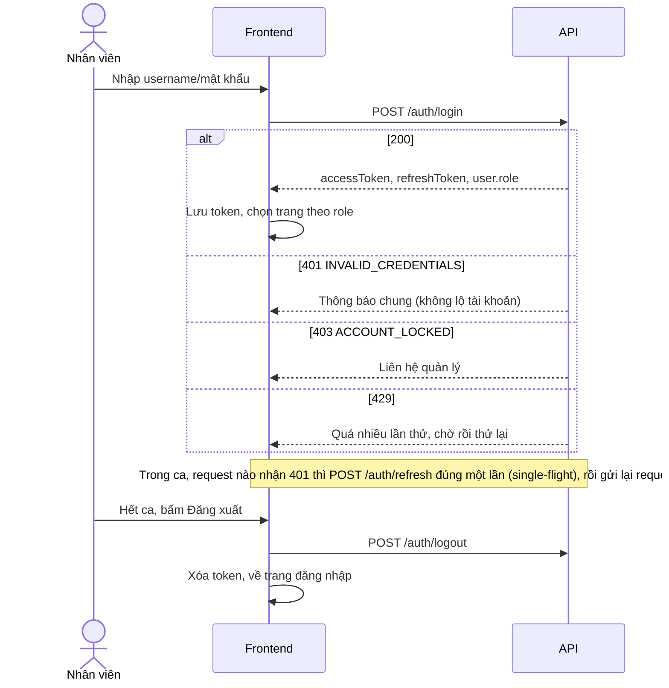
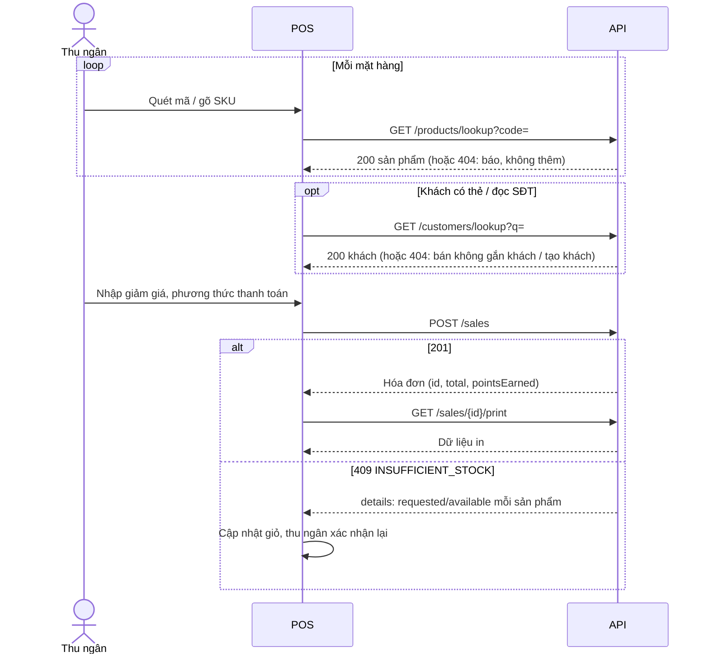
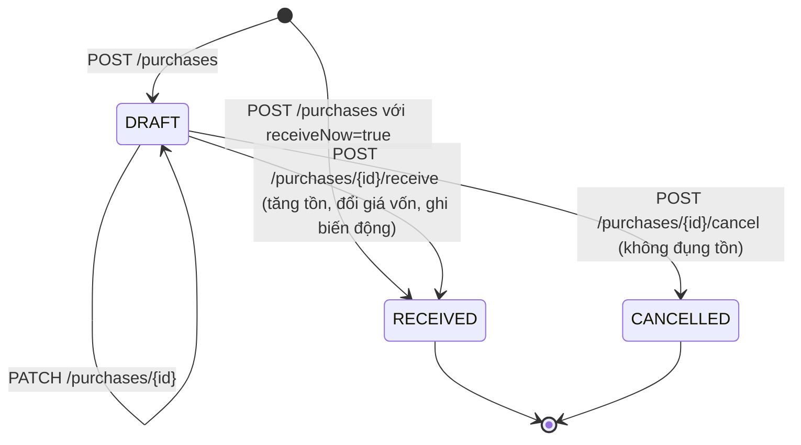
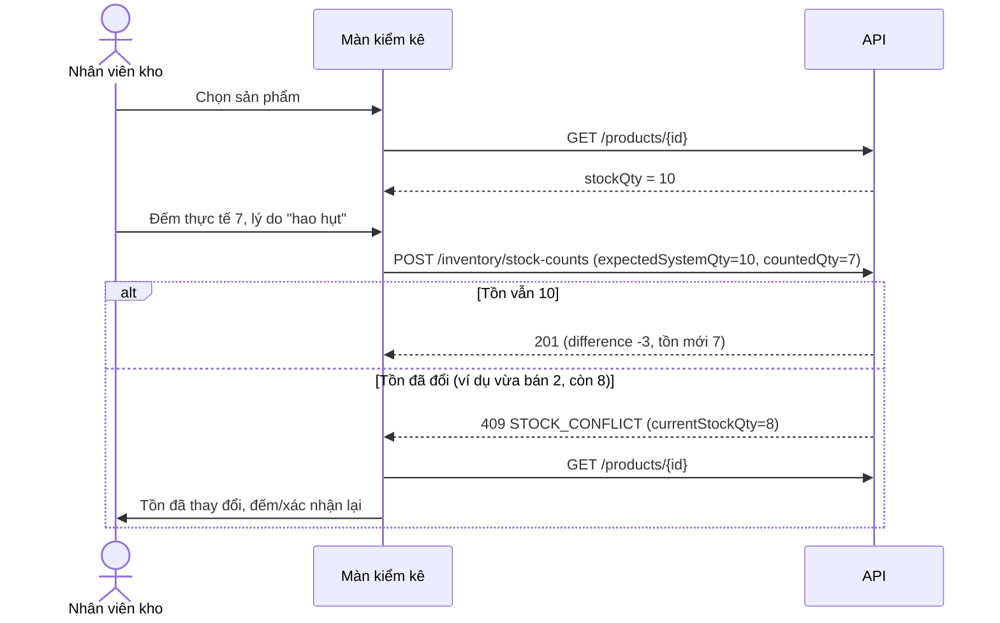
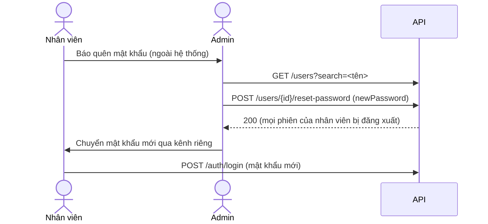

<!--
DOCUMENT METADATA
Owner: @backend-developer
Update trigger: Any endpoint, role, screen flow or business rule that changes how an API should be used
Update scope: Affected sections; every operation of openapi.json must keep its own "#### METHOD /path" heading in section 3 (enforced by src/common/swagger/contract-docs.spec.ts)
Read by: @frontend-developer, @qa-engineer, @ui-ux-designer, @project-manager, reviewers
Language: Vietnamese prose; code, endpoint paths, field names, enums and error codes stay in English
-->

# Hướng dẫn mục đích và cách dùng API

> **Trạng thái**: Live (API v1) · **Cập nhật lần cuối**: 2026-10-02
> Tài liệu này trả lời câu hỏi **"API nào dùng để làm gì, gọi khi nào, ở màn hình nào, ai được gọi"**. Hình dạng request/response, mã lỗi chi tiết và luồng xác thực nằm ở [`api_integration_guide.md`](api_integration_guide.md), [`API.md`](API.md) và [`openapi.json`](openapi.json); tài liệu này không lặp lại chúng.

## Mục lục

1. [Giới thiệu](#1-giới-thiệu)
2. [Bản đồ màn hình → API](#2-bản-đồ-màn-hình--api)
3. [Danh mục API theo nhóm nghiệp vụ](#3-danh-mục-api-theo-nhóm-nghiệp-vụ)
4. [Kịch bản nghiệp vụ end-to-end](#4-kịch-bản-nghiệp-vụ-end-to-end)
5. [Ma trận truy vết SRS → API](#5-ma-trận-truy-vết-srs--api)
6. [Câu hỏi thường gặp cho frontend/QA](#6-câu-hỏi-thường-gặp-cho-frontendqa)

---

## 1. Giới thiệu

### 1.1 Hệ thống là gì

Ứng dụng web quản lý **siêu thị mini một cửa hàng, một kho** thay cho sổ sách/Excel (SRS mục 1): quản lý hàng hóa và tồn kho, nhập hàng, bán hàng tại quầy (POS), khách hàng thân thiết, kiểm kê và báo cáo. API là REST, tiền tệ VND, mọi thao tác ghi đều gắn với một tài khoản nhân viên đã đăng nhập. **Khách hàng không có tài khoản** và không bao giờ gọi API; nhân viên tra cứu khách theo mã hoặc số điện thoại.

### 1.2 Ba vai trò

| Vai trò | Người dùng thực tế | Làm được gì (tóm tắt) |
|---------|--------------------|------------------------|
| `ADMIN` | Quản lý / chủ cửa hàng | Tất cả: người dùng, danh mục, sản phẩm, nhà cung cấp, nhập hàng, bán hàng, khách hàng, tồn kho, kiểm kê, mọi báo cáo |
| `CASHIER` | Nhân viên bán hàng | Tra cứu sản phẩm (không thấy `costPrice`) và tồn hiện tại, lập hóa đơn, in/in lại, tra cứu và tạo khách hàng |
| `STOCKKEEPER` | Nhân viên kho | Sản phẩm, danh mục, nhà cung cấp, phiếu nhập, tồn kho, cảnh báo tồn thấp, biến động kho, kiểm kê, báo cáo tồn kho |

Quyền được kiểm tra **ở server** (route mặc định bị từ chối, sai vai trò trả `403 FORBIDDEN`). Frontend ẩn menu/nút theo vai trò chỉ để thân thiện, không phải để bảo mật. Danh sách vai trò của từng endpoint lấy từ `x-roles` trong `openapi.json` và được lặp lại ở mục "Ai dùng" bên dưới.

### 1.3 Quan hệ giữa các tài liệu

| Tài liệu | Trả lời câu hỏi | Dùng khi |
|----------|------------------|----------|
| **File này** (`api_usage_guide.md`) | *Mục đích*: API làm gì, khi nào gọi, ở đâu, ai gọi, thứ tự gọi, tác động dữ liệu | Thiết kế màn hình, viết test nghiệp vụ, hiểu "nên gọi API nào" |
| [`api_integration_guide.md`](api_integration_guide.md) | *Cách tích hợp*: envelope, luồng token, phân trang, định dạng tiền/ngày, danh mục mã lỗi, ví dụ code | Viết `apiFetch`, xử lý lỗi, map form |
| [`API.md`](API.md) | *Hợp đồng bằng lời* (tiếng Anh): request/response và quy tắc từng endpoint | Cần chi tiết trường và điều kiện |
| [`openapi.json`](openapi.json) / [`api-types.ts`](api-types.ts) | *Hợp đồng máy đọc* (nguồn sự thật): schema, enum, `x-roles`, mã lỗi | Sinh client/type; khi các tài liệu khác mâu thuẫn |

Quy ước trong tài liệu này:

- Mỗi endpoint ở mục 3 có một tiêu đề `#### METHOD /path` (bỏ tiền tố `/api/v1`). Một unit test (`contract-docs.spec.ts`) đọc `openapi.json` và **fail nếu thiếu tiêu đề của bất kỳ endpoint nào**, nên tài liệu không thể lạc hậu một cách âm thầm khi thêm endpoint.
- Mã tham chiếu: **F1–F10** (chức năng), **UC-01–UC-05** (use case), **BR1–BR11** (quy tắc nghiệp vụ), **NF1–NF8** (phi chức năng) lấy từ SRS.
- "Link hợp đồng" trỏ tới mục tương ứng trong `API.md`; không có schema ở đây.

---

## 2. Bản đồ màn hình → API

SRS không quy định danh sách màn hình; dưới đây là **đề xuất** suy ra từ F1–F10 và UC-01–UC-05 (frontend có thể gộp/tách miễn giữ đúng thứ tự gọi và quyền). API **không có endpoint "giỏ hàng" hay "dashboard"**: giỏ hàng nằm ở client cho đến khi `POST /sales`; dashboard là tổng hợp từ các endpoint báo cáo/tồn kho.

### 2.1 Bảng tổng hợp

| # | Màn hình | Vai trò mở được | API chính |
|---|----------|-----------------|-----------|
| S01 | Đăng nhập | Công khai | `POST /auth/login` |
| S02 | Trang chủ / Dashboard theo vai trò | Cả 3 (nội dung khác nhau) | `GET /auth/me`, `GET /reports/*`, `GET /inventory/low-stock`, `GET /sales`, `GET /purchases` |
| S03 | POS bán hàng | `ADMIN`, `CASHIER` | `GET /products/lookup`, `GET /products`, `GET /customers/lookup`, `POST /customers`, `POST /sales`, `GET /sales/{id}/print` |
| S04 | Lịch sử hóa đơn và in lại | `ADMIN`, `CASHIER` | `GET /sales`, `GET /sales/{id}`, `GET /sales/{id}/print` |
| S05 | Khách hàng | `ADMIN`, `CASHIER` | `GET /customers`, `POST /customers`, `GET /customers/{id}`, `PATCH /customers/{id}`, `GET /sales?customerId=` |
| S06 | Sản phẩm | Xem: cả 3; sửa: `ADMIN`, `STOCKKEEPER` | `GET/POST/PATCH /products`, `deactivate`/`activate`, `GET /categories` |
| S07 | Danh mục | Xem: cả 3; sửa: `ADMIN`, `STOCKKEEPER` | `GET/POST/PATCH /categories`, `deactivate`/`activate` |
| S08 | Nhà cung cấp | `ADMIN`, `STOCKKEEPER` | `GET/POST/PATCH /suppliers`, `deactivate`/`activate` |
| S09a | Phiếu nhập: danh sách | `ADMIN`, `STOCKKEEPER` | `GET /purchases`, `GET /suppliers` |
| S09b | Phiếu nhập: tạo / sửa nháp | `ADMIN`, `STOCKKEEPER` | `GET /suppliers`, `GET /products`, `POST /purchases`, `PATCH /purchases/{id}` |
| S09c | Phiếu nhập: chi tiết | `ADMIN`, `STOCKKEEPER` | `GET /purchases/{id}`, `POST /purchases/{id}/receive`, `POST /purchases/{id}/cancel` |
| S10 | Tồn kho và cảnh báo | Tồn: cả 3; cảnh báo: `ADMIN`, `STOCKKEEPER` | `GET /inventory/stock`, `GET /inventory/low-stock` |
| S11 | Kiểm kê | `ADMIN`, `STOCKKEEPER` | `GET /inventory/stock`, `GET /products/{id}`, `POST /inventory/stock-counts`, `GET /inventory/stock-counts` |
| S12 | Lịch sử biến động kho | `ADMIN`, `STOCKKEEPER` | `GET /inventory/movements`, `GET /products` |
| S13a | Báo cáo doanh thu | `ADMIN` | `GET /reports/revenue` |
| S13b | Báo cáo sản phẩm bán chạy | `ADMIN` | `GET /reports/top-products` |
| S13c | Báo cáo lợi nhuận gộp | `ADMIN` | `GET /reports/gross-profit` |
| S13d | Báo cáo tồn kho | `ADMIN`, `STOCKKEEPER` | `GET /reports/inventory`, `GET /categories` |
| S14 | Quản lý nhân viên | `ADMIN` | `GET/POST/PATCH /users`, `lock`/`unlock`/`reset-password` |
| S15 | Hồ sơ cá nhân | Cả 3 | `GET /auth/me`, `POST /auth/logout` |

Màn hình nền, không có giao diện riêng: **phiên làm việc** (`POST /auth/refresh` do `apiFetch` gọi tự động khi gặp `401`) và **`GET /health`** (giám sát, xem mục 3.1).

Cách đọc các mục con: "Khi mở" là các lời gọi lúc vào màn hình; "Thao tác" là các lời gọi theo nút/ô tìm kiếm; số thứ tự thể hiện **thứ tự gọi**. Các lời gọi cùng số có thể chạy song song.

### 2.2 S01. Đăng nhập (UC-01, F1)

- **Ai mở**: bất kỳ ai chưa có phiên.
- **Khi mở**: không gọi API. Nếu có phiên đã lưu thì thay bằng `GET /auth/me` (xem S15) để quyết định có bỏ qua trang này không.
- **Thao tác**:
  1. Bấm "Đăng nhập": `POST /auth/login` (đã có `user.role` trong phản hồi, **không cần** gọi `/auth/me` ngay).
  2. Điều hướng theo vai trò: `ADMIN` → S02; `CASHIER` → S03 (POS); `STOCKKEEPER` → S10.
- **Lưu ý**: `401 INVALID_CREDENTIALS` dùng một thông báo chung (không lộ tài khoản có tồn tại không); `403 ACCOUNT_LOCKED` chỉ hiện sau khi đúng mật khẩu; `429` khi gõ sai quá 5 lần/60 giây/IP (mặc định).

### 2.3 S02. Trang chủ / Dashboard theo vai trò (F8, F9)

Không có endpoint dashboard riêng; mỗi vai trò ghép các lời gọi chỉ đọc sau (đều chạy song song):

| Vai trò | Khối hiển thị | API |
|---------|---------------|-----|
| `ADMIN` | Doanh thu hôm nay / tháng này | `GET /reports/revenue?from=<ngày>&to=<ngày>&groupBy=day` (và một lời gọi `groupBy=month` cho tháng) |
| `ADMIN` | Top sản phẩm | `GET /reports/top-products?from&to&limit=5` |
| `ADMIN` | Lợi nhuận gộp ước tính | `GET /reports/gross-profit?from&to` |
| `ADMIN`, `STOCKKEEPER` | Số mặt hàng sắp hết | `GET /inventory/low-stock?pageSize=1` rồi đọc `meta.total` |
| `STOCKKEEPER` | Phiếu nhập nháp chờ nhận | `GET /purchases?status=DRAFT&pageSize=5` |
| `CASHIER` | Hóa đơn hôm nay của tôi | `GET /sales?cashierId=<me.id>&from=<hôm nay>&to=<hôm nay>` (`me.id` lấy từ `GET /auth/me`) |

`CASHIER` không có quyền `/reports/*` (sẽ nhận `403`); đừng gọi chúng rồi nuốt lỗi, chỉ không vẽ khối đó.

### 2.4 S03. POS bán hàng (UC-02, F6, F7, F10)

- **Ai mở**: `ADMIN`, `CASHIER`.
- **Khi mở**: không bắt buộc gọi API. Giỏ hàng rỗng ở client. (Tùy chọn: `GET /auth/me` nếu cần hiện tên thu ngân; thông tin cửa hàng chỉ có trên bản in.)
- **Thao tác**:
  1. **Quét mã vạch / nhập SKU** → `GET /products/lookup?code=` (khớp chính xác, chỉ sản phẩm đang bán). `404 PRODUCT_NOT_FOUND` = không có hoặc đã ngừng bán: báo, không thêm vào giỏ.
  2. **Gõ tên để tìm** (không có mã) → `GET /products?search=&isActive=true&pageSize=20`; chọn một dòng rồi thêm vào giỏ.
  3. **Gắn khách (tùy chọn)** → `GET /customers/lookup?q=<mã hoặc SĐT>`. `404 CUSTOMER_NOT_FOUND` → tiếp tục không gắn khách hoặc mở "Khách mới" (4).
  4. **Khách mới tại quầy** → `POST /customers` rồi dùng `id` trả về.
  5. **Thanh toán** → `POST /sales` (một lần duy nhất, kèm `customerId?`, `items`, `discountAmount?`, `payments`).
  6. **In hóa đơn** → `GET /sales/{id}/print` với `id` của bước 5.
- **Thứ tự**: (1 hoặc 2) lặp lại → (3 hoặc 3→4, tùy chọn) → 5 → 6.
- **Lưu ý**: số tồn trong `ProductResponse` chỉ để hiển thị; việc chặn bán vượt tồn do `POST /sales` quyết định (`409 INSUFFICIENT_STOCK`). Tính tạm tiền ở client chỉ để hiển thị, số chính thức là phản hồi của `POST /sales`.

### 2.5 S04. Lịch sử hóa đơn và in lại (F6, F10, UC-02 E7)

- **Ai mở**: `ADMIN`, `CASHIER` (thu ngân thấy hóa đơn của mọi người).
- **Khi mở**: `GET /sales?page=1&pageSize=20` (mặc định mới nhất trước).
- **Thao tác**:
  1. Ô tìm số hóa đơn → `GET /sales?search=<một phần số HD>`.
  2. Lọc khách → `GET /sales?customerQuery=<SĐT hoặc mã KH>`; lọc thanh toán → `paymentMethod=`; lọc ngày → `from=&to=`; lọc thu ngân → `cashierId=`.
  3. Bấm một dòng → `GET /sales/{id}` (có `items`, `payments`).
  4. Bấm "In lại" → `GET /sales/{id}/print` rồi `window.print()`. **Không** gọi `POST /sales`.

### 2.6 S05. Khách hàng (F7, F10)

- **Ai mở**: `ADMIN`, `CASHIER`.
- **Khi mở**: `GET /customers` (mới nhất trước).
- **Thao tác**: tìm → `GET /customers?search=` (tên, mã hoặc SĐT); "Thêm khách" → `POST /customers`; mở chi tiết → `GET /customers/{id}` (và `GET /sales?customerId={id}` để hiện lịch sử mua); sửa → `PATCH /customers/{id}`.
- **Lưu ý**: không có endpoint xóa, không sửa được `loyaltyPoints` (điểm chỉ do `POST /sales` cộng).

### 2.7 S06. Sản phẩm (F3, F10)

- **Ai mở**: xem: cả 3 (thu ngân không thấy `costPrice`); thêm/sửa/ngừng bán: `ADMIN`, `STOCKKEEPER`.
- **Khi mở**: song song `GET /products?page=1&pageSize=20` và `GET /categories?isActive=true&pageSize=100` (để nạp bộ lọc/ô chọn danh mục).
- **Thao tác**: tìm → `GET /products?search=&categoryId=&isActive=`; "Thêm" → `POST /products`; "Sửa" → `PATCH /products/{id}`; "Ngừng bán" → `POST /products/{id}/deactivate`; "Bán lại" → `POST /products/{id}/activate`.
- **Lưu ý**: form không có ô sửa `stockQty`/`costPrice` (gửi sẽ bị `400`). Tồn thay đổi qua nhập hàng, bán hàng, kiểm kê; giá vốn đổi khi nhận phiếu nhập.

### 2.8 S07. Danh mục (F3)

- **Ai mở**: xem: cả 3; sửa: `ADMIN`, `STOCKKEEPER`.
- **Khi mở**: `GET /categories`.
- **Thao tác**: "Thêm" → `POST /categories`; "Sửa" → `PATCH /categories/{id}`; "Ngừng dùng" / "Dùng lại" → `POST /categories/{id}/deactivate` / `activate`; tìm → `GET /categories?search=`.

### 2.9 S08. Nhà cung cấp (F4)

- **Ai mở**: `ADMIN`, `STOCKKEEPER`.
- **Khi mở**: `GET /suppliers`.
- **Thao tác**: tìm → `GET /suppliers?search=` (tên, SĐT, email); "Thêm" → `POST /suppliers`; "Sửa" → `PATCH /suppliers/{id}`; "Ngừng hợp tác" / "Mở lại" → `deactivate` / `activate`; xem chi tiết → `GET /suppliers/{id}`.

### 2.10 S09. Phiếu nhập (F5, UC-03)

**S09a Danh sách** (`ADMIN`, `STOCKKEEPER`). Khi mở: song song `GET /purchases` và `GET /suppliers?isActive=true` (cho bộ lọc). Thao tác: lọc `status=`, `supplierId=`, `from=&to=`, ô tìm `search=<số phiếu>`; bấm dòng → S09c; nút "Tạo phiếu" → S09b.

**S09b Tạo / sửa nháp**. Khi mở: song song `GET /suppliers?isActive=true` (ô chọn NCC); khi gõ tìm hàng: `GET /products?search=&isActive=true`. Thao tác:
1. "Lưu nháp" → `POST /purchases` (không `receiveNow`) → chuyển sang S09c.
2. "Lưu và nhận hàng ngay" → `POST /purchases` với `receiveNow: true` (tạo và nhận trong một giao dịch).
3. Mở lại một phiếu `DRAFT` để sửa → `GET /purchases/{id}` nạp form, "Lưu" → `PATCH /purchases/{id}` (nếu gửi `items` thì **thay toàn bộ dòng**).

**S09c Chi tiết**. Khi mở: `GET /purchases/{id}`. Thao tác (chỉ hiện khi `status = DRAFT`): "Xác nhận nhận hàng" → `POST /purchases/{id}/receive`; "Hủy phiếu" → `POST /purchases/{id}/cancel`; "Sửa" → S09b. Sau mỗi thao tác dùng luôn phản hồi (là phiếu đã cập nhật), không cần gọi lại `GET`.

### 2.11 S10. Tồn kho và cảnh báo (F9)

- **Ai mở**: bảng tồn: cả 3; tab "Sắp hết hàng": `ADMIN`, `STOCKKEEPER`.
- **Khi mở**: `GET /inventory/stock` (mặc định chỉ sản phẩm đang bán). Tab cảnh báo: `GET /inventory/low-stock`.
- **Thao tác**: tìm → `?search=` (tên, SKU, mã vạch); lọc danh mục → `?categoryId=`; công tắc "chỉ hàng sắp hết" ở bảng tồn → `lowStock=true`. Từ một dòng cảnh báo bấm "Lập phiếu nhập" → S09b với sản phẩm đã điền sẵn. Bấm "Kiểm kê" → S11.

### 2.12 S11. Kiểm kê (UC-04, F9)

- **Ai mở**: `ADMIN`, `STOCKKEEPER`.
- **Khi mở**: `GET /inventory/stock?search=` để chọn sản phẩm (hoặc nhận `productId` từ S10); lịch sử các lần đếm: `GET /inventory/stock-counts`.
- **Thao tác**:
  1. Chọn sản phẩm → **đọc lại tồn mới nhất** bằng `GET /products/{id}` (hoặc `GET /inventory/stock?search=<sku>`). Giá trị `stockQty` đọc được chính là `expectedSystemQty`.
  2. Nhập số đếm và lý do → "Ghi nhận" → `POST /inventory/stock-counts` với `{ productId, countedQty, reason, expectedSystemQty }`.
  3. `409 STOCK_CONFLICT` → quay lại bước 1 (tải lại, cho người dùng xác nhận lại với tồn mới).
- **Lưu ý**: không dùng số `stockQty` nằm trong danh sách đã mở từ lâu.

### 2.13 S12. Lịch sử biến động kho (F9)

- **Ai mở**: `ADMIN`, `STOCKKEEPER`.
- **Khi mở**: `GET /inventory/movements` (mới nhất trước).
- **Thao tác**: lọc `productId=` (chọn sản phẩm qua `GET /products?search=`), `type=PURCHASE|SALE|ADJUSTMENT|REVERSAL`, `from=&to=`. `referenceType`/`referenceId` cho phép chuyển sang phiếu nhập, hóa đơn hoặc lần kiểm kê tương ứng.

### 2.14 S13. Báo cáo (F8, UC-05)

Bốn tab, mỗi tab một lời gọi khi bấm "Xem" (luôn truyền cả `from` và `to`, `YYYY-MM-DD`, tối đa 366 ngày, `to` bao gồm cả ngày đó):

| Tab | Vai trò | Khi mở / thao tác |
|-----|---------|-------------------|
| Doanh thu | `ADMIN` | `GET /reports/revenue?from&to&groupBy=day hoặc month` |
| Bán chạy | `ADMIN` | `GET /reports/top-products?from&to&limit&sortBy=quantity hoặc revenue` |
| Lợi nhuận gộp | `ADMIN` | `GET /reports/gross-profit?from&to&groupBy=day hoặc month` |
| Tồn kho | `ADMIN`, `STOCKKEEPER` | `GET /reports/inventory?from&to&categoryId&search&isActive&page&pageSize` (song song `GET /categories` cho bộ lọc) |

Khoảng ngày trống vẫn trả `200` với `rows` rỗng: hiển thị "Không có dữ liệu" (UC-05 E3), không phải lỗi. `400 INVALID_DATE_RANGE`: nhắc người dùng sửa bộ lọc (UC-05 E1).

### 2.15 S14. Quản lý nhân viên (F2)

- **Ai mở**: chỉ `ADMIN`.
- **Khi mở**: `GET /users`.
- **Thao tác**: tìm/lọc → `GET /users?search=&role=&isActive=`; "Thêm nhân viên" → `POST /users`; xem → `GET /users/{id}`; đổi tên hiển thị/vai trò → `PATCH /users/{id}`; "Khóa" → `POST /users/{id}/lock`; "Mở khóa" → `POST /users/{id}/unlock`; "Đặt lại mật khẩu" → `POST /users/{id}/reset-password`.
- **Lưu ý**: nút "Khóa" của chính mình bị `409 CANNOT_LOCK_SELF`; khóa/hạ quyền admin hoạt động cuối cùng bị `409 LAST_ACTIVE_ADMIN`.

### 2.16 S15. Hồ sơ cá nhân

- **Ai mở**: cả 3 vai trò.
- **Khi mở**: `GET /auth/me` (tên, tên đăng nhập, vai trò).
- **Thao tác**: "Đăng xuất" → `POST /auth/logout`, rồi xóa token ở client và chuyển về S01 (kể cả khi lời gọi lỗi).
- **Khoảng trống**: API **không có** endpoint tự đổi mật khẩu hay sửa hồ sơ; người dùng phải nhờ `ADMIN` (S14, `reset-password`). Xem mục 5.3.

---

## 3. Danh mục API theo nhóm nghiệp vụ

Mỗi endpoint có một bảng cùng khuôn. Cách đọc các dòng:

- **Ai dùng**: vai trò từ `x-roles` của `openapi.json` ("Công khai" = không cần token).
- **Gọi trước / sau**: các lời gọi nên có trước và nên làm sau.
- **Tác động dữ liệu**: "Chỉ đọc" hoặc những gì được ghi; **giao dịch** = ghi nhiều bảng trong một transaction (lỗi thì rollback toàn bộ, NF4); **retry** = có an toàn khi gọi lại không.
- Cuối mỗi bảng có link **hợp đồng** tới mục tương ứng của [`API.md`](API.md) (request, response, mã lỗi).

### 3.1 Hệ thống và xác thực

#### GET /health

| | |
|---|---|
| **Mục đích** | Kiểm tra server còn sống và kết nối được cơ sở dữ liệu (`SELECT 1`). |
| **Khi nào dùng** | Giám sát, healthcheck của Docker/load balancer/CI, hoặc một banner "mất kết nối" của frontend. **Không** gọi trước mỗi thao tác nghiệp vụ. |
| **Ở đâu** | Không thuộc màn hình nghiệp vụ nào. |
| **Ai dùng** | Công khai (hệ thống giám sát, DevOps). |
| **Gọi trước / sau** | Không phụ thuộc. |
| **Tác động dữ liệu** | Chỉ đọc. Retry an toàn. |
| **Quy tắc liên quan** | NF4 (độ tin cậy); UC-01 E4 và UC-05 E4 (DB không sẵn sàng → `503 SERVICE_UNAVAILABLE`). |
| **Lưu ý** | `200` chỉ có nghĩa "server và DB lên"; nó không chứng minh phiên của người dùng còn hiệu lực. Hợp đồng: [`API.md#health`](API.md#health). |

#### POST /auth/login

| | |
|---|---|
| **Mục đích** | Xác thực tên đăng nhập + mật khẩu, mở một phiên và cấp `accessToken` (mặc định 15 phút) cùng `refreshToken` xoay vòng (mặc định 7 ngày). |
| **Khi nào dùng** | Khi người dùng bấm "Đăng nhập", hoặc khi refresh thất bại (`401`) và phiên đã mất. **Không** gọi để "làm mới" token còn hạn; dùng `POST /auth/refresh`. |
| **Ở đâu** | S01 Đăng nhập. |
| **Ai dùng** | Công khai (mọi nhân viên). |
| **Gọi trước / sau** | Không cần gì trước. Sau: lưu token, điều hướng theo `user.role`. Phản hồi đã chứa `user`, không cần `GET /auth/me` ngay. |
| **Tác động dữ liệu** | Tạo một bản ghi phiên (`user_sessions`) lưu **hash** của refresh token, user-agent, IP. Không đổi dữ liệu nghiệp vụ. Mỗi lần gọi tạo một phiên mới, nên không tự động gọi lặp. |
| **Quy tắc liên quan** | F1, UC-01 (E1 thiếu trường → `400`; E2 sai thông tin → `401 INVALID_CREDENTIALS` thông báo chung; E3 khóa → `403 ACCOUNT_LOCKED`), NF2. |
| **Lưu ý** | Giới hạn nghiêm ngặt: mặc định 5 lần/60 giây/IP, vượt thì `429`. `ACCOUNT_LOCKED` chỉ lộ ra khi **đúng mật khẩu** (không dò được tài khoản nào tồn tại). Tên đăng nhập không phân biệt hoa thường. Hợp đồng: [`API.md#auth`](API.md#auth); luồng token: [`api_integration_guide.md`](api_integration_guide.md) mục 3. |

#### POST /auth/refresh

| | |
|---|---|
| **Mục đích** | Đổi refresh token lấy access token mới (và refresh token mới) của **cùng một phiên**, để người dùng không phải đăng nhập lại mỗi 15 phút. |
| **Khi nào dùng** | Khi một request nhận `401 UNAUTHENTICATED` vì access token hết hạn: refresh **một lần**, rồi gửi lại request gốc. Không gọi định kỳ theo đồng hồ. |
| **Ở đâu** | Lớp `apiFetch` (không phải màn hình). |
| **Ai dùng** | Công khai theo route, nhưng cần refresh token hợp lệ (mọi vai trò đang đăng nhập). |
| **Gọi trước / sau** | Trước: một request bị `401`. Sau: lưu **cả hai** token mới, gửi lại request gốc. Nếu refresh trả `401` → xóa token, về S01. |
| **Tác động dữ liệu** | Ghi: xoay hash refresh token của phiên (compare-and-set), kéo dài hạn phiên. Token cũ chết ngay. **Không retry** bằng token cũ. |
| **Quy tắc liên quan** | F1, NF2. |
| **Lưu ý** | **Không bao giờ gọi refresh song song** (nhiều request cùng `401`): chỉ một cái thắng, cái còn lại dùng token đã xoay → bị coi là tái sử dụng và **thu hồi cả phiên** (`INVALID_REFRESH_TOKEN`). Phải gộp bằng một promise dùng chung (single-flight). Cẩn thận với nhiều tab dùng chung token. Hợp đồng: [`API.md#sessions-and-refresh-tokens`](API.md#sessions-and-refresh-tokens). |

#### POST /auth/logout

| | |
|---|---|
| **Mục đích** | Kết thúc phiên hiện tại: access token và refresh token của phiên đó vô hiệu ngay. |
| **Khi nào dùng** | Khi người dùng bấm "Đăng xuất" hoặc hết ca. Khi token đã hết hạn thì chỉ cần xóa token ở client, không cần gọi. |
| **Ở đâu** | S15 Hồ sơ cá nhân / menu người dùng. |
| **Ai dùng** | `ADMIN`, `CASHIER`, `STOCKKEEPER`. |
| **Gọi trước / sau** | Sau: xóa token, về S01. Phản hồi `200` với `data: null`. |
| **Tác động dữ liệu** | Ghi: đặt `revokedAt` cho phiên. Chỉ ảnh hưởng thiết bị này; các phiên khác của cùng tài khoản vẫn sống. Idempotent, retry an toàn. |
| **Quy tắc liên quan** | F1 ("kết thúc phiên khi đăng xuất"), UC-01. |
| **Lưu ý** | Dù lời gọi lỗi mạng, client vẫn nên xóa token cục bộ. Hợp đồng: [`API.md#auth`](API.md#auth). |

#### GET /auth/me

| | |
|---|---|
| **Mục đích** | Trả người dùng của phiên hiện tại (`id`, `username`, `fullName`, `role`). |
| **Khi nào dùng** | Khi tải lại trang với token đã lưu (khôi phục phiên, xác định vai trò để dựng menu); để lấy `id` cho bộ lọc `cashierId`. **Không** gọi sau `login` (đã có `user`). |
| **Ở đâu** | Khởi động ứng dụng, S02, S15. |
| **Ai dùng** | `ADMIN`, `CASHIER`, `STOCKKEEPER`. |
| **Gọi trước / sau** | Sau: dựng menu theo `role`. Nếu `401` thì refresh một lần. |
| **Tác động dữ liệu** | Chỉ đọc. Retry an toàn. |
| **Quy tắc liên quan** | F1; vai trò đọc từ DB nên đổi vai trò/khóa có hiệu lực ngay. |
| **Lưu ý** | Là cách rẻ nhất để biết phiên còn sống. `401` sau khi đã refresh → về S01. Hợp đồng: [`API.md#auth`](API.md#auth). |

### 3.2 Người dùng (chỉ ADMIN)

Toàn nhóm: **F2, BR10**. Không có endpoint xóa; ngừng một tài khoản = **khóa**. Mật khẩu không bao giờ được trả về.

#### GET /users

| | |
|---|---|
| **Mục đích** | Liệt kê tài khoản nhân viên, tìm theo tên đăng nhập/họ tên, lọc vai trò và trạng thái. |
| **Khi nào dùng** | Khi mở màn quản lý nhân viên hoặc tìm một tài khoản để khóa/đặt lại mật khẩu. |
| **Ở đâu** | S14. |
| **Ai dùng** | `ADMIN`. |
| **Gọi trước / sau** | Sau: `GET /users/{id}`, `PATCH`, `lock`/`unlock`/`reset-password`. |
| **Tác động dữ liệu** | Chỉ đọc. Retry an toàn. |
| **Quy tắc liên quan** | F2, F10. |
| **Lưu ý** | `STOCKKEEPER` và `CASHIER` nhận `403` (SRS bảng quyền nói kho được "tra cứu" tài khoản, API hiện chỉ cho `ADMIN`; xem mục 5.3). Hợp đồng: [`API.md#users`](API.md#users). |

#### POST /users

| | |
|---|---|
| **Mục đích** | Tạo tài khoản nhân viên mới với vai trò và mật khẩu ban đầu. |
| **Khi nào dùng** | Khi tuyển nhân viên mới. Không dùng để "mở lại" nhân viên cũ: dùng `unlock`. |
| **Ở đâu** | S14, nút "Thêm nhân viên". |
| **Ai dùng** | `ADMIN`. |
| **Gọi trước / sau** | Sau: chuyển username/mật khẩu cho nhân viên qua kênh riêng; nhân viên tự đăng nhập. |
| **Tác động dữ liệu** | Ghi một `users` (mật khẩu lưu dạng hash mạnh). Không retry mù: gọi lặp trả `409 DUPLICATE_VALUE` (username đã có). |
| **Quy tắc liên quan** | F2, NF2. |
| **Lưu ý** | `username` được lưu chữ thường, 3–50 ký tự `a-zA-Z0-9._-`; mật khẩu 8–128 ký tự. Hợp đồng: [`API.md#users`](API.md#users). |

#### GET /users/{id}

| | |
|---|---|
| **Mục đích** | Xem chi tiết một tài khoản. |
| **Khi nào dùng** | Khi mở form sửa hoặc trang chi tiết nhân viên. Muốn danh sách thì dùng `GET /users`. |
| **Ở đâu** | S14, hộp thoại sửa. |
| **Ai dùng** | `ADMIN`. |
| **Gọi trước / sau** | Sau khi chọn một dòng từ `GET /users`. |
| **Tác động dữ liệu** | Chỉ đọc. Retry an toàn. |
| **Quy tắc liên quan** | F2. |
| **Lưu ý** | `404 USER_NOT_FOUND` nếu id sai. Hợp đồng: [`API.md#users`](API.md#users). |

#### PATCH /users/{id}

| | |
|---|---|
| **Mục đích** | Sửa `fullName` và/hoặc gán lại `role` cho nhân viên. |
| **Khi nào dùng** | Khi nhân viên đổi tên hoặc chuyển vị trí (ví dụ thu ngân sang kho). Không dùng để khóa (dùng `lock`) hay đổi mật khẩu (dùng `reset-password`). |
| **Ở đâu** | S14, hộp thoại sửa. |
| **Ai dùng** | `ADMIN`. |
| **Gọi trước / sau** | Trước: `GET /users/{id}`. |
| **Tác động dữ liệu** | Ghi một `users`, trong transaction. Idempotent, retry an toàn. **Không** thu hồi phiên: token đang dùng vẫn hợp lệ, nhưng vai trò được đọc lại từ DB ở mỗi request. |
| **Quy tắc liên quan** | F2, BR10. |
| **Lưu ý** | Hạ quyền admin hoạt động cuối cùng → `409 LAST_ACTIVE_ADMIN`. Không đổi được `username`. Hợp đồng: [`API.md#users`](API.md#users). |

#### POST /users/{id}/lock

| | |
|---|---|
| **Mục đích** | Khóa tài khoản (`isActive=false`) và **đăng xuất ngay mọi phiên** của người đó. |
| **Khi nào dùng** | Nhân viên nghỉ việc, nghi ngờ lộ mật khẩu, hoặc tạm ngưng. **Không xóa** tài khoản vì đã gắn hóa đơn/phiếu nhập/biến động kho (BR10). |
| **Ở đâu** | S14, nút "Khóa". |
| **Ai dùng** | `ADMIN`. |
| **Gọi trước / sau** | Sau: tải lại danh sách. Muốn dùng lại: `unlock`. |
| **Tác động dữ liệu** | Ghi: `users.isActive`, và đặt `revokedAt` cho mọi phiên đang mở, trong một transaction. Idempotent. Token của người bị khóa bị `401` ở request kế tiếp. |
| **Quy tắc liên quan** | F2, BR10, F1. |
| **Lưu ý** | Không tự khóa mình (`409 CANNOT_LOCK_SELF`); không khóa admin hoạt động cuối cùng (`409 LAST_ACTIVE_ADMIN`). Hợp đồng: [`API.md#users`](API.md#users). |

#### POST /users/{id}/unlock

| | |
|---|---|
| **Mục đích** | Mở lại tài khoản đã khóa. |
| **Khi nào dùng** | Nhân viên quay lại làm việc. |
| **Ở đâu** | S14, nút "Mở khóa". |
| **Ai dùng** | `ADMIN`. |
| **Gọi trước / sau** | Sau: nên `reset-password` nếu khóa vì nghi lộ mật khẩu; nhân viên đăng nhập lại. |
| **Tác động dữ liệu** | Ghi: `users.isActive=true`. **Không** khôi phục phiên cũ (đã bị thu hồi khi khóa), phải đăng nhập lại. Idempotent. |
| **Quy tắc liên quan** | F2. |
| **Lưu ý** | Mật khẩu cũ vẫn dùng được trừ khi đặt lại. Hợp đồng: [`API.md#users`](API.md#users). |

#### POST /users/{id}/reset-password

| | |
|---|---|
| **Mục đích** | Admin đặt mật khẩu mới cho nhân viên (quy trình "quên mật khẩu") và đăng xuất mọi phiên của họ. |
| **Khi nào dùng** | Nhân viên quên mật khẩu, hoặc sau sự cố bảo mật. Không có API tự đổi mật khẩu, nên đây là đường duy nhất. |
| **Ở đâu** | S14, nút "Đặt lại mật khẩu". |
| **Ai dùng** | `ADMIN`. |
| **Gọi trước / sau** | Sau: chuyển mật khẩu mới cho nhân viên qua kênh riêng; họ đăng nhập lại. |
| **Tác động dữ liệu** | Ghi: hash mật khẩu mới và thu hồi mọi phiên, trong một transaction. Phản hồi `200` với `data: null`. Retry an toàn (kết quả cuối là mật khẩu của lần gọi sau cùng). |
| **Quy tắc liên quan** | F2, NF2. |
| **Lưu ý** | Mật khẩu 8–128 ký tự. Không ghi/log mật khẩu mới ở client. Hợp đồng: [`API.md#users`](API.md#users). |

### 3.3 Danh mục sản phẩm

Toàn nhóm: **F3**. Danh mục là nhóm hàng (đồ uống, bánh kẹo...). Hợp đồng chung: [`API.md#categories`](API.md#categories).

#### GET /categories

| | |
|---|---|
| **Mục đích** | Liệt kê danh mục, tìm theo tên, lọc theo trạng thái. |
| **Khi nào dùng** | Nạp ô chọn danh mục/bộ lọc ở màn sản phẩm, tồn kho, báo cáo tồn; màn quản lý danh mục. Gọi với `isActive=true` để chọn danh mục cho sản phẩm mới. |
| **Ở đâu** | S06, S07, S10, S13d. |
| **Ai dùng** | `ADMIN`, `CASHIER`, `STOCKKEEPER`. |
| **Gọi trước / sau** | Thường song song với `GET /products`. Dùng `pageSize` lớn (tối đa 100) nếu cần nạp cả danh sách vào ô chọn. |
| **Tác động dữ liệu** | Chỉ đọc. Retry an toàn. |
| **Quy tắc liên quan** | F3, F10. |
| **Lưu ý** | Không lọc `isActive` sẽ trả cả danh mục đã ngừng; đừng cho chọn chúng khi tạo sản phẩm (server từ chối `422 CATEGORY_INACTIVE`). |

#### POST /categories

| | |
|---|---|
| **Mục đích** | Tạo danh mục mới (tên duy nhất, không để trống). |
| **Khi nào dùng** | Khi cần nhóm hàng mới trước khi thêm sản phẩm thuộc nhóm đó. |
| **Ở đâu** | S07, nút "Thêm danh mục"; có thể mở nhanh từ form sản phẩm. |
| **Ai dùng** | `ADMIN`, `STOCKKEEPER`. |
| **Gọi trước / sau** | Sau: dùng `id` để tạo sản phẩm. |
| **Tác động dữ liệu** | Ghi một `categories`. Không idempotent; gọi lặp cùng tên trả `409 DUPLICATE_VALUE`. |
| **Quy tắc liên quan** | F3. |
| **Lưu ý** | `CASHIER` nhận `403`. |

#### GET /categories/{id}

| | |
|---|---|
| **Mục đích** | Xem một danh mục. |
| **Khi nào dùng** | Mở form sửa danh mục. Danh sách đã đủ cho hầu hết nhu cầu hiển thị. |
| **Ở đâu** | S07. |
| **Ai dùng** | `ADMIN`, `CASHIER`, `STOCKKEEPER`. |
| **Gọi trước / sau** | Trước `PATCH /categories/{id}`. |
| **Tác động dữ liệu** | Chỉ đọc. Retry an toàn. |
| **Quy tắc liên quan** | F3. |
| **Lưu ý** | `404 CATEGORY_NOT_FOUND`. |

#### PATCH /categories/{id}

| | |
|---|---|
| **Mục đích** | Đổi tên hoặc mô tả danh mục (`description: null` để xóa mô tả). |
| **Khi nào dùng** | Sửa lỗi chính tả, đổi tên nhóm. Không dùng để ngừng dùng (dùng `deactivate`). |
| **Ở đâu** | S07. |
| **Ai dùng** | `ADMIN`, `STOCKKEEPER`. |
| **Gọi trước / sau** | Trước: `GET /categories/{id}`. |
| **Tác động dữ liệu** | Ghi một `categories`. Idempotent. Sản phẩm giữ nguyên liên kết. |
| **Quy tắc liên quan** | F3. |
| **Lưu ý** | Đổi sang tên đã có → `409 DUPLICATE_VALUE`. |

#### POST /categories/{id}/deactivate

| | |
|---|---|
| **Mục đích** | Ngừng sử dụng danh mục (không xóa). |
| **Khi nào dùng** | Nhóm hàng không còn kinh doanh. Không có endpoint xóa. |
| **Ở đâu** | S07. |
| **Ai dùng** | `ADMIN`, `STOCKKEEPER`. |
| **Gọi trước / sau** | Sau: danh mục không còn chọn được cho sản phẩm mới/đổi danh mục. |
| **Tác động dữ liệu** | Ghi `categories.isActive=false`. Idempotent. Sản phẩm đang thuộc danh mục **không** bị tự ngừng bán và vẫn bán được; xử lý từng sản phẩm riêng nếu cần. |
| **Quy tắc liên quan** | F3, BR10 (ngừng thay vì xóa). |
| **Lưu ý** | Nên chuyển các sản phẩm sang danh mục khác trước nếu muốn gọn. |

#### POST /categories/{id}/activate

| | |
|---|---|
| **Mục đích** | Dùng lại danh mục đã ngừng. |
| **Khi nào dùng** | Nhóm hàng kinh doanh trở lại. |
| **Ở đâu** | S07. |
| **Ai dùng** | `ADMIN`, `STOCKKEEPER`. |
| **Gọi trước / sau** | Sau: có thể chọn lại cho sản phẩm. |
| **Tác động dữ liệu** | Ghi `categories.isActive=true`. Idempotent. |
| **Quy tắc liên quan** | F3. |
| **Lưu ý** | Không. |

### 3.4 Sản phẩm

Toàn nhóm: **F3, F10, BR4, BR5, BR9, BR10**. `stockQty` và `costPrice` **chỉ đọc** qua API (gửi lên bị `400`): tồn đổi bởi nhập hàng/bán hàng/kiểm kê, giá vốn đổi khi nhận phiếu nhập (BR11). `CASHIER` không nhận trường `costPrice` (trường vắng mặt). Hợp đồng chung: [`API.md#products`](API.md#products).

#### GET /products

| | |
|---|---|
| **Mục đích** | Danh sách/tìm kiếm sản phẩm (theo tên, SKU hoặc mã vạch, **khớp một phần**), lọc danh mục và trạng thái. |
| **Khi nào dùng** | Màn quản lý sản phẩm; ô "tìm theo tên" ở POS khi không có mã; chọn hàng khi lập phiếu nhập. **Không dùng cho quét mã vạch**: dùng `GET /products/lookup`. |
| **Ở đâu** | S03 (tìm tay), S06, S09b, S12. |
| **Ai dùng** | `ADMIN`, `CASHIER`, `STOCKKEEPER`. |
| **Gọi trước / sau** | Sau: thêm vào giỏ (POS) hoặc dòng phiếu nhập. |
| **Tác động dữ liệu** | Chỉ đọc. Retry an toàn. |
| **Quy tắc liên quan** | F3, F10, UC-02 bước 1. |
| **Lưu ý** | Không truyền `isActive` thì trả **cả sản phẩm đã ngừng bán**; ở POS và phiếu nhập luôn truyền `isActive=true`. Kết quả sắp theo tên và phân trang (mặc định 20, tối đa 100). |

#### POST /products

| | |
|---|---|
| **Mục đích** | Tạo sản phẩm mới: danh mục, SKU, mã vạch (tùy chọn), tên, đơn vị, giá bán, ngưỡng cảnh báo tồn thấp, giá vốn mở đầu (tùy chọn). |
| **Khi nào dùng** | Khi có mặt hàng mới. Sản phẩm mới luôn có `stockQty = 0`; để có tồn phải lập phiếu nhập rồi nhận hàng (hoặc kiểm kê). |
| **Ở đâu** | S06, nút "Thêm sản phẩm". |
| **Ai dùng** | `ADMIN`, `STOCKKEEPER`. |
| **Gọi trước / sau** | Trước: `GET /categories?isActive=true`. Sau: `POST /purchases` để nhập hàng lần đầu. |
| **Tác động dữ liệu** | Ghi một `products` (không tạo biến động kho). Gọi lặp trả `409 DUPLICATE_VALUE` (SKU hoặc mã vạch trùng). |
| **Quy tắc liên quan** | F3, BR4, BR5, BR9. |
| **Lưu ý** | Danh mục phải tồn tại và đang hoạt động (`422 CATEGORY_*`). `costPrice` ở đây chỉ là giá vốn mở đầu; sau lần nhận hàng đầu tiên nó được tính lại theo bình quân gia quyền (nếu tồn đang là 0 thì lấy đúng giá nhập). Muốn có tồn đầu kỳ thì nhập hàng, không nhập tay. |

#### GET /products/lookup

| | |
|---|---|
| **Mục đích** | Tra **một** sản phẩm theo mã vạch hoặc SKU chính xác, chỉ sản phẩm **đang bán**. Đây là API của thao tác quét ở quầy. |
| **Khi nào dùng** | Mỗi lần máy quét trả mã hoặc thu ngân gõ SKU. **Không** dùng `GET /products?search=` cho việc này: `search` khớp một phần và có thể trả nhiều dòng, kể cả sản phẩm đã ngừng bán, khiến quét nhầm hoặc bán hàng đã ngừng. |
| **Ở đâu** | S03, ô quét mã. |
| **Ai dùng** | `ADMIN`, `CASHIER`, `STOCKKEEPER`. |
| **Gọi trước / sau** | Sau: thêm sản phẩm vào giỏ (client); cuối cùng `POST /sales`. |
| **Tác động dữ liệu** | Chỉ đọc. Retry an toàn. |
| **Quy tắc liên quan** | F6, F10, UC-02 bước 1–2 và E1. |
| **Lưu ý** | `404 PRODUCT_NOT_FOUND` = không có **hoặc** đã ngừng bán (cùng một thông báo): hiện lỗi, cho quét tiếp. Quét lại cùng mã thì tăng số lượng ở giỏ, không gọi trùng nếu đã có dòng. `stockQty` trong phản hồi chỉ để tham khảo, không thay cho kiểm tra khi thanh toán. |

#### GET /products/{id}

| | |
|---|---|
| **Mục đích** | Xem chi tiết một sản phẩm (kể cả đã ngừng bán) theo id. |
| **Khi nào dùng** | Mở form sửa; **đọc tồn mới nhất ngay trước khi kiểm kê** (lấy `expectedSystemQty`). Không dùng để quét mã. |
| **Ở đâu** | S06, S11, chi tiết dòng ở các màn khác. |
| **Ai dùng** | `ADMIN`, `CASHIER`, `STOCKKEEPER`. |
| **Gọi trước / sau** | Trước `PATCH /products/{id}` hoặc `POST /inventory/stock-counts`. |
| **Tác động dữ liệu** | Chỉ đọc. Retry an toàn. |
| **Quy tắc liên quan** | F3, UC-04 bước 1. |
| **Lưu ý** | `404 PRODUCT_NOT_FOUND`. `costPrice` vắng với `CASHIER`. |

#### PATCH /products/{id}

| | |
|---|---|
| **Mục đích** | Sửa thông tin sản phẩm: danh mục, SKU, mã vạch (`null` để xóa), tên, đơn vị, giá bán, ngưỡng cảnh báo. |
| **Khi nào dùng** | Đổi giá bán, đổi ngưỡng cảnh báo tồn thấp, sửa tên/mã. Không dùng để chỉnh tồn (kiểm kê) hay giá vốn (nhập hàng), hay ngừng bán (`deactivate`). |
| **Ở đâu** | S06, hộp thoại sửa. |
| **Ai dùng** | `ADMIN`, `STOCKKEEPER`. |
| **Gọi trước / sau** | Trước: `GET /products/{id}`. |
| **Tác động dữ liệu** | Ghi một `products`. Idempotent. **Không** đổi hóa đơn cũ: mỗi dòng hóa đơn đã chụp tên, SKU, giá bán, giá vốn lúc bán (BR5). Giỏ hàng đang mở ở POS giữ giá cũ ở client, nhưng giá tính tiền là giá hiện hành tại `POST /sales`. |
| **Quy tắc liên quan** | F3, BR5, BR9. |
| **Lưu ý** | Gửi `stockQty`/`costPrice` → `400`. SKU/mã vạch trùng → `409 DUPLICATE_VALUE`. Chuyển sang danh mục ngừng dùng → `422 CATEGORY_INACTIVE`. |

#### POST /products/{id}/deactivate

| | |
|---|---|
| **Mục đích** | Ngừng bán sản phẩm (không xóa) nhưng giữ nguyên lịch sử và tồn. |
| **Khi nào dùng** | Hàng ngừng kinh doanh, hết nguồn. **Luôn ngừng thay vì xóa** (BR10): sản phẩm đã gắn hóa đơn/phiếu nhập; API cũng không có endpoint xóa. |
| **Ở đâu** | S06. |
| **Ai dùng** | `ADMIN`, `STOCKKEEPER`. |
| **Gọi trước / sau** | Trước: xử lý tồn còn lại (bán hết hoặc kiểm kê điều chỉnh) nếu cần. Sau: sản phẩm không quét/bán được, không nhập được, biến khỏi `GET /inventory/low-stock`. |
| **Tác động dữ liệu** | Ghi `products.isActive=false`. Idempotent. Phiếu nhập **nháp** đang chứa sản phẩm này sẽ không nhận được (`422 PRODUCT_UNAVAILABLE`) cho tới khi bán lại hoặc sửa phiếu. |
| **Quy tắc liên quan** | F3, BR10, UC-02 E1, UC-03 E1. |
| **Lưu ý** | Hàng còn tồn đã ngừng bán vẫn tính vào giá trị tồn của `GET /reports/inventory` nếu không lọc `isActive`. |

#### POST /products/{id}/activate

| | |
|---|---|
| **Mục đích** | Bán lại sản phẩm đã ngừng. |
| **Khi nào dùng** | Hàng kinh doanh trở lại. |
| **Ở đâu** | S06. |
| **Ai dùng** | `ADMIN`, `STOCKKEEPER`. |
| **Gọi trước / sau** | Sau: quét/bán/nhập được trở lại. |
| **Tác động dữ liệu** | Ghi `products.isActive=true`. Idempotent. |
| **Quy tắc liên quan** | F3, BR10. |
| **Lưu ý** | Không. |

### 3.5 Nhà cung cấp

Toàn nhóm: **F4, BR10**, vai trò `ADMIN`, `STOCKKEEPER` (thu ngân không thấy). Hợp đồng chung: [`API.md#suppliers`](API.md#suppliers).

#### GET /suppliers

| | |
|---|---|
| **Mục đích** | Liệt kê/tìm nhà cung cấp (tên, SĐT, email), lọc trạng thái. |
| **Khi nào dùng** | Màn quản lý NCC; ô chọn NCC khi lập phiếu nhập (truyền `isActive=true`). |
| **Ở đâu** | S08, S09a, S09b. |
| **Ai dùng** | `ADMIN`, `STOCKKEEPER`. |
| **Gọi trước / sau** | Sau: `POST /purchases` với `supplierId`. |
| **Tác động dữ liệu** | Chỉ đọc. Retry an toàn. |
| **Quy tắc liên quan** | F4, F10. |
| **Lưu ý** | Không lọc `isActive` sẽ lẫn NCC đã ngừng; chọn NCC ngừng khi lập phiếu bị `422 SUPPLIER_INACTIVE`. |

#### POST /suppliers

| | |
|---|---|
| **Mục đích** | Thêm nhà cung cấp (tên bắt buộc; SĐT, email, địa chỉ, ghi chú tùy chọn). |
| **Khi nào dùng** | Khi bắt đầu mua hàng từ một NCC mới. |
| **Ở đâu** | S08. |
| **Ai dùng** | `ADMIN`, `STOCKKEEPER`. |
| **Gọi trước / sau** | Sau: lập phiếu nhập cho NCC này. |
| **Tác động dữ liệu** | Ghi một `suppliers`. Không idempotent (tên NCC không bắt buộc duy nhất, gọi lặp sẽ tạo bản ghi trùng: tránh double-submit bằng cách khóa nút). |
| **Quy tắc liên quan** | F4. |
| **Lưu ý** | Không. |

#### GET /suppliers/{id}

| | |
|---|---|
| **Mục đích** | Xem một nhà cung cấp. |
| **Khi nào dùng** | Mở form sửa/chi tiết NCC. |
| **Ở đâu** | S08. |
| **Ai dùng** | `ADMIN`, `STOCKKEEPER`. |
| **Gọi trước / sau** | Trước `PATCH /suppliers/{id}`. |
| **Tác động dữ liệu** | Chỉ đọc. Retry an toàn. |
| **Quy tắc liên quan** | F4. |
| **Lưu ý** | `404 SUPPLIER_NOT_FOUND`. |

#### PATCH /suppliers/{id}

| | |
|---|---|
| **Mục đích** | Sửa thông tin liên hệ/ghi chú NCC (`null` xóa trường tùy chọn). |
| **Khi nào dùng** | NCC đổi SĐT/địa chỉ, cập nhật ghi chú. Không dùng để ngừng hợp tác (`deactivate`). |
| **Ở đâu** | S08. |
| **Ai dùng** | `ADMIN`, `STOCKKEEPER`. |
| **Gọi trước / sau** | Trước: `GET /suppliers/{id}`. |
| **Tác động dữ liệu** | Ghi một `suppliers`. Idempotent. Phiếu nhập cũ giữ liên kết tới NCC. |
| **Quy tắc liên quan** | F4. |
| **Lưu ý** | Không. |

#### POST /suppliers/{id}/deactivate

| | |
|---|---|
| **Mục đích** | Ngừng sử dụng NCC (không xóa) để bảo toàn lịch sử nhập hàng. |
| **Khi nào dùng** | Chấm dứt hợp tác. Không có endpoint xóa. |
| **Ở đâu** | S08. |
| **Ai dùng** | `ADMIN`, `STOCKKEEPER`. |
| **Gọi trước / sau** | Trước: xử lý các phiếu nhập `DRAFT` của NCC này (nhận hoặc hủy). |
| **Tác động dữ liệu** | Ghi `suppliers.isActive=false`. Idempotent. Phiếu `DRAFT` của NCC này **không nhận được** nữa (`422 SUPPLIER_INACTIVE`); phiếu đã `RECEIVED` không bị ảnh hưởng. |
| **Quy tắc liên quan** | F4, BR10, UC-03 E1. |
| **Lưu ý** | Lập phiếu mới với NCC này bị từ chối. |

#### POST /suppliers/{id}/activate

| | |
|---|---|
| **Mục đích** | Mở lại NCC đã ngừng. |
| **Khi nào dùng** | Hợp tác trở lại. |
| **Ở đâu** | S08. |
| **Ai dùng** | `ADMIN`, `STOCKKEEPER`. |
| **Gọi trước / sau** | Sau: lập/nhận phiếu nhập được trở lại. |
| **Tác động dữ liệu** | Ghi `suppliers.isActive=true`. Idempotent. |
| **Quy tắc liên quan** | F4, BR10. |
| **Lưu ý** | Không. |

### 3.6 Khách hàng

Toàn nhóm: **F7, F10, BR6, BR9**, vai trò `ADMIN`, `CASHIER` (nhân viên kho không thấy khách hàng). Khách hàng chỉ là bản ghi do nhân viên quản lý, không có tài khoản. Hợp đồng chung: [`API.md#customers`](API.md#customers).

#### GET /customers

| | |
|---|---|
| **Mục đích** | Danh sách/tìm khách hàng theo tên, mã `KHxxxxxx` hoặc số điện thoại (một phần), mới nhất trước. |
| **Khi nào dùng** | Màn quản lý khách hàng, tìm khi chưa chắc mã/SĐT đầy đủ. **Không** dùng ở POS để gắn khách: dùng `GET /customers/lookup` (khớp chính xác, không đoán). |
| **Ở đâu** | S05. |
| **Ai dùng** | `ADMIN`, `CASHIER`. |
| **Gọi trước / sau** | Sau: `GET /customers/{id}`. |
| **Tác động dữ liệu** | Chỉ đọc. Retry an toàn. |
| **Quy tắc liên quan** | F7, F10. |
| **Lưu ý** | Số điện thoại được chuẩn hóa (`+84901234567`, `0901 234 567` thành `0901234567`) trước khi so khớp. |

#### POST /customers

| | |
|---|---|
| **Mục đích** | Tạo khách hàng (`fullName`; SĐT, email tùy chọn); server tự sinh `customerCode` dạng `KH000001`. |
| **Khi nào dùng** | Khách muốn tích điểm mà chưa có hồ sơ (sau khi `GET /customers/lookup` trả `404`), hoặc nhập hồ sơ ở màn Khách hàng. |
| **Ở đâu** | S03 (hộp thoại "Khách mới"), S05. |
| **Ai dùng** | `ADMIN`, `CASHIER`. |
| **Gọi trước / sau** | Trước: `GET /customers/lookup` để tránh tạo trùng. Sau: dùng `id` trả về làm `customerId` ở `POST /sales`. |
| **Tác động dữ liệu** | Ghi một `customers` và tăng bộ đếm mã khách (trong một transaction). Điểm khởi đầu 0. SĐT trùng → `409 DUPLICATE_VALUE`, nên gọi lặp không tạo bản sao khi có SĐT; khách **không có SĐT** thì gọi lặp sẽ tạo bản ghi trùng. |
| **Quy tắc liên quan** | F7, BR9, UC-02 E5. |
| **Lưu ý** | SĐT hợp lệ có 10–11 chữ số, bắt đầu bằng 0, nếu không `400`. Khi nhận `409` ở POS, nên tra lại bằng SĐT rồi dùng khách đã có. |

#### GET /customers/lookup

| | |
|---|---|
| **Mục đích** | Tra **một** khách theo mã khách hoặc SĐT chính xác để gắn vào hóa đơn. |
| **Khi nào dùng** | Ở POS, khi khách đưa thẻ/đọc SĐT. Không dùng cho tìm kiếm mờ (dùng `GET /customers?search=`). |
| **Ở đâu** | S03, ô "Khách hàng". |
| **Ai dùng** | `ADMIN`, `CASHIER`. |
| **Gọi trước / sau** | Sau: giữ `id` trong trạng thái giỏ để gửi ở `POST /sales`; nếu `404 CUSTOMER_NOT_FOUND` → bán không gắn khách hoặc `POST /customers`. |
| **Tác động dữ liệu** | Chỉ đọc. Retry an toàn. |
| **Quy tắc liên quan** | F7, UC-02 bước 4 và E5. |
| **Lưu ý** | Server **không bao giờ tự đoán/gắn nhầm khách**: luôn hiển thị tên + SĐT để thu ngân xác nhận trước khi chốt. |

#### GET /customers/{id}

| | |
|---|---|
| **Mục đích** | Xem hồ sơ khách (mã, tên, SĐT, email, `loyaltyPoints`). |
| **Khi nào dùng** | Mở chi tiết/sửa khách; làm mới số điểm sau khi bán. |
| **Ở đâu** | S05. |
| **Ai dùng** | `ADMIN`, `CASHIER`. |
| **Gọi trước / sau** | Có thể kèm `GET /sales?customerId=` để hiện lịch sử mua. |
| **Tác động dữ liệu** | Chỉ đọc. Retry an toàn. |
| **Quy tắc liên quan** | F7, BR6. |
| **Lưu ý** | `404 CUSTOMER_NOT_FOUND`. |

#### PATCH /customers/{id}

| | |
|---|---|
| **Mục đích** | Sửa tên, SĐT, email (`null` xóa SĐT/email). |
| **Khi nào dùng** | Khách đổi số, sửa chính tả. **Không** sửa được điểm: điểm chỉ do `POST /sales` cộng. |
| **Ở đâu** | S05. |
| **Ai dùng** | `ADMIN`, `CASHIER`. |
| **Gọi trước / sau** | Trước: `GET /customers/{id}`. |
| **Tác động dữ liệu** | Ghi một `customers`. Idempotent. Hóa đơn cũ không đổi. |
| **Quy tắc liên quan** | F7, BR9. |
| **Lưu ý** | SĐT trùng khách khác → `409 DUPLICATE_VALUE`. Gửi `loyaltyPoints` → `400`. |

### 3.7 Phiếu nhập hàng

Toàn nhóm: **F5, UC-03, BR3, BR10, BR11**, vai trò `ADMIN`, `STOCKKEEPER`. Vòng đời: `DRAFT` → `RECEIVED` hoặc `CANCELLED`. **Chỉ chuyển `DRAFT` → `RECEIVED` mới tăng tồn**; phiếu `RECEIVED`/`CANCELLED` là bản ghi lịch sử, không sửa, không nhận lại, không xóa. Hợp đồng chung: [`API.md#purchases`](API.md#purchases).

#### GET /purchases

| | |
|---|---|
| **Mục đích** | Danh sách phiếu nhập (không kèm dòng hàng), lọc theo số phiếu, trạng thái, NCC, ngày tạo; mới nhất trước. |
| **Khi nào dùng** | Màn danh sách phiếu; tìm phiếu nháp đang chờ nhận; đối chiếu lịch sử nhập từ một NCC. |
| **Ở đâu** | S09a, S02 (khối của kho). |
| **Ai dùng** | `ADMIN`, `STOCKKEEPER`. |
| **Gọi trước / sau** | Sau: `GET /purchases/{id}`. |
| **Tác động dữ liệu** | Chỉ đọc. Retry an toàn. |
| **Quy tắc liên quan** | F5, F10. |
| **Lưu ý** | Khoảng ngày lọc theo ngày **tạo** phiếu (không phải ngày nhận); chấp nhận chỉ `from` hoặc chỉ `to`. |

#### POST /purchases

| | |
|---|---|
| **Mục đích** | Lập phiếu nhập cho một NCC với các dòng (`productId`, `quantity`, `unitCost`); server tính tổng. Mặc định tạo **nháp**; `receiveNow: true` tạo và nhận hàng trong cùng một transaction. |
| **Khi nào dùng** | Khi đặt/nhận hàng từ NCC. Dùng nháp khi chưa có hàng thực tế hoặc cần duyệt lại; dùng `receiveNow` khi hàng đã về và số liệu chắc chắn. |
| **Ở đâu** | S09b, S10 (từ cảnh báo tồn thấp). |
| **Ai dùng** | `ADMIN`, `STOCKKEEPER`. |
| **Gọi trước / sau** | Trước: `GET /suppliers?isActive=true`, `GET /products?isActive=true`. Sau (nháp): `PATCH`, `receive` hoặc `cancel`. |
| **Tác động dữ liệu** | Nháp: ghi `purchases` + `purchase_items` (số phiếu `PNyyyyMMddNNNN`), **không đổi tồn, giá vốn hay biến động**. Với `receiveNow`: thêm cộng tồn, cập nhật giá vốn bình quân gia quyền và ghi biến động `PURCHASE`; **một transaction**, lỗi ở bước nhận thì cả phiếu cũng không được tạo. **Không idempotent**: gọi lặp tạo thêm phiếu nháp mới hoặc cộng tồn thêm lần nữa (không có khóa chống trùng); kiểm `GET /purchases` trước khi gửi lại khi mất phản hồi. |
| **Quy tắc liên quan** | F5, UC-03 (E1 NCC/sản phẩm ngừng; E2 dòng không hợp lệ), BR3, BR4, BR11. |
| **Lưu ý** | Ít nhất 1 dòng, mỗi sản phẩm một dòng, `quantity` nguyên > 0, `unitCost` ≥ 0 (`422 INVALID_PURCHASE_LINE`/`INVALID_QUANTITY`). NCC phải đang hoạt động (`422 SUPPLIER_INACTIVE`) và sản phẩm đang bán (`422 PRODUCT_UNAVAILABLE`). |

#### GET /purchases/{id}

| | |
|---|---|
| **Mục đích** | Chi tiết phiếu nhập: NCC, người lập, trạng thái, các dòng hàng, tổng tiền, thời điểm nhận (`receivedAt`/`receivedBy`). |
| **Khi nào dùng** | Mở phiếu để xem, sửa nháp, nhận hoặc hủy; kiểm lại trạng thái sau khi mất phản hồi của `receive`. |
| **Ở đâu** | S09b (nạp form sửa), S09c. |
| **Ai dùng** | `ADMIN`, `STOCKKEEPER`. |
| **Gọi trước / sau** | Trước các thao tác trên phiếu nháp. |
| **Tác động dữ liệu** | Chỉ đọc. Retry an toàn. |
| **Quy tắc liên quan** | F5. |
| **Lưu ý** | `404 PURCHASE_NOT_FOUND`. Chỉ hiện nút Sửa/Nhận/Hủy khi `status = DRAFT`. |

#### PATCH /purchases/{id}

| | |
|---|---|
| **Mục đích** | Sửa **phiếu nháp**: đổi NCC, ghi chú (`null` xóa), và/hoặc **thay toàn bộ** các dòng hàng. |
| **Khi nào dùng** | Điều chỉnh số lượng/đơn giá trước khi nhận. Không dùng cho phiếu đã nhận/hủy (không sửa được lịch sử). |
| **Ở đâu** | S09b. |
| **Ai dùng** | `ADMIN`, `STOCKKEEPER`. |
| **Gọi trước / sau** | Trước: `GET /purchases/{id}`. Sau: `POST /purchases/{id}/receive`. |
| **Tác động dữ liệu** | Ghi: khóa dòng phiếu, nếu có `items` thì xóa các dòng cũ và tạo lại, tính lại tổng, trong một transaction. **Không đổi tồn**. Idempotent với cùng nội dung. |
| **Quy tắc liên quan** | F5, UC-03 E2, BR3. |
| **Lưu ý** | Gửi `items` là thay thế, không phải thêm dòng: luôn gửi **toàn bộ** danh sách. Phiếu không còn nháp → `409 PURCHASE_ALREADY_RECEIVED` / `PURCHASE_CANCELLED`. Hai người sửa cùng lúc: người sau ghi đè người trước (không có kiểm tra phiên bản), nên tải lại trước khi lưu. |

#### POST /purchases/{id}/receive

| | |
|---|---|
| **Mục đích** | Xác nhận đã nhận hàng: `DRAFT` → `RECEIVED`, **tăng tồn** từng sản phẩm, cập nhật giá vốn bình quân gia quyền, ghi biến động `PURCHASE` có người thực hiện. |
| **Khi nào dùng** | Khi hàng thực sự về kho và đã đối chiếu. Đây là thao tác duy nhất làm tăng tồn từ nhập hàng. |
| **Ở đâu** | S09c, nút "Xác nhận nhận hàng". |
| **Ai dùng** | `ADMIN`, `STOCKKEEPER`. |
| **Gọi trước / sau** | Trước: phiếu `DRAFT` (xem `GET /purchases/{id}`). Sau: dùng luôn phản hồi; tồn/giá vốn mới thấy ở `GET /inventory/stock`, `GET /products/{id}`; biến động ở `GET /inventory/movements?type=PURCHASE`. |
| **Tác động dữ liệu** | **Một transaction**: khóa phiếu rồi khóa các sản phẩm theo thứ tự id; tăng `stockQty`; `costPrice = làm tròn 2 số lẻ của (tồn cũ × giá vốn cũ + SL nhập × giá nhập) / (tồn cũ + SL nhập)` (tồn cũ = 0 thì bằng giá nhập); ghi biến động `PURCHASE` dương; đặt `receivedAt`, `receivedBy`. Lỗi → rollback toàn bộ. **Retry an toàn**: lần gọi thứ hai (hay hai request đua nhau) nhận `409 PURCHASE_ALREADY_RECEIVED`, tồn không bị cộng đôi. |
| **Quy tắc liên quan** | F5, UC-03 (E1, E3, E4), BR3, BR11, NF4. |
| **Lưu ý** | Khi mất phản hồi, **đừng đoán**: gọi `GET /purchases/{id}` xem đã `RECEIVED` chưa. NCC hoặc sản phẩm đã bị ngừng → `422` và không có gì thay đổi. `409 PURCHASE_ALREADY_RECEIVED` sau một lần bấm đúp có nghĩa lần đầu đã thành công, không phải lỗi dữ liệu. |

#### POST /purchases/{id}/cancel

| | |
|---|---|
| **Mục đích** | Hủy phiếu **nháp** (`DRAFT` → `CANCELLED`). Phiếu được giữ lại làm lịch sử. |
| **Khi nào dùng** | Đặt nhầm, NCC không giao. Không dùng để "hoàn" một phiếu đã nhận: phiếu `RECEIVED` không hủy được (hoàn nhập chưa thuộc phạm vi, BR2). |
| **Ở đâu** | S09c, nút "Hủy phiếu". |
| **Ai dùng** | `ADMIN`, `STOCKKEEPER`. |
| **Gọi trước / sau** | Trước: phiếu `DRAFT`. Sau: phiếu chỉ để xem. |
| **Tác động dữ liệu** | Ghi `purchases.status = CANCELLED` trong transaction. **Không đụng tồn** (nháp chưa từng cộng tồn). Lần gọi thứ hai trả `409 PURCHASE_CANCELLED`. |
| **Quy tắc liên quan** | F5, BR2, BR3. |
| **Lưu ý** | Phiếu đã nhận nhầm: sửa tồn bằng kiểm kê (`POST /inventory/stock-counts`) có lý do, đừng tìm API hủy. |

### 3.8 Bán hàng (POS)

Toàn nhóm: **F6, UC-02, BR1, BR3, BR5–BR8**, vai trò `ADMIN`, `CASHIER`. Hóa đơn là bản ghi lịch sử: **không sửa, không hủy, không xóa** (hủy/hoàn/đổi trả ngoài phạm vi, BR2). Hợp đồng chung: [`API.md#sales-pos`](API.md#sales-pos).

#### GET /sales

| | |
|---|---|
| **Mục đích** | Danh sách hóa đơn (không kèm dòng hàng, có tóm tắt khách, thu ngân, các khoản thanh toán), mới nhất trước. |
| **Khi nào dùng** | Tìm lại hóa đơn để in lại hoặc đối soát; thống kê ca của một thu ngân; **kiểm tra hóa đơn đã tạo chưa khi `POST /sales` mất phản hồi**. |
| **Ở đâu** | S04, S05 (lịch sử mua của khách), S02 (thu ngân). |
| **Ai dùng** | `ADMIN`, `CASHIER` (thu ngân thấy hóa đơn của tất cả). |
| **Gọi trước / sau** | Sau: `GET /sales/{id}` hoặc `/print`. |
| **Tác động dữ liệu** | Chỉ đọc. Retry an toàn. |
| **Quy tắc liên quan** | F6, F10. |
| **Lưu ý** | Các bộ lọc kết hợp bằng AND: `search` (một phần số HD), `customerId`, `customerQuery` (một phần SĐT hoặc mã KH), `paymentMethod`, `cashierId`, `from`/`to` (ngày cửa hàng, `to` bao gồm). Hóa đơn thanh toán nhiều phương thức khớp với từng phương thức của nó. |

#### POST /sales

| | |
|---|---|
| **Mục đích** | **Chốt bán hàng**: lập hóa đơn từ giỏ, ghi thanh toán, trừ tồn, ghi sổ biến động và cộng điểm cho khách (nếu có), tất cả trong một giao dịch. |
| **Khi nào dùng** | Một lần duy nhất khi thu ngân bấm "Thanh toán" với giỏ đã chốt. Không gọi nháp/giữ chỗ giữa chừng (không có khái niệm đơn tạm ở server). **Không** gọi lại để "in lại" (dùng `GET /sales/{id}/print`). |
| **Ở đâu** | S03, nút "Thanh toán". |
| **Ai dùng** | `ADMIN`, `CASHIER`. |
| **Gọi trước / sau** | Trước: `GET /products/lookup` (hoặc `GET /products`) cho từng mặt hàng; tùy chọn `GET /customers/lookup` (+ `POST /customers`). Sau: `GET /sales/{id}/print` với `id` trả về để in; xóa giỏ. |
| **Tác động dữ liệu** | **Một transaction**: khóa các sản phẩm (theo id), kiểm tra tồn và trạng thái bán, **chụp** tên/SKU/giá bán/giá vốn từng dòng (BR5, BR11), phân bổ giảm giá, kiểm tra thanh toán, sinh số `HDyyyyMMddNNNN`, ghi `sales` + `sale_items` + `payments`, **trừ `stockQty`**, ghi biến động `SALE` âm, cộng `loyaltyPoints` = `floor(total / 10000)` khi có `customerId` (mặc định, BR6). Lỗi bất kỳ → rollback hết, không hóa đơn, không trừ tồn, không cộng điểm. `409 TRANSACTION_CONFLICT`/`503 TRANSACTION_TIMEOUT` = chưa ghi gì, **retry an toàn**. **Không có khóa idempotency**: nếu mất phản hồi (timeout mạng), hóa đơn có thể đã được tạo; hãy kiểm `GET /sales?cashierId=...&from=...` trước khi gửi lại, nếu không có thể bán đôi. |
| **Quy tắc liên quan** | F6, F7, UC-02 (E2–E4, E6), BR1, BR3, BR4, BR5, BR6, BR7, BR11, NF4. |
| **Lưu ý** | Hàng trùng trong giỏ được gộp. Số lượng nguyên ≥ 1, tối đa 200 dòng. Giảm giá `discountAmount` (VND nguyên): `0 ≤ giảm < tạm tính` và không quá `MAX_DISCOUNT_PERCENT_CASHIER` (mặc định 10%) cho thu ngân, `MAX_DISCOUNT_PERCENT_ADMIN` (mặc định 100%) cho admin; vượt → `422 INVALID_DISCOUNT` kèm hạn mức. Thanh toán: tổng `amount` phải **bằng đúng** số phải trả (`422 INVALID_PAYMENT`); `CASH` có `tenderedAmount` ≥ `amount` và server tính tiền thối; phương thức khác tiền đưa = số tiền. Tồn không đủ → `409 INSUFFICIENT_STOCK` kèm `details` từng sản phẩm (`requested`, `available`) để cập nhật giỏ; sản phẩm ngừng bán/không tồn tại → `422 PRODUCT_UNAVAILABLE`. Không có thanh toán nợ/trả sau: hóa đơn tạo ra luôn là `PAID`. |

#### GET /sales/{id}

| | |
|---|---|
| **Mục đích** | Chi tiết hóa đơn: các dòng đã chụp giá, các khoản thanh toán, khách, thu ngân, điểm đã cộng. |
| **Khi nào dùng** | Xem chi tiết một hóa đơn trong lịch sử, màn xác nhận sau khi bán. Muốn dữ liệu để **in** thì dùng `/print`. |
| **Ở đâu** | S04, S03 (sau khi bán). |
| **Ai dùng** | `ADMIN`, `CASHIER`. |
| **Gọi trước / sau** | Sau: `GET /sales/{id}/print`. |
| **Tác động dữ liệu** | Chỉ đọc. Retry an toàn. |
| **Quy tắc liên quan** | F6, BR5 (xem lại đúng giá lúc bán dù giá sản phẩm đã đổi). |
| **Lưu ý** | `404 SALE_NOT_FOUND`. Phản hồi có `unitCostSnapshot` (giá vốn lúc bán) cho cả thu ngân: **đừng hiển thị cho `CASHIER`**. |

#### GET /sales/{id}/print

| | |
|---|---|
| **Mục đích** | Dữ liệu sẵn sàng để in hóa đơn: thông tin cửa hàng, thu ngân, khách, dòng hàng, tổng, thanh toán, tiền thối, điểm vừa cộng và **số dư điểm hiện tại** của khách. |
| **Khi nào dùng** | Ngay sau `POST /sales` thành công, và mỗi lần **in lại** (máy in lỗi, khách xin bản khác). In lại **luôn** dùng endpoint này; tuyệt đối không `POST /sales` lần nữa (sẽ tạo hóa đơn thứ hai và trừ tồn lần hai). |
| **Ở đâu** | S03, S04. |
| **Ai dùng** | `ADMIN`, `CASHIER`. |
| **Gọi trước / sau** | Trước: có `id` hóa đơn (từ `POST /sales` hoặc `GET /sales`). Sau: `window.print()`. |
| **Tác động dữ liệu** | **Chỉ đọc**, không ghi gì, retry/in lại bao nhiêu lần cũng an toàn. |
| **Quy tắc liên quan** | F6, UC-02 bước 8 và E7. |
| **Lưu ý** | `customer` và `customerPointsBalance` là `null` khi hóa đơn không gắn khách. `customerPointsBalance` là số dư **tại thời điểm gọi**, nên bản in lại có thể khác điểm lúc bán nếu khách đã mua thêm. Tên/địa chỉ/SĐT cửa hàng lấy từ cấu hình server. |

### 3.9 Tồn kho và kiểm kê

Toàn nhóm: **F9, UC-04, BR1, BR3, BR11**. Tồn lưu ngay trên sản phẩm; mọi thay đổi đều có dòng biến động (sổ cái) kèm người thực hiện. Hợp đồng chung: [`API.md#inventory`](API.md#inventory).

#### GET /inventory/stock

| | |
|---|---|
| **Mục đích** | Xem tồn hiện tại của sản phẩm (kèm danh mục, ngưỡng, cờ `isLowStock`). Không trả giá vốn. |
| **Khi nào dùng** | Thu ngân kiểm tra còn hàng; kho tra cứu/chọn sản phẩm cần kiểm kê; bảng tồn tổng quát. |
| **Ở đâu** | S10, S11. |
| **Ai dùng** | `ADMIN`, `CASHIER`, `STOCKKEEPER`. |
| **Gọi trước / sau** | Sau: `GET /products/{id}` hoặc `POST /inventory/stock-counts`. |
| **Tác động dữ liệu** | Chỉ đọc. Retry an toàn. |
| **Quy tắc liên quan** | F9, F10, BR1. |
| **Lưu ý** | Mặc định chỉ sản phẩm **đang bán** (`isActive=false` để xem hàng đã ngừng). `lowStock=true` lọc `tồn ≤ ngưỡng`. Số tồn là ảnh chụp tại lúc đọc, có thể đã đổi khi người khác đang bán: không dùng làm `expectedSystemQty` nếu đã mở lâu. |

#### GET /inventory/low-stock

| | |
|---|---|
| **Mục đích** | Cảnh báo tồn thấp: sản phẩm **đang bán** có `tồn ≤ ngưỡng cảnh báo` (`reorderLevel`). |
| **Khi nào dùng** | Đầu ngày/ca của kho, huy hiệu cảnh báo trên menu, để quyết định lập phiếu nhập. |
| **Ở đâu** | S10 (tab "Sắp hết hàng"), S02. |
| **Ai dùng** | `ADMIN`, `STOCKKEEPER`. |
| **Gọi trước / sau** | Sau: `POST /purchases` cho các mặt hàng cần bổ sung. |
| **Tác động dữ liệu** | Chỉ đọc. Retry an toàn. |
| **Quy tắc liên quan** | F9, F3 (ngưỡng cảnh báo). |
| **Lưu ý** | Sản phẩm có ngưỡng 0 và hết hàng (0 ≤ 0) cũng nằm trong danh sách. `CASHIER` nhận `403` (dùng `GET /inventory/stock` để xem tồn). Chỉ cần đếm thì lấy `meta.total` với `pageSize=1`. |

#### GET /inventory/movements

| | |
|---|---|
| **Mục đích** | Sổ biến động kho: mỗi lần tồn đổi (nhập `PURCHASE`, bán `SALE`, kiểm kê `ADJUSTMENT`) có lượng thay đổi có dấu, tham chiếu chứng từ, người thực hiện, thời điểm. |
| **Khi nào dùng** | Truy vết "vì sao tồn thế này", đối soát sau kiểm kê, kiểm tra chứng từ. Không dùng để biết tồn hiện tại (dùng `/inventory/stock`). |
| **Ở đâu** | S12. |
| **Ai dùng** | `ADMIN`, `STOCKKEEPER`. |
| **Gọi trước / sau** | Thường sau khi chọn sản phẩm từ `GET /products`. |
| **Tác động dữ liệu** | Chỉ đọc. Retry an toàn. |
| **Quy tắc liên quan** | F9, BR3, BR2 (loại `REVERSAL` đã có trong enum nhưng chưa có nghiệp vụ nào tạo ra nó). |
| **Lưu ý** | Mới nhất trước. Lần kiểm kê có chênh lệch bằng 0 **không** tạo dòng biến động (nhưng vẫn có bản ghi kiểm kê). |

#### GET /inventory/stock-counts

| | |
|---|---|
| **Mục đích** | Lịch sử các lần kiểm kê: số hệ thống, số đếm, chênh lệch, lý do, người thực hiện (`KKyyyyMMddNNNN`). |
| **Khi nào dùng** | Xem lại các lần kiểm kê, kiểm tra trước khi kiểm lại một sản phẩm. |
| **Ở đâu** | S11, S12. |
| **Ai dùng** | `ADMIN`, `STOCKKEEPER`. |
| **Gọi trước / sau** | Sau `POST /inventory/stock-counts` để thấy bản ghi mới. |
| **Tác động dữ liệu** | Chỉ đọc. Retry an toàn. |
| **Quy tắc liên quan** | F9, UC-04. |
| **Lưu ý** | Lọc `productId`, `from`, `to`. |

#### POST /inventory/stock-counts

| | |
|---|---|
| **Mục đích** | Ghi nhận một lần kiểm kê một sản phẩm: đặt tồn hệ thống bằng số đếm thực tế, lưu chênh lệch thành biến động `ADJUSTMENT` kèm lý do và người thực hiện. |
| **Khi nào dùng** | Sau khi đếm hàng thực tế. Không dùng để bù nhập hàng (dùng phiếu nhập) hay để đổi giá vốn (kiểm kê **không** đổi giá vốn, BR11). |
| **Ở đâu** | S11, nút "Ghi nhận kiểm kê". |
| **Ai dùng** | `ADMIN`, `STOCKKEEPER`. |
| **Gọi trước / sau** | Trước: **đọc tồn mới nhất** (`GET /products/{id}` hoặc `GET /inventory/stock`) rồi truyền giá trị đó làm `expectedSystemQty`. Sau: hiển thị `product.stockQty` mới từ phản hồi. |
| **Tác động dữ liệu** | **Một transaction**: khóa sản phẩm; nếu tồn hiện tại ≠ `expectedSystemQty` → `409 STOCK_CONFLICT` (không ghi gì); ngược lại ghi bản ghi kiểm kê (số hệ thống, số đếm, chênh lệch), ghi biến động `ADJUSTMENT` có dấu (bỏ qua nếu chênh lệch 0), đặt `stockQty = countedQty`. Lỗi → rollback. **Retry cẩn thận**: nếu lần đầu thực ra đã thành công và có chênh lệch, lần gửi lại sẽ thấy tồn khác `expectedSystemQty` và nhận `409 STOCK_CONFLICT` (an toàn); nhưng nếu chênh lệch là 0 thì gửi lại sẽ tạo thêm một bản ghi kiểm kê trùng (tồn vẫn đúng). |
| **Quy tắc liên quan** | F9, UC-04 (E1 số đếm âm; E2 xung đột; E3 thiếu lý do; E4 rollback), BR1, BR11. |
| **Lưu ý** | `countedQty` nguyên ≥ 0 (phần lẻ → `422 INVALID_QUANTITY`); `reason` bắt buộc, ≤ 500 ký tự. **`expectedSystemQty` phải lấy từ lần đọc mới, ngay trước khi gửi**: dùng số cũ trong danh sách là nguyên nhân thường gặp của `STOCK_CONFLICT`. Khi gặp xung đột, tải lại tồn và cho người dùng **xác nhận lại**, đừng tự động gửi lại bằng số mới. Mỗi lần chỉ một sản phẩm. |

### 3.10 Báo cáo

Toàn nhóm: **F8, UC-05, BR8**; **chỉ đọc**, retry an toàn. Bắt buộc `from` và `to` (`YYYY-MM-DD`, múi giờ cửa hàng, `to` bao gồm ngày đó, tối đa 366 ngày, sai → `400 INVALID_DATE_RANGE`). Chỉ hóa đơn `PAID` được tính. Khoảng trống dữ liệu trả `200` với `rows` rỗng. Hợp đồng chung: [`API.md#reports`](API.md#reports).

#### GET /reports/revenue

| | |
|---|---|
| **Mục đích** | Doanh thu theo ngày hoặc tháng: số hóa đơn, tổng tiền hàng (`grossSales`), giảm giá, doanh thu thuần (`netRevenue` = tổng `total` hóa đơn). |
| **Khi nào dùng** | Cuối ngày/tháng, dashboard quản lý. Muốn biết lãi thì dùng `gross-profit`. |
| **Ở đâu** | S13a, S02. |
| **Ai dùng** | `ADMIN`. |
| **Gọi trước / sau** | Không phụ thuộc. |
| **Tác động dữ liệu** | Chỉ đọc. Retry an toàn. |
| **Quy tắc liên quan** | F8, UC-05. |
| **Lưu ý** | `groupBy=day` (mặc định) hoặc `month`. Kỳ không có hóa đơn **vắng** trong `rows` (không có dòng 0): frontend tự điền 0 nếu cần vẽ biểu đồ liên tục. |

#### GET /reports/top-products

| | |
|---|---|
| **Mục đích** | Xếp hạng sản phẩm bán chạy theo số lượng hoặc doanh thu trong khoảng ngày. |
| **Khi nào dùng** | Quyết định nhập hàng, dàn hàng, tổng kết tuần/tháng. |
| **Ở đâu** | S13b, S02. |
| **Ai dùng** | `ADMIN`. |
| **Gọi trước / sau** | Không phụ thuộc. |
| **Tác động dữ liệu** | Chỉ đọc. Retry an toàn. |
| **Quy tắc liên quan** | F8. |
| **Lưu ý** | `limit` 1–100 (mặc định 10); `sortBy=quantity` (mặc định) hoặc `revenue`. |

#### GET /reports/gross-profit

| | |
|---|---|
| **Mục đích** | Lợi nhuận gộp **ước tính** theo ngày/tháng: doanh thu từng dòng (sau phân bổ giảm giá) trừ giá vốn **đã chụp lúc bán**, kèm tỷ suất. |
| **Khi nào dùng** | Đánh giá hiệu quả kinh doanh. Không coi là lãi ròng: chưa tính chi phí vận hành, thuế (BR8). |
| **Ở đâu** | S13c, S02. |
| **Ai dùng** | `ADMIN`. |
| **Gọi trước / sau** | Không phụ thuộc. |
| **Tác động dữ liệu** | Chỉ đọc. Retry an toàn. |
| **Quy tắc liên quan** | F8, BR8, BR11, BR5. |
| **Lưu ý** | Giá vốn là bình quân gia quyền tại thời điểm bán, nên đổi giá vốn hôm nay không làm đổi báo cáo quá khứ. `marginPercent` = 0 khi doanh thu = 0. |

#### GET /reports/inventory

| | |
|---|---|
| **Mục đích** | Báo cáo tồn kho: tổng hợp (số mặt hàng, tổng giá trị tồn, số hàng sắp hết, biến động nhập/xuất/điều chỉnh trong khoảng ngày) và danh sách sản phẩm phân trang kèm giá trị tồn. |
| **Khi nào dùng** | Cuối kỳ, kiểm soát giá trị hàng tồn, đối chiếu sau kiểm kê. Muốn xem **từng** biến động thì dùng `GET /inventory/movements`. |
| **Ở đâu** | S13d. |
| **Ai dùng** | `ADMIN`, `STOCKKEEPER`. |
| **Gọi trước / sau** | Có thể song song `GET /categories` cho bộ lọc. |
| **Tác động dữ liệu** | Chỉ đọc. Retry an toàn. |
| **Quy tắc liên quan** | F8, F9, UC-05 (kho được xem báo cáo tồn nhưng không xem doanh thu/lợi nhuận). |
| **Lưu ý** | Bản trả về này **có giá vốn và giá trị tồn** (thu ngân không có quyền gọi). `summary` bao quát mọi sản phẩm khớp bộ lọc, không chỉ trang hiện tại; danh sách nằm ở `data.products` dạng `{ items, meta }`. Bỏ `isActive` để bao cả hàng đã ngừng nhưng còn tồn. |

---

## 4. Kịch bản nghiệp vụ end-to-end

Mỗi kịch bản liệt kê chuỗi lời gọi theo thứ tự. Chi tiết trường dữ liệu: xem mục 3 và [`API.md`](API.md).

### 4.1 Mở ca và đăng nhập

1. `POST /auth/login` → điều hướng: `ADMIN` → Dashboard, `CASHIER` → POS, `STOCKKEEPER` → Tồn kho.
2. Mở lại trình duyệt trong cùng phiên: `GET /auth/me`; `401` thì refresh một lần, vẫn lỗi thì về đăng nhập.
3. Hết ca: `POST /auth/logout`, xóa token.

### 4.2 Bán hàng tại quầy

**a. Không khách, một mặt hàng, tiền mặt**
1. `GET /products/lookup?code=...` cho mỗi mã quét.
2. `POST /sales` với `items` và `payments: [{ method: "CASH", amount: <total>, tenderedAmount: <tiền khách đưa> }]`. Client tính `total` để hiển thị; server mới là nguồn chính thức.
3. `GET /sales/{id}/print` → in. Hiển thị `changeAmount` (tiền thối) lấy từ phản hồi.

**b. Có khách hàng**
1. Như (a), thêm `GET /customers/lookup?q=<mã hoặc SĐT>` trước khi thanh toán, hiển thị tên + SĐT để thu ngân xác nhận.
2. `POST /sales` kèm `customerId`. Phản hồi có `pointsEarned` = `floor(total / 10000)`; bản in có `customerPointsBalance`.

**c. Có giảm giá**
1. Thu ngân nhập `discountAmount` (VND nguyên, theo cả hóa đơn, không theo dòng).
2. Hạn mức: dưới tạm tính và tối đa 10% (thu ngân) / 100% (admin) theo mặc định. Vượt hạn mức → `422 INVALID_DISCOUNT` kèm `maxDiscountAmount`; hiển thị số tối đa và cho nhập lại, hoặc nhờ admin thao tác.
3. Số tiền phải trả = tạm tính − giảm giá; các khoản thanh toán phải cộng đúng bằng số này.

**d. Nhiều phương thức thanh toán**
1. `payments` có thể có 1–10 phần tử, ví dụ `CASH` 100.000 (tiền đưa 100.000) và `TRANSFER` 36.000 (`reference` là mã giao dịch).
2. Tổng `amount` bằng đúng `total`, không hơn không kém (`422 INVALID_PAYMENT` kèm `{ total, paid }`). Chỉ `CASH` được đưa dư để có tiền thối. Hệ thống chỉ **ghi nhận** phương thức, không tích hợp cổng thanh toán.

**e. Hết hàng giữa chừng**
1. Giỏ được dựng khi tồn đủ, nhưng người khác bán mất hàng trước khi chốt: `POST /sales` trả `409 INSUFFICIENT_STOCK` với `details: [{ productId, sku, name, requested, available }]` và **không ghi gì**.
2. Frontend hạ số lượng của các dòng đó về `available` (hoặc bỏ dòng nếu `available = 0`), báo thu ngân, rồi `POST /sales` lại **sau khi thu ngân xác nhận**.
3. `422 PRODUCT_UNAVAILABLE` (ngừng bán giữa chừng) → bỏ dòng đó khỏi giỏ.

**f. Mất mạng sau khi gửi `POST /sales`**: không gửi lại ngay. Gọi `GET /sales?cashierId=<me.id>&from=<hôm nay>&to=<hôm nay>` xem hóa đơn đã có chưa (server không có khóa idempotency).

### 4.3 Khách hàng mới tại quầy

1. `GET /customers/lookup?q=<SĐT>` → `404 CUSTOMER_NOT_FOUND`.
2. Thu ngân chọn "Tạo khách mới": nhập tên + SĐT (tùy chọn email) → `POST /customers` → nhận `id` và `customerCode`.
3. Giữ `id` ở giỏ; `POST /sales` với `customerId`.
4. Nếu bước 2 trả `409 DUPLICATE_VALUE` (SĐT đã có, ví dụ người khác vừa tạo): chạy lại `GET /customers/lookup?q=<SĐT>` và dùng khách đó.

### 4.4 Nhập hàng từ nhà cung cấp

**Nháp → sửa → nhận hàng**
1. `GET /suppliers?isActive=true` chọn NCC; `GET /products?search=&isActive=true` chọn hàng.
2. `POST /purchases` (không `receiveNow`) → phiếu `DRAFT`, tồn **chưa đổi**.
3. Cần chỉnh: `GET /purchases/{id}` → `PATCH /purchases/{id}` với **toàn bộ** `items` mới.
4. Hàng về: `POST /purchases/{id}/receive` → `RECEIVED`, tồn tăng, giá vốn bình quân gia quyền cập nhật, biến động `PURCHASE`.
5. Xác minh (tùy chọn): `GET /inventory/movements?type=PURCHASE&productId=...`.

**Nhập và nhận ngay**: `POST /purchases` với `receiveNow: true` (một bước, một transaction).

**Hủy phiếu**: `POST /purchases/{id}/cancel` khi phiếu còn `DRAFT` → `CANCELLED`, tồn không đổi. Phiếu đã `RECEIVED` không hủy được (`409 PURCHASE_ALREADY_RECEIVED`); nhận nhầm số lượng thì chỉnh bằng kiểm kê có lý do.

**Lỗi thường gặp**: `409 PURCHASE_ALREADY_RECEIVED` khi bấm đúp "Nhận hàng" nghĩa là lần đầu đã thành công (tồn không bị cộng đôi); hãy tải lại phiếu. `422 SUPPLIER_INACTIVE`/`PRODUCT_UNAVAILABLE`: NCC hoặc sản phẩm bị ngừng sau khi lập nháp; kích hoạt lại hoặc sửa phiếu.

### 4.5 Kiểm kê định kỳ, có xung đột tồn

1. Chọn sản phẩm (`GET /inventory/stock?search=`), rồi `GET /products/{id}` để có `stockQty` mới nhất = `expectedSystemQty`.
2. Nhân viên đếm, nhập `countedQty` và `reason` (bắt buộc).
3. `POST /inventory/stock-counts`. Thành công: hiển thị số mới và `countNo`.
4. `409 STOCK_CONFLICT`: tải lại tồn, cho nhân viên **đếm lại/xác nhận lại** (hàng đang được bán trong lúc đếm), gửi lại với `expectedSystemQty` mới. Tránh kiểm kê vào giờ cao điểm hoặc ghi chú cho thu ngân.
5. Kiểm tra: `GET /inventory/movements?productId=...&type=ADJUSTMENT` và `GET /inventory/stock-counts`.

Giá vốn **không** đổi sau kiểm kê. Kiểm kê nhiều sản phẩm = nhiều lời gọi, mỗi sản phẩm một transaction độc lập.

### 4.6 Xử lý cảnh báo tồn thấp → lập phiếu nhập

1. `GET /inventory/low-stock` (có thể lọc `categoryId`).
2. Chọn các mặt hàng cần bổ sung và NCC: `GET /suppliers?isActive=true`.
3. `POST /purchases` (nháp) với `items` có `unitCost` theo báo giá, hoặc `receiveNow: true` nếu hàng đã giao.
4. Khi hàng về: `POST /purchases/{id}/receive`.
5. `GET /inventory/low-stock` lại: các mặt hàng đã vượt ngưỡng sẽ biến mất khỏi danh sách.

Hàng đã ngừng bán không xuất hiện trong cảnh báo (chỉ tính sản phẩm đang bán).

### 4.7 Cuối ngày / cuối tháng xem báo cáo

1. Admin mở báo cáo, chọn khoảng ngày (cuối ngày: `from = to = hôm nay`; cuối tháng: ngày 1 đến ngày cuối).
2. Song song: `GET /reports/revenue?...&groupBy=day`, `GET /reports/gross-profit?...`, `GET /reports/top-products?...&limit=10`.
3. Kho/Admin đối chiếu tồn: `GET /reports/inventory?from&to`.
4. Cần chi tiết hóa đơn: `GET /sales?from=&to=` rồi `GET /sales/{id}`.

Khoảng ngày tối đa 366 ngày; `to` đã bao gồm ngày đó; ngày không có bán không có dòng trong `rows`. Báo cáo tháng hiển thị theo `groupBy=month`. Báo cáo lợi nhuận là ước tính (BR8).

### 4.8 Thêm sản phẩm mới và ngừng bán sản phẩm

**Thêm mới**
1. `GET /categories?isActive=true` (nếu cần danh mục mới: `POST /categories`).
2. `POST /products` (SKU, mã vạch, giá bán, ngưỡng cảnh báo). `409 DUPLICATE_VALUE` → SKU/mã vạch đã tồn tại.
3. Sản phẩm mới có tồn 0: lập phiếu nhập (mục 4.4) để có hàng bán. Chưa có tồn thì POS sẽ báo `INSUFFICIENT_STOCK`.

**Ngừng bán**
1. (Tùy chọn) bán hết hoặc điều chỉnh tồn còn lại bằng kiểm kê; xử lý phiếu nhập `DRAFT` có chứa sản phẩm.
2. `POST /products/{id}/deactivate`. Sản phẩm biến khỏi `GET /products/lookup` và không nhập, không bán được; hóa đơn/phiếu cũ giữ nguyên.
3. Muốn bán lại: `POST /products/{id}/activate`. **Không có API xóa**.

### 4.9 Nhân viên nghỉ việc → khóa tài khoản

1. Admin: `GET /users?search=<tên>` tìm tài khoản.
2. `POST /users/{id}/lock`: khóa và đăng xuất mọi phiên ngay; token đang dùng của họ bị `401` ở request kế tiếp.
3. Không xóa tài khoản: hóa đơn, phiếu nhập, biến động kho vẫn cần hiển thị người thực hiện.
4. Nếu cùng người là admin cuối cùng đang hoạt động → `409 LAST_ACTIVE_ADMIN`; tạo/nâng một admin khác trước. Không khóa chính mình (`409 CANNOT_LOCK_SELF`).
5. Quay lại làm: `POST /users/{id}/unlock`, có thể kèm `reset-password`.

### 4.10 Quên mật khẩu → admin đặt lại

Hệ thống không có "quên mật khẩu qua email" hay tự đổi mật khẩu. Nếu tài khoản đang bị khóa, `unlock` trước (đăng nhập tài khoản khóa trả `403 ACCOUNT_LOCKED` sau khi đúng mật khẩu).

---

## 5. Ma trận truy vết SRS → API

### 5.1 Chức năng F1–F10

| Mã | Chức năng | Endpoint thực hiện | Ghi chú |
|----|-----------|--------------------|---------|
| F1 | Đăng nhập/đăng xuất | `POST /auth/login`, `POST /auth/refresh`, `POST /auth/logout`, `GET /auth/me` | Quyền kiểm tra ở server (guard + `x-roles`) |
| F2 | Quản lý người dùng | `GET /users`, `POST /users`, `GET /users/{id}`, `PATCH /users/{id}`, `POST /users/{id}/lock`, `POST /users/{id}/unlock`, `POST /users/{id}/reset-password` | Không có xóa (đúng yêu cầu) |
| F3 | Danh mục hàng hóa | `/products` (7 endpoint), `/categories` (6 endpoint) | Đơn vị tính, SKU, mã vạch, giá bán, ngưỡng tồn thấp là trường của sản phẩm |
| F4 | Nhà cung cấp | `/suppliers` (6 endpoint) | Ngừng sử dụng thay vì xóa |
| F5 | Nhập hàng | `POST /purchases`, `GET /purchases`, `GET /purchases/{id}`, `PATCH /purchases/{id}`, `POST /purchases/{id}/receive`, `POST /purchases/{id}/cancel` | Tăng tồn chỉ ở `receive` |
| F6 | Bán hàng (POS) | `GET /products/lookup`, `GET /products`, `POST /sales`, `GET /sales`, `GET /sales/{id}`, `GET /sales/{id}/print` | Giỏ hàng nằm ở client; không có API "thêm vào giỏ"/kiểm tồn tạm |
| F7 | Khách hàng | `GET /customers`, `GET /customers/lookup`, `GET /customers/{id}`, `POST /customers`, `PATCH /customers/{id}`; gắn khách và cộng điểm ở `POST /sales` | Không có xóa khách; không có đổi/tiêu điểm |
| F8 | Báo cáo | `GET /reports/revenue`, `/top-products`, `/gross-profit`, `/inventory` | Lọc theo khoảng ngày |
| F9 | Quản lý tồn kho | `GET /inventory/stock`, `/low-stock`, `/movements`, `GET`/`POST /inventory/stock-counts` | Kiểm kê từng sản phẩm một |
| F10 | Tìm kiếm/lọc | `search`/`customerQuery`/`paymentMethod`/`from`/`to`... ở `GET /products`, `/sales`, `/customers`, `/purchases`, `/suppliers`, `/inventory/*`; `GET /products/lookup`, `GET /customers/lookup` | Phân trang mặc định 20, tối đa 100 |
| NF2 | Bảo mật | Mọi endpoint (JWT + phiên DB + role guard + validation) | Không dùng cookie nên không có bề mặt CSRF |
| NF4 | Độ tin cậy | `POST /sales`, `POST /purchases` (khi `receiveNow`), `POST /purchases/{id}/receive`, `POST /inventory/stock-counts` | Mỗi cái một transaction |

`GET /health` phục vụ vận hành (NF4/NF7), không thuộc F nào.

### 5.2 Use case UC-01–UC-05

| UC | Endpoint | Luồng ngoại lệ → mã lỗi |
|----|----------|--------------------------|
| UC-01 Đăng nhập | `POST /auth/login`, `GET /auth/me` | E1 → `400`; E2 → `401 INVALID_CREDENTIALS`; E3 → `403 ACCOUNT_LOCKED`; E4 → `503 SERVICE_UNAVAILABLE` |
| UC-02 Bán hàng | `GET /products/lookup`, `GET /products`, `GET /customers/lookup`, `POST /customers`, `POST /sales`, `GET /sales/{id}/print` | E1 → `404`/`422 PRODUCT_UNAVAILABLE`; E2, E3 → `409 INSUFFICIENT_STOCK`; E4 → `422 INVALID_PAYMENT`/`INVALID_DISCOUNT`; E5 → `404 CUSTOMER_NOT_FOUND` (rồi bán không khách hoặc tạo khách); E6 → rollback; E7 → in lại bằng `/print` |
| UC-03 Nhập hàng | `POST /purchases`, `PATCH /purchases/{id}`, `POST /purchases/{id}/receive` | E1 → `422 SUPPLIER_INACTIVE`/`PRODUCT_UNAVAILABLE`; E2 → `422 INVALID_PURCHASE_LINE`/`INVALID_QUANTITY`; E3 → `409 PURCHASE_ALREADY_RECEIVED`; E4 → rollback |
| UC-04 Kiểm kê | `GET /inventory/stock`, `GET /products/{id}`, `POST /inventory/stock-counts` | E1 → `400`/`422`; E2 → `409 STOCK_CONFLICT`; E3 → `400` (thiếu lý do)/`403`; E4 → rollback |
| UC-05 Báo cáo | `GET /reports/*` | E1 → `400 INVALID_DATE_RANGE`; E2 → `403`; E3 → `200` với `rows` rỗng; E4 → `503` |

### 5.3 Quy tắc nghiệp vụ BR1–BR11 và nơi thực thi

| BR | Nội dung rút gọn | Thực thi ở | Trạng thái |
|----|-------------------|-----------|------------|
| BR1 | Một kho, không tồn âm | `POST /sales` (khóa dòng + kiểm tồn), ràng buộc CHECK của DB (`422 CONSTRAINT_VIOLATION`) | Đầy đủ |
| BR2 | Không xóa cứng giao dịch; hủy/hoàn hóa đơn **ngoài phạm vi** | Không có endpoint xóa/hủy hóa đơn/phiếu đã nhận; `REVERSAL` chỉ có trong enum | **Chưa có API** (đúng thiết kế) |
| BR3 | Phiếu nhập chỉ tăng tồn khi `DRAFT` → `RECEIVED`; hóa đơn trừ tồn khi thanh toán | `POST /purchases/{id}/receive`, `POST /sales` | Đầy đủ |
| BR4 | Số lượng > 0, nguyên | DTO + service (`INVALID_QUANTITY`) ở sales, purchases, stock-counts | Đầy đủ |
| BR5 | Tiền DECIMAL, snapshot giá | `POST /sales` chụp tên/SKU/giá/giá vốn từng dòng | Đầy đủ |
| BR6 | Điểm = `floor(total / 10000)` | `POST /sales` (cần `customerId`); `POINTS_PER_VND` cấu hình | Đầy đủ (chưa có quy đổi/tiêu điểm) |
| BR7 | Giảm giá theo hóa đơn, không vượt subtotal | `POST /sales` (`INVALID_DISCOUNT`, hạn mức theo vai trò) | Đầy đủ |
| BR8 | Lợi nhuận gộp ước tính | `GET /reports/gross-profit` | Đầy đủ |
| BR9 | SKU, mã vạch, SĐT duy nhất | `POST`/`PATCH /products`, `/customers` (`409 DUPLICATE_VALUE`) | Đầy đủ |
| BR10 | Ngừng hoạt động thay vì xóa | `deactivate`/`lock` cho sản phẩm, danh mục, NCC, người dùng | Đầy đủ (khách hàng không có cơ chế ngừng) |
| BR11 | Giá vốn bình quân gia quyền khi nhận hàng; kiểm kê không đổi giá vốn | `POST /purchases/{id}/receive`; `POST /inventory/stock-counts` không đụng giá vốn | Đầy đủ |

### 5.4 Các điểm SRS **chưa có API** (khoảng trống)

| Hạng mục SRS | Tình trạng | Tác động lên frontend |
|--------------|------------|------------------------|
| BR2: hủy/hoàn/đổi trả hóa đơn, bút toán đảo kho | Ngoài phạm vi bản đầu, không có endpoint; `MovementType.REVERSAL` chưa được dùng | Không vẽ nút "Hủy hóa đơn"/"Trả hàng" |
| Khách hàng tự đăng nhập/mua online (mục 1.2) | Ngoài phạm vi, không có endpoint công khai cho khách | Khách chỉ được nhân viên tra cứu |
| Phiếu nhập: hủy phiếu **đã nhận** / hoàn nhập | Không có (chỉ hủy `DRAFT`) | Dùng kiểm kê để sửa số |
| Tự đổi mật khẩu / quên mật khẩu qua email / sửa hồ sơ cá nhân | Không có; chỉ admin `reset-password` | Màn Hồ sơ chỉ xem + đăng xuất |
| Quy đổi/tiêu điểm tích lũy (BR6) | Không có; điểm chỉ tăng | Hiển thị điểm, không có nút dùng điểm |
| Khuyến mãi tự động, máy quét/máy in/cổng thanh toán cụ thể, hóa đơn điện tử | Ngoài phạm vi | Chỉ ghi nhận phương thức; in bằng `window.print()` |
| Nhiều chi nhánh/kho, lô và hạn sử dụng, hàng cân lẻ | Ngoài phạm vi (số lượng nguyên) | Ô số lượng chỉ nhận số nguyên |
| Đồng bộ khi mất mạng (offline) | Ngoài phạm vi | Không có hàng đợi offline phía server |
| Giỏ hàng / giữ chỗ tồn / đơn tạm ở server | Không có (UC-02 bước 2–3 là tính ở client; kiểm tồn thật ở `POST /sales`) | Giỏ lưu ở client |
| Quản lý khách: xóa/ngừng khách | Không có | Chỉ tạo/sửa/tra cứu |
| Kiểm kê hàng loạt (nhiều sản phẩm một phiếu) | Mỗi lần ghi nhận một sản phẩm | Màn kiểm kê gửi từng dòng |
| Mức giảm giá tối đa/ai duyệt (SRS 4.1 #1) | Đã chốt ở dạng cấu hình: 10% thu ngân, 100% admin; không có luồng "duyệt" | Thu ngân vượt hạn mức → nhờ admin lập hóa đơn |

**Lệch giữa SRS và hành vi API cần lưu ý**: bảng quyền SRS ghi `STOCKKEEPER` được "tra cứu" tài khoản, nhưng toàn bộ `/users` chỉ cho `ADMIN` (kho nhận `403`). API cũng cho phép `ADMIN` bán hàng (đúng SRS: "Admin: tất cả"). Dashboard theo vai trò (S02) là ghép nhiều endpoint, không có endpoint riêng.

---

## 6. Câu hỏi thường gặp cho frontend/QA

**1. Quét mã vạch dùng API nào, và vì sao không dùng `GET /products?search=`?**
`GET /products/lookup?code=`. Nó khớp chính xác theo mã vạch hoặc SKU và chỉ trả sản phẩm đang bán, nên quét luôn ra đúng một món hoặc `404`. `search` khớp một phần (tên, SKU, mã vạch), mặc định bao cả sản phẩm đã ngừng bán và có thể trả nhiều dòng.

**2. Bán xong lỗi máy in thì in lại thế nào? Có tạo hóa đơn mới không?**
Gọi `GET /sales/{id}/print` (chỉ đọc) bao nhiêu lần tùy ý. Không bao giờ gọi lại `POST /sales`: sẽ tạo hóa đơn thứ hai và trừ tồn lần hai.

**3. `POST /sales` bị timeout, có thử lại không?**
Chưa. `409 TRANSACTION_CONFLICT` và `503 TRANSACTION_TIMEOUT` (có phản hồi) là an toàn để thử lại vì chưa ghi gì. Nhưng nếu **không nhận được phản hồi nào**, hóa đơn có thể đã tạo (không có khóa idempotency): tra `GET /sales?cashierId=...&from=...` trước.

**4. Nhiều request cùng nhận `401`, có gọi `POST /auth/refresh` ở mỗi request không?**
Không. Chỉ một lời gọi refresh dùng chung (single-flight); các request khác chờ rồi gửi lại. Refresh song song hoặc dùng lại token cũ bị coi là tái sử dụng và **thu hồi cả phiên**, người dùng phải đăng nhập lại.

**5. Vì sao kiểm kê trả `409 STOCK_CONFLICT`?**
Vì tồn hệ thống đã đổi (có bán, nhập, hay người khác kiểm kê) kể từ lúc bạn đọc `expectedSystemQty`. Đọc lại tồn mới nhất, cho nhân viên đếm/xác nhận lại rồi gửi lại. Không lấy `stockQty` từ danh sách đã mở lâu.

**6. Hết hàng giữa chừng thì sao?**
`POST /sales` trả `409 INSUFFICIENT_STOCK` với `details` từng sản phẩm (`requested`, `available`) và không ghi gì. Cập nhật giỏ rồi cho thu ngân xác nhận lại. `stockQty` hiển thị lúc quét chỉ là tham khảo.

**7. Muốn xóa sản phẩm / nhà cung cấp / nhân viên / danh mục?**
Không có API xóa. Dùng `deactivate` (sản phẩm, danh mục, NCC) hoặc `lock` (nhân viên) để giữ lịch sử (BR10). Khôi phục bằng `activate`/`unlock`.

**8. Vì sao `CASHIER` không thấy `costPrice` và bị `403` ở `/reports/*`, `/inventory/low-stock`, `/suppliers`?**
Giá vốn là thông tin nhạy cảm: trường `costPrice` vắng mặt (không phải `null`) trong phản hồi sản phẩm cho thu ngân. Báo cáo, cảnh báo tồn thấp, nhà cung cấp và phiếu nhập dành cho `ADMIN`/`STOCKKEEPER`. Thu ngân xem tồn bằng `GET /inventory/stock`. Lưu ý `GET /sales/{id}` vẫn có `unitCostSnapshot`: đừng hiển thị cho thu ngân.

**9. Điểm khách hàng tính thế nào, và khi nào được cộng?**
Cộng một lần ngay trong giao dịch `POST /sales` nếu có `customerId`: `floor(total / 10000)` (tính trên số tiền **sau giảm giá**), mặc định 1 điểm mỗi 10.000 VND. Bản in (`/print`) có `pointsEarned` và `customerPointsBalance`. Không có quy đổi điểm.

**10. Lọc theo ngày: `to` có tính ngày cuối không, múi giờ nào?**
Có, `to` bao gồm cả ngày đó, theo ngày của cửa hàng (`Asia/Ho_Chi_Minh`, `YYYY-MM-DD`). Báo cáo bắt buộc cả `from` và `to` và tối đa 366 ngày; các danh sách (`/sales`, `/purchases`, `/inventory/movements`, `/inventory/stock-counts`) chấp nhận chỉ một đầu. Ngày sai hoặc `to < from` → `400 INVALID_DATE_RANGE`.

**11. Gửi nhận hàng hai lần có bị cộng tồn đôi không?**
Không. Lần thứ hai nhận `409 PURCHASE_ALREADY_RECEIVED`, kể cả khi hai request đến cùng lúc (một thắng). Nếu bạn thấy lỗi này sau khi bấm đúp thì lần đầu đã thành công.

**12. `PATCH /purchases/{id}` với `items` có thêm dòng vào phiếu không?**
Không, nó **thay toàn bộ** các dòng. Luôn gửi danh sách đầy đủ; bỏ `items` khỏi body nếu chỉ đổi NCC hoặc ghi chú. Chỉ phiếu `DRAFT` mới sửa được.

**13. Màn dashboard gọi endpoint nào?**
Không có endpoint dashboard; ghép các endpoint chỉ đọc theo vai trò (mục 2.3) và chạy song song. Đừng gọi `/reports/*` cho `CASHIER` hoặc `STOCKKEEPER` (chỉ `/reports/inventory` cho kho).

