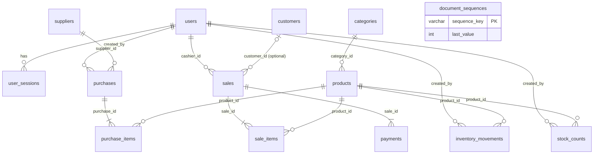

<!--
DOCUMENT METADATA
Owner: @database-expert
Update trigger: Any schema change, migration, index addition, or significant query pattern decision
Update scope: Full document
Read by: @backend-developer (to write queries), @systems-architect (for scaling and architecture decisions)
-->

# Database Reference

> **Engine**: MySQL 8.0 (8.0.16+ required: CHECK constraints are enforced), InnoDB, `utf8mb4` / `utf8mb4_unicode_ci`
> **ORM / Query layer**: Prisma 6 (`prisma/schema.prisma`); raw SQL for row locks, sequences and report aggregation
> **Connection**: via the `DATABASE_URL` environment variable (see `.env.example`)
> **Last updated**: 2026-10-02

Conventions: `snake_case` tables/columns, auto-increment `INT` primary keys (sessions use a UUID), timestamps `DATETIME(3)` stored in **UTC**, money `DECIMAL(12,2)` (VND), quantities `DECIMAL(12,3)` (v1 services only accept whole numbers, BR4). Transaction records are never hard-deleted (BR2/BR10).

---

## Schema Overview



`inventory_movements.reference_type/reference_id` is a polymorphic pointer (PURCHASE -> `purchases.id`, SALE -> `sales.id`, STOCK_COUNT -> `stock_counts.id`) and therefore has no foreign key. `document_sequences` is standalone.

Enums (MySQL `ENUM`): `Role` ADMIN/CASHIER/STOCKKEEPER · `PurchaseStatus` DRAFT/RECEIVED/CANCELLED · `SaleStatus` PAID (the only value v1 writes) · `PaymentMethod` CASH/CARD/TRANSFER/OTHER · `MovementType` PURCHASE/SALE/ADJUSTMENT/REVERSAL · `ReferenceType` PURCHASE/SALE/STOCK_COUNT.

---

## Tables

### users
Staff accounts. `username` is stored lower-case.

| Column | Type | Constraints | Description |
|--------|------|-------------|-------------|
| id | int | PK, auto | |
| username | varchar(50) | NOT NULL, UNIQUE, CHECK not blank | Login name |
| password_hash | varchar(255) | NOT NULL | argon2id hash |
| full_name | varchar(120) | NOT NULL, CHECK not blank | |
| role | enum | NOT NULL | ADMIN / CASHIER / STOCKKEEPER |
| is_active | bool | NOT NULL, default true | false = locked (no delete) |
| created_at, updated_at | datetime(3) | NOT NULL | |

### user_sessions
One row per login. The access JWT carries `id` as its `sid` claim.

| Column | Type | Constraints | Description |
|--------|------|-------------|-------------|
| id | char(36) | PK (uuid) | Session id |
| user_id | int | NOT NULL, FK users | |
| refresh_token_hash | char(64) | NOT NULL, UNIQUE | SHA-256 hex of the opaque refresh token |
| expires_at | datetime(3) | NOT NULL | Sliding; extended on rotation |
| revoked_at | datetime(3) | NULL | Set on logout / lock / password reset |
| user_agent | varchar(255) | NULL | |
| ip | varchar(64) | NULL | |
| created_at | datetime(3) | NOT NULL | |

Index: `idx_user_sessions_user_id_revoked_at (user_id, revoked_at)`.

### categories

| Column | Type | Constraints |
|--------|------|-------------|
| id | int | PK |
| name | varchar(120) | NOT NULL, UNIQUE, CHECK not blank |
| description | varchar(500) | NULL |
| is_active | bool | NOT NULL, default true |
| created_at, updated_at | datetime(3) | NOT NULL |

### suppliers

| Column | Type | Constraints |
|--------|------|-------------|
| id | int | PK |
| name | varchar(200) | NOT NULL, CHECK not blank |
| phone, email, address | varchar | NULL |
| note | varchar(1000) | NULL |
| is_active | bool | NOT NULL, default true |
| created_at, updated_at | datetime(3) | NOT NULL |

Indexes: `idx_suppliers_name`, `idx_suppliers_phone`.

### products
Stock is stored on the product (BR1). `stock_qty` and `cost_price` change only through purchases, sales and stock counts.

| Column | Type | Constraints | Description |
|--------|------|-------------|-------------|
| id | int | PK | |
| category_id | int | NOT NULL, FK categories | |
| sku | varchar(50) | NOT NULL, UNIQUE, CHECK not blank | |
| barcode | varchar(50) | NULL, UNIQUE | Unique when not null (MySQL allows many NULLs) |
| name | varchar(200) | NOT NULL, CHECK not blank | |
| unit | varchar(30) | NOT NULL | |
| sale_price | decimal(12,2) | NOT NULL, CHECK >= 0 | |
| cost_price | decimal(12,2) | NOT NULL, default 0, CHECK >= 0 | Weighted average (BR11) |
| stock_qty | decimal(12,3) | NOT NULL, default 0, **CHECK >= 0** | Never negative (BR1) |
| reorder_level | decimal(12,3) | NOT NULL, default 0, CHECK >= 0 | Low-stock threshold |
| is_active | bool | NOT NULL, default true | |
| created_at, updated_at | datetime(3) | NOT NULL | |

Indexes: `idx_products_name`, `idx_products_category_id`; unique `sku`, `barcode`.

### customers

| Column | Type | Constraints | Description |
|--------|------|-------------|-------------|
| id | int | PK | |
| customer_code | varchar(20) | NOT NULL, UNIQUE | `KH000001` |
| full_name | varchar(120) | NOT NULL | |
| phone | varchar(20) | NULL, UNIQUE | Normalised to local form `0xxxxxxxxx` |
| email | varchar(255) | NULL | |
| loyalty_points | int | NOT NULL, default 0, CHECK >= 0 | |
| created_at, updated_at | datetime(3) | NOT NULL | |

Index: `idx_customers_full_name`.

### purchases

| Column | Type | Constraints | Description |
|--------|------|-------------|-------------|
| id | int | PK | |
| purchase_no | varchar(20) | NOT NULL, UNIQUE | `PN` + yyyyMMdd + seq |
| supplier_id | int | NOT NULL, FK suppliers | |
| created_by | int | NOT NULL, FK users | |
| status | enum | NOT NULL, default DRAFT | DRAFT / RECEIVED / CANCELLED |
| subtotal, total | decimal(12,2) | NOT NULL, CHECK >= 0 | Server-computed |
| note | varchar(1000) | NULL | |
| received_at | datetime(3) | NULL | Set when RECEIVED |
| received_by | int | NULL | User who confirmed receipt (added to the SRS design) |
| created_at, updated_at | datetime(3) | NOT NULL | |

Indexes: `idx_purchases_supplier_id`, `idx_purchases_created_by`, `idx_purchases_status_created_at`, `idx_purchases_created_at`.

### purchase_items

| Column | Type | Constraints |
|--------|------|-------------|
| id | int | PK |
| purchase_id | int | NOT NULL, FK purchases |
| product_id | int | NOT NULL, FK products |
| quantity | decimal(12,3) | NOT NULL, CHECK > 0 |
| unit_cost | decimal(12,2) | NOT NULL, CHECK >= 0 |
| line_total | decimal(12,2) | NOT NULL, CHECK >= 0 |

Unique `uq_purchase_items_purchase_id_product_id` (one line per product); index `idx_purchase_items_product_id`.

### sales
Invoices. Only `PAID` is written in v1.

| Column | Type | Constraints | Description |
|--------|------|-------------|-------------|
| id | int | PK | |
| invoice_no | varchar(20) | NOT NULL, UNIQUE | `HD` + yyyyMMdd + seq |
| customer_id | int | NULL, FK customers | |
| cashier_id | int | NOT NULL, FK users | |
| status | enum | NOT NULL, default PAID | |
| subtotal | decimal(12,2) | NOT NULL, CHECK >= 0 | |
| discount_amount | decimal(12,2) | NOT NULL, default 0, CHECK >= 0 and `< subtotal` | |
| total | decimal(12,2) | NOT NULL, **CHECK > 0** | Always positive (BR7) |
| points_earned | int | NOT NULL, default 0, CHECK >= 0 | Added to the SRS design (receipt) |
| note | varchar(500) | NULL | |
| sold_at | datetime(3) | NOT NULL | |
| created_at, updated_at | datetime(3) | NOT NULL | |

Indexes: `idx_sales_sold_at`, `idx_sales_customer_id`, `idx_sales_cashier_id_sold_at`, `idx_sales_created_at`; unique `invoice_no`.

### sale_items
Snapshot of name, SKU, price and cost at sale time (BR5, BR11).

| Column | Type | Constraints |
|--------|------|-------------|
| id | int | PK |
| sale_id | int | NOT NULL, FK sales |
| product_id | int | NOT NULL, FK products |
| sku_snapshot | varchar(50) | NOT NULL |
| name_snapshot | varchar(200) | NOT NULL |
| quantity | decimal(12,3) | NOT NULL, CHECK > 0 |
| unit_price | decimal(12,2) | NOT NULL, CHECK >= 0 |
| unit_cost_snapshot | decimal(12,2) | NOT NULL, CHECK >= 0 |
| discount_amount | decimal(12,2) | NOT NULL, default 0, CHECK >= 0 (allocated invoice discount) |
| line_total | decimal(12,2) | NOT NULL, CHECK >= 0 (`quantity * unit_price - discount_amount`) |

Indexes: `idx_sale_items_sale_id`, `idx_sale_items_product_id`.

### payments

| Column | Type | Constraints | Description |
|--------|------|-------------|-------------|
| id | int | PK | |
| sale_id | int | NOT NULL, FK sales | |
| method | enum | NOT NULL | CASH / CARD / TRANSFER / OTHER |
| amount | decimal(12,2) | NOT NULL, CHECK > 0 | Applied to the invoice |
| tendered_amount | decimal(12,2) | NOT NULL, CHECK >= amount | Cash handed over |
| change_amount | decimal(12,2) | NOT NULL, default 0, CHECK >= 0 | 0 for non-cash |
| paid_at | datetime(3) | NOT NULL | |
| reference | varchar(100) | NULL | Transfer code, card slip, ... |

Index: `idx_payments_sale_id`.

### inventory_movements
Append-only stock ledger (never updated or deleted).

| Column | Type | Constraints | Description |
|--------|------|-------------|-------------|
| id | int | PK | |
| product_id | int | NOT NULL, FK products | |
| movement_type | enum | NOT NULL | PURCHASE / SALE / ADJUSTMENT / REVERSAL |
| quantity_change | decimal(12,3) | NOT NULL, CHECK <> 0 | Signed |
| reference_type | enum | NOT NULL | PURCHASE / SALE / STOCK_COUNT |
| reference_id | int | NOT NULL | Id in the referenced table (no FK) |
| created_by | int | NOT NULL, FK users | Acting user |
| note | varchar(500) | NULL | Stock-count reason |
| created_at | datetime(3) | NOT NULL | |

Indexes: `idx_inventory_movements_product_id_created_at`, `idx_inventory_movements_reference (reference_type, reference_id)`, `idx_inventory_movements_created_at`, `idx_inventory_movements_created_by`. `REVERSAL` is reserved for the future sale-cancellation flow (BR2).

### stock_counts
One row per physical count (gives UC-04 a count code and detail). Added to the SRS design.

| Column | Type | Constraints |
|--------|------|-------------|
| id | int | PK |
| count_no | varchar(20) | NOT NULL, UNIQUE (`KK` + yyyyMMdd + seq) |
| product_id | int | NOT NULL, FK products |
| system_qty | decimal(12,3) | NOT NULL, CHECK >= 0 (stock before) |
| counted_qty | decimal(12,3) | NOT NULL, CHECK >= 0 (stock after) |
| difference | decimal(12,3) | NOT NULL (`counted - system`, signed) |
| reason | varchar(500) | NOT NULL, CHECK not blank |
| created_by | int | NOT NULL, FK users |
| created_at | datetime(3) | NOT NULL |

Indexes: `idx_stock_counts_product_id_created_at`, `idx_stock_counts_created_at`, `idx_stock_counts_created_by`.

### document_sequences
Concurrency-safe numbering (see BACKEND.md, "Document numbering").

| Column | Type | Constraints | Description |
|--------|------|-------------|-------------|
| sequence_key | varchar(40) | PK | `HD20261002`, `PN20261002`, `KK20261002`, `KH` |
| last_value | int | NOT NULL, default 0, CHECK >= 0 | Reserved word: always quote with backticks in raw SQL |

---

## Indexing Strategy

Lookup fields from NF1/NF8 are indexed: `sku` and `barcode` (unique), product `name`, customer `phone` (unique), `customer_code` (unique), customer `full_name`, `invoice_no` (unique), `sold_at`, `created_at` columns, and `(product_id, created_at)` on movements. Every foreign key has an index. Name/SKU searches use `LIKE '%term%'` (not index-assisted); with the NF8 target of 10,000 products this is acceptable, and a FULLTEXT index is the upgrade path if needed. Report aggregations scan `sales.sold_at` ranges via `idx_sales_sold_at`.

## Constraint Enforcement

Prisma cannot model CHECK constraints, so they are added by hand at the end of the initial migration (`migration.sql`, "Manual: CHECK constraints"): non-negative prices and stock, positive quantities and totals, `discount_amount < subtotal`, `tendered_amount >= amount`, non-blank names/SKU/reason. They are invisible to `prisma migrate dev` drift detection, so any new migration that touches these tables must keep them. Application services validate the same rules first and return friendly 4xx errors; the CHECKs are the last line of defence.

## Migration Workflow

Tool: **Prisma Migrate** (`prisma/migrations/<timestamp>_<name>/migration.sql`, committed).

```bash
# develop: edit prisma/schema.prisma, then
npx prisma migrate dev --name <short_description>      # generates + applies + regenerates the client
# (use --create-only to hand-edit the SQL first, e.g. to add CHECK constraints)

# deploy / CI / e2e database
npx prisma migrate deploy
```

Rollback: Prisma has no automatic down-migrations. By project convention each migration folder also carries a hand-written `down.sql` (the reverse DDL plus removal of its `_prisma_migrations` row). It is applied manually (`mysql < down.sql`) and is intended for development/staging. Production rollback must be planned per migration; destructive changes follow `.claude/rules/migrations.md` (deprecate before dropping).

| Migration | Contents |
|-----------|----------|
| `20261002043358_init_schema` | All tables, enums, indexes, foreign keys, and CHECK constraints |

Naming deviation: `.claude/rules/migrations.md` suggests `YYYYMMDD_NNN_description.sql`; Prisma requires its own `<timestamp>_<name>` directory layout, which is used instead.

## Seed Data

`npm run prisma:seed` (idempotent): an admin from `SEED_ADMIN_USERNAME` / `SEED_ADMIN_PASSWORD`, demo `cashier` and `stockkeeper` users (`SEED_DEMO_PASSWORD`), 6 categories, 12 products with opening stock (booked through a received purchase), 2 suppliers and 3 customers.

`npm run seed:demo -- --reset` (dev database only) instead fills every table with ~90 days of consistent demo data (see `docs/backend/BACKEND.md`, "Demo data seed"); `npm run seed:demo:verify` checks its integrity.

## Backup

Daily MySQL backup and a tested restore procedure (NF7) are not configured yet; tracked in `TODO.md`.
